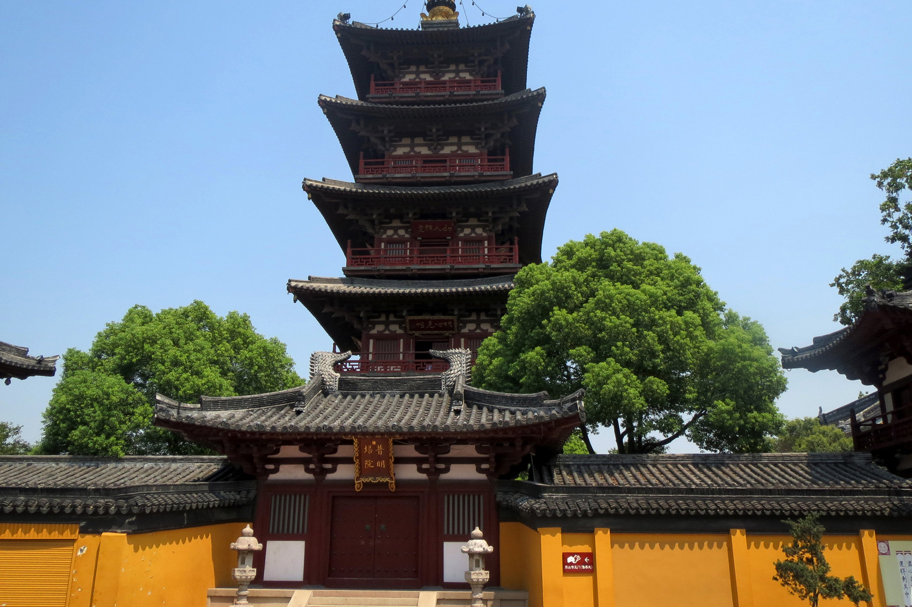

Hàn San Tự Các

####**<a target="_blank" href="https://hvdic.thivien.net/whv/%E6%A5%93" rel="noreferrer noopener">楓</a><a target="_blank" href="https://hvdic.thivien.net/whv/%E6%A9%8B" rel="noreferrer noopener">橋</a><a target="_blank" href="https://hvdic.thivien.net/whv/%E5%A4%9C" rel="noreferrer noopener">夜</a><a target="_blank" href="https://hvdic.thivien.net/whv/%E6%B3%8A" rel="noreferrer noopener">泊</a>&nbsp;&nbsp;Phong Kiều dạ bạc**
*Nửa đêm đậu bến Phong Kiều*

<a target="_blank" href="https://hvdic.thivien.net/whv/%E6%9C%88" rel="noreferrer noopener">月 </a><a target="_blank" href="https://hvdic.thivien.net/whv/%E8%90%BD" rel="noreferrer noopener">落 </a><a target="_blank" href="https://hvdic.thivien.net/whv/%E7%83%8F" rel="noreferrer noopener">烏 </a><a target="_blank" href="https://hvdic.thivien.net/whv/%E5%95%BC" rel="noreferrer noopener">啼 </a><a target="_blank" href="https://hvdic.thivien.net/whv/%E9%9C%9C" rel="noreferrer noopener">霜 </a><a target="_blank" href="https://hvdic.thivien.net/whv/%E6%BB%BF" rel="noreferrer noopener">滿 </a><a target="_blank" href="https://hvdic.thivien.net/whv/%E5%A4%A9" rel="noreferrer noopener">天</a>， Nguyệt lạc ô đề sương mãn thiên,

*Trăng lặn, quạ kêu, sương phủ đầy trời.*

<a target="_blank" href="https://hvdic.thivien.net/whv/%E6%B1%9F" rel="noreferrer noopener">江 </a><a target="_blank" href="https://hvdic.thivien.net/whv/%E6%A5%93" rel="noreferrer noopener">楓 </a><a target="_blank" href="https://hvdic.thivien.net/whv/%E6%BC%81" rel="noreferrer noopener">漁 </a><a target="_blank" href="https://hvdic.thivien.net/whv/%E7%81%AB" rel="noreferrer noopener">火 </a><a target="_blank" href="https://hvdic.thivien.net/whv/%E5%B0%8D" rel="noreferrer noopener">對 </a><a target="_blank" href="https://hvdic.thivien.net/whv/%E6%84%81" rel="noreferrer noopener">愁 </a><a target="_blank" href="https://hvdic.thivien.net/whv/%E7%9C%A0" rel="noreferrer noopener">眠</a>。 Giang phong ngư hoả đối sầu miên.

*Hàng phong bên sông, ngọn đèn thuyền chài ở trước người đang ngủ buồn.*

<a target="_blank" href="https://hvdic.thivien.net/whv/%E5%A7%91" rel="noreferrer noopener">姑 </a><a target="_blank" href="https://hvdic.thivien.net/whv/%E8%98%87" rel="noreferrer noopener">蘇 </a><a target="_blank" href="https://hvdic.thivien.net/whv/%E5%9F%8E" rel="noreferrer noopener">城 </a><a target="_blank" href="https://hvdic.thivien.net/whv/%E5%A4%96" rel="noreferrer noopener">外 </a><a target="_blank" href="https://hvdic.thivien.net/whv/%E5%AF%92" rel="noreferrer noopener">寒 </a><a target="_blank" href="https://hvdic.thivien.net/whv/%E5%B1%B1" rel="noreferrer noopener">山 </a><a target="_blank" href="https://hvdic.thivien.net/whv/%E5%AF%BA" rel="noreferrer noopener">寺</a>， Cô Tô&nbsp;thành ngoại&nbsp;Hàn San tự,

*Ngoài thành Cô Tô là chùa Hàn San,*

<a target="_blank" href="https://hvdic.thivien.net/whv/%E5%A4%9C" rel="noreferrer noopener">夜 </a><a target="_blank" href="https://hvdic.thivien.net/whv/%E5%8D%8A" rel="noreferrer noopener">半 </a><a target="_blank" href="https://hvdic.thivien.net/whv/%E9%90%98" rel="noreferrer noopener">鐘 </a><a target="_blank" href="https://hvdic.thivien.net/whv/%E8%81%B2" rel="noreferrer noopener">聲 </a><a target="_blank" href="https://hvdic.thivien.net/whv/%E5%88%B0" rel="noreferrer noopener">到 </a><a target="_blank" href="https://hvdic.thivien.net/whv/%E5%AE%A2" rel="noreferrer noopener">客 </a><a target="_blank" href="https://hvdic.thivien.net/whv/%E8%88%B9" rel="noreferrer noopener">船</a>。 Dạ bán chung thanh đáo khách thuyền.

*Tiếng chuông lúc nửa đêm vẳng đến thuyền khách.* (Năm 756)

Trong bối cảnh thành Trường An chìm trong cơn tao loạn thì nhà thơ Trương Kế, một đại quan tiến sĩ Ngự Sử đài, chẳng kịp theo đoàn hộ giá vương tôn lánh nạn mà đành lưu lạc xuống tận miền Giang Nam trên chiếc thuyền phiêu bạt. Một đêm ghé bến Phong Kiều, động mối u hoài chất chứa, gợi cảm cùng ngoại cảnh thê lương, bức xúc viết nên bài thơ tuyệt diệu, vượt qua cả không gian và thời gian, lưu truyền hậu thế:

Nguyệt lạc ô đề sương mãn thiên\
Giang phong ngư hoả đối sầu miên\
Cô Tô thành ngoại Hàn San tự\
Dạ bán chung thanh đáo khách thuyền

####Dịch nghĩa:####
Trăng lặn, quạ kêu, sương phủ đầy trời\
Trong giấc mơ buồn có cây phong ở bến sông và ngọn lửa thuyền chài\
Chùa Hàn San ở ngoại thành Cô Tô\
Nửa đêm khách đi thuyền tới nghe thấy tiếng chuông chùa ngân vang
####Dịch thơ:####
Trăng tà, tiếng quạ kêu sương\
Lửa chài, cây bãi, đối người nằm co\
Con thuyền đậu bến Cô Tô\
Nửa đêm nghe tiếng chuông chùa Hàn San

(Bản dịch: Tản Đà)

Cuốn *Thơ Đường* của Trần Trọng San có ghi lại có một truyền thuyết khá lãng mạn về bài này. Một đêm trăng, sư cụ trụ trì chùa Hàn San, cảm hứng nghĩ ra hai câu thơ:

>Sơ tam sơ tứ nguyệt mông lung\
Bán tự ngân câu bán tự cung

Thao thức mãi trong phòng mà sư cụ không nghĩ ra hai câu tiếp. Tự nhiên có tiếng gõ cửa. Thì ra là chú tiểu cũng trằn trọc vì 2 câu thơ mình mới nghĩ ra:

>Nhất phiến ngọc hồ phân lưỡng đoạn\
Bán trầm thuỷ để bán phù không

nhưng cũng không làm tiếp được và xin thầy giúp. Nghe xong, sư cụ mừng quá, quỳ xuống tạ Phật. Vì quả thật 2 câu thơ của chú tiểu ăn khớp với hai câu của sư cụ, thành bài tứ tuyệt mà Trần Trọng San đã dịch như sau:

Mồng ba, mồng bốn, trăng mờ\
Nửa dường móc bạc nửa như cung trời\
Một bình ngọc trắng chia hai\
Nửa chìm đáy nước nửa cài từng không

Làm xong bài thơ này lúc nửa đêm, sư cụ bảo chú tiểu đánh chuông tạ ơn Phật. Tình cờ đêm hôm đó trên thuyền, thi sĩ Trương Kế cũng không ngủ được vì không nghĩ được câu tiếp cho hai câu “Nguyệt lạc ô đề...” Tự nhiên chuông chùa Hàn San đổ đến, gợi hứng cho thi nhân hoàn tất bài *Phong kiều dạ bạc* “...Dạ bán chung thanh đáo khách thuyền...”

*Lắng biết mọi người đã ngủ yên cả, vị thần tử của giang sơn Trung Hoa vắt chân chữ ngũ, khe khẽ ngâm một bài thơ cổ, qua nỗi xúc động đột nhiên tụ lại trong người:*

>Uỵt loọc, vú thày sướng mủn thín,\
Coóng phống, dì phố, tui sàu mìn,\
Cú chấu sèng ngồi Hồn Sán sì.\
Dề pun, chống séng tâu hác sin.

*Ngay lúc ấy, từ gian buồng bên, nổi lên mấy tiếng gì như chuột rúc. Lữ khách, thấy đứt mạch cảm hứng, càu nhàu trong bóng tối:*

*- Ấy dà! Cẩm tố xỉ a! (Chà! Lắm chuột thế!)*

*Nhưng đó không phải tiếng chuột rúc. Đó là tiếng người con gái chở đò ban tối cười qua hai làn môi khép kín.*

Cuốn **Chân Trời Cũ** văn gồm nhiều truyện ngắn, theo ghi chú của tác giả thì nó được viết vào tháng Giêng năm 1940, xuất bản lần đầu năm 1942. Nó được tái bản nhiều lần về sau này. Tôi rất nhớ hai câu kết của truyện ngắn Ngày Gặp Gỡ:

“*Người khách sang sông chiều muộn ấy về sau này là cha tôi. Và cô lái đò, là mẹ tôi“.*

Hồ Dzếnh (Hà Triệu Anh)
