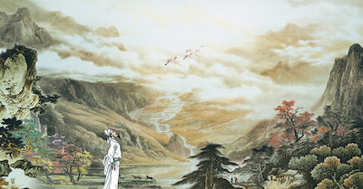

Như Tô-Đông-Pha sao lãng lợi danh mà chơi gió chơi giăng, sảng khoái hơn người, nhưng gái lầu xanh buồn trong gió trăng hoa tuyết, gượng lúc thơ hoạ cầm cờ, lòng trong trắng thương thân dày dạn, dạ ngẩn ngơ bên hiếu bên tình, tâm hồn cao quý như vậy lại không hơn cái sảng khoái dễ dàng kia sao ?  
**Bằng Vân - Khúc Đoạn Trường- Lời bình luận toàn khúc**  

***
 
               
 

Đến ngày 15 tháng mười năm ấy, Tô lại cùng Miên Trúc Đạo sĩ và Hoàng Lỗ Trực (2) đi chơi sông Xích Bích. Hồi này tiết trời đông ken, nước sông cạn xiết, bờ sông và sườn núi chìa ra, đường lối đã thay đổi, khác hẳn lần đi chơi trước. Khi về bỗng có con chim hạc lướt qua thuyền bay sang phía tây. Đêm khuya Tô chiêm bao thấy một Đạo sĩ đến nói truyện, tỉnh dậy mới biết chim hạc bay qua thuyền là tiên nhân, bèn làm ra bài phú Hậu Xích Bích.  
Vua Triết Tông (1086-1099) xem hai bài phú, khen là kỳ tài, vời Tô về triều phong chức Hàn lâm học sĩ, rồi thăng lên Bộ binh Thượng thư.  

Hai bài phú Xích Bích, lời mạnh mẽ phóng khoáng, ý sâu xa thần diệu, thực là nghị luận của đại triết gia, tiêu biểu cho phái Khổng học chịu ảnh hưởng của Lão Trang, đời sau đều phục là tuyệt tác.  

Thi nhân đời nhà Minh, Lý Phan Long bàn rằng :  
Anh hùng như Tào Tháo, sự nghiệp của Chu Du nay còn thấy đâu. Chỉ có bóng trăng đẹp, dòng nước trong và câu văn bất hủ của Tô Đông Pha muôn đời còn mãi.  

Sách Quảng dương tạp ký của Lưu Hiến Đình đời Thanh chép :  
Sông Xích Bích chỗ Tô Đông Pha cùng bạn đi chơi ngày trước, nay đã bồi thành lục địa, cách sông Trường Giang rất xa : biển xanh biến thành ruộng dâu, thay đổi chóng thế. Nay ở trên núi Xích Bích thuộc huyện Hoàng Cương, tỉnh Hồ Bắc, còn nhô ra một tảng đá lớn sắc đỏ như mũi con voi, vì thế gọi là núi Xích Bích.  
Dưới chân núi có đình, trong đình có tượng Đông Pha bằng đá trắng, ở trên treo bức hoành 4 chữ Vạn Cổ Phong Lưu rất lớn do Từ Tử Trinh viết. Phía đông đình có ba gian nhà, trong nhà treo một cái biển sơn thiếp, viết 2 chữ Nhị Phú. Phía nam đình cũng có ba gian nhà, trên vách đề la liệt thơ của danh sĩ, danh nhân các triều đại tán tụng hai bài phú.  
Lối đông bắc leo mấy chục bậc đá thì lên gác. Gác này trước bị đổ, đến năm Gia Tĩnh (1523-1567) đời vua Thế Tông nhà Minh được quan Lệnh Hoàng Cương là Mạnh Tân trùng tu lại. Gian giữa gác đề hai chữ Lưu Pha dưới có một tấm bia đá chép nguyên văn hai bài phú Xích Bích do Triệu Tùng Tuyết là danh bút đời nhà nguyên viết. Chung quanh còn đình tạ rất nhiều, đều là chỗ kỷ niệm văn chương sự nghiệp của tác giả hai bài phú, kể ra không thể xiết.  

### Phụ ghi.

1. Dương Thế Xương hiệu là Miên Trúc Đạo sĩ, quê ở tỉnh Tứ Xuyên, ẩn cư trong núi Hoàng Cương. Dương là bạn thân với Đông Pha.  
2. Hoàng Đình Cương tự là Lỗ Trực, hiệu Sơn Cốc Đạo nhân, quê ở đất Phần Ninh, đỗ Tiến sĩ, thụ chức Tri Ngạc châu. Hoàng hay thơ, văn chương phóng túng, viết chữ lối thảo rất tốt, cùng với Đông Pha nổi tiếng danh sĩ đương thời. Khi mất học trò tôn tên Thụy&nbsp; là Văn Tiết Tiên sinh.  
[Source link](http://www.saimonthidan.com/?c=article&p=1037) *Sài Môn Thi đàn*

***

#### [link~> Bài Hậu Xích Bích Phú trên Thi viện](https://www.thivien.net/T%C3%B4-Th%E1%BB%A9c/H%E1%BA%ADu-X%C3%ADch-B%C3%ADch-ph%C3%BA/poem-BfwldcS0qekxn1B0b2u_yw){:target="_blank"}   

***

Bản dịch của Hà Thượng Nhân  

Cùng năm đó, tháng mười, giữa tháng  
Từ Tuyết Đường về ngả Lâm Cao  
Có hai ông khách đi theo  
Móc sương lã chã, cây đèo xác xơ  
Cúi xuống thấy mờ mờ nhân ảnh  
Ngẩng lên nhìn vành vạnh trăng cao  
Ngắm xem phong cảnh thanh tao  
Vừa đi vừa hát vui sao cho cùng!  
Tiếc có khách lại không có rượu  
Rượu lại không đồ nhậu, buồn chưa!  
Trăng trong gió mát dang chờ  
Khách rằng: “Xẩm tối bất ngờ giăng câu  
Tóm ngay được ở đâu chú cá  
Giống cá lư dưới chỗ Tùng Giang  
Tìm đâu được hũ rượu ngang?  
Ta bàn với vợ, vợ rằng: “Chớ lo  
Tôi vốn có một vò rượu quý  
Ðã lâu nay cất kỹ để dành”  
Thế rồi rượu cá sắm sanh  
Xuôi dòng Xích Bích lại thành cuộc chơi!  
Khúc sông chảy muôn vời sóng nước  
Sườn núi cao ngàn thước chênh vênh  
Núi cao trăng sáng mông mênh  
Nước ròng, đá núi gập ghềnh phô ra  
Ta vén áo dần dà bới cỏ  
Ngồi lên trên những chỗ cheo leo  
Ngửng trông tổ cắt ngặt nghèo  
Cúi nhìn u hiểm thuỷ triều Bằng Di  
Hai người khách chẳng đi tới được  
Tiếng gọi nhau dội ngược cỏ cây  
Ta nghe tê tái lòng này  
Phập phồng lo sợ ở đây rợn người  
Bèn trở lại, thuyền xuôi mặc sóng  
Sắp nửa đêm in vắng bốn bề  
Chợt nghe chim hạt bay khuya  
Lẻ loi, cánh giống bánh xe rộn ràng  
Giữa trời rộng kêu vang lảnh lót  
Vừa phương đông, đã thoát phương đoài  
Thế rồi khách bỏ mặc ai  
Ta lim dim một giấc dài như mơ  
Mơ thấy một phơ phơ đạo sĩ  
Mặc áo lông từ chỗ Lâm Cao  
Gặp ta người vội vái chào:  
“Cuộc chơi Xích Bích thế nao, vui không?”  
Hỏi họ tên nhưng ông chẳng nói  
Ta biết rồi: “Vừa mới hôm qua  
Tiếng kêu trong vắt gần xa  
Cái con chim hạc chính là ông thôi!”  
Lão đạo sĩ chỉ cười lặng lẽ  
Ta giật mình mở cửa nhìn ra  
Vắng tanh nào thấy đâu là!
./.