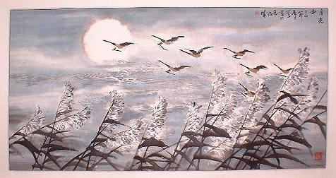

                    

Truyện Kiều, ai cũng công nhận là hay. Nhưng không ai dám nói là hiểu hết cái hay trong truyện Kiều.

Bởi văn truyện Kiều không nhữ nhiều điển tích mà thôi, còn có những chỗ lập ngôn khúc chiết, ý tứ cao xa, nếu không gia tâm nghiên cứu thì không sao hiểu thấu được.\
Nay chúng tôi dẫu đương thời học hỏi nhưng dày công suy xét, bàn bạc cùng nhau, có lý hội được đôi phần tinh vi trong truyện Kiều, càng đi xa càng thấy những cái hay mà trước không ngờ tới.

Người xưa có câu: *Biết mà không nói là bất nhân, nói mà không biết là bất nghĩa.* Vẫn hay rằng cái biết của người xưa không đâu là bờ bến, chẳng phải ai cũng sợ mang điều bất nhân bất nghĩa.

Song le, từ con mắt kẻ phàm cho tới con mắt trông thấu cả sáu cõi, từ tấm lòng ngu muội cho tới tấm lòng nghĩ suốt cả nghìn đời, có biết bao nhiêu là con mắt mờ tỏ, tấm lòng trong đục khác nhau.\
Cái biết trong lời nói cổ-nhân, thật khó định nghĩa.
Ngẫu nhiên mà thấy, cũng gọi là biết, tìm tòi có công, cũng gọi là biết, biết chuyện cao xa, biết việc gần gần, cái gì lại không là biết? 
Miễn cái biết cho tinh tường và người biết cho trong sạch, thì cái gì biết lại không là quý.

Huống cái biết nói đây lại là cái biết về một đấng thiên tài đã xuất hiện trên đất nước thiêng liêng này. Cái biết về một thiên tuyệt tác, ngày nay và mai sau, mãi mãi như ánh mặt trời rạng rỡ trên núi sông Việt Quốc, làm ngọn lửa tinh thần bùng cháy trong tâm can người Việt, cái biết về Đoạn-Trường tân thanh của Nguyễn tiên sinh.\
Bằng-Vân may cùng Tố Như cùng tiếng mẹ đẻ, lại có duyên ngoài mây thấy vũ trụ văn chương, lòng nào lặng im cho được?\
Đáng lẽ đợi trình bày cả thiên bình luận, nhưng nghĩ rằng nói ít thì chẳng hết lời mà nói dài ngại chưa quen biết, nên trong toàn tập tân thanh, hãy lựa lấy một khúc, vài lời bàn nói, cũng gọi như chim bay muôn dặm, trước hãy dơ cánh xem sao.

*B.V. Biên-hoà, Thu Nhâm-ngọ*

  
