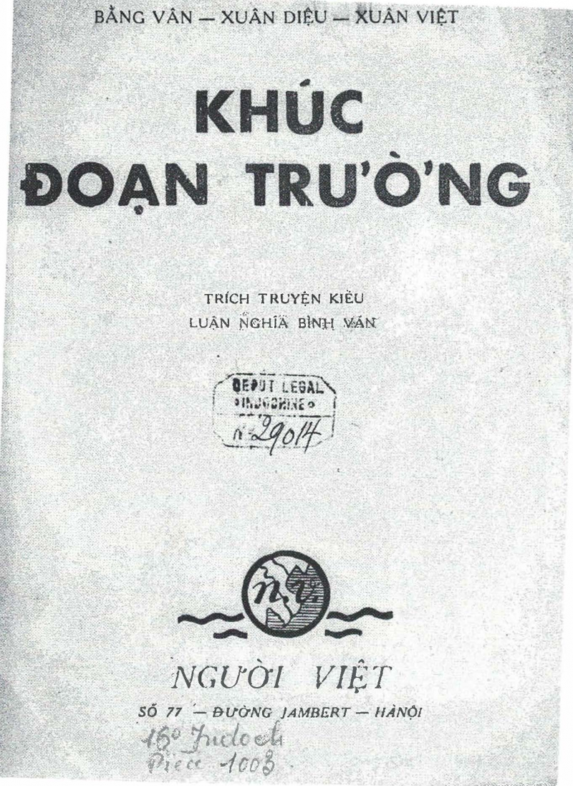
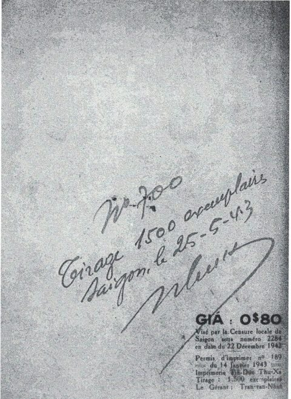

<!-- wp:group -->

<!-- wp:jetpack/podcast-player {"url":"https:\/\/anchor.fm\/quoc-anh-tran\/episodes\/KDT-1-edpmi5"} /-->

<!-- wp:paragraph -->

<!-- /wp:paragraph -->

<!-- /wp:group -->

<!-- wp:paragraph -->

<strong>Trích truyện Kiều, luận nghĩa bình văn.</strong>

<!-- /wp:paragraph -->

<!-- wp:paragraph -->

<em>NXB Người Việt 77 r Jambert Ha-Nội (1943)</em>

<h1>Notice bibliographique</h1>

<!-- /wp:heading -->

<!-- wp:list -->

<ul>
<li>Notice&nbsp;&nbsp; Au format public&nbsp; Au format Intermarc&nbsp; Au format Unimarc&nbsp; Au format public</li>
</ul>

<!-- /wp:list -->

<!-- wp:paragraph -->

<strong>Type(s) de contenu et mode(s) de consultation&nbsp;:&nbsp;</strong>Texte : sans médiation

<!-- /wp:paragraph -->

<!-- wp:paragraph -->

<strong>Auteur(s)&nbsp;:&nbsp;</strong><a href="https://catalogue.bnf.fr/ark:/12148/cb17820401c" class="">Bằng Vân</a>&nbsp;<a href="https://catalogue.bnf.fr/rechercher.do?index=AUT3&amp;numNotice=17820401">Voir les notices liées en tant qu'auteur</a> <a href="https://catalogue.bnf.fr/ark:/12148/cb10340118v" class="">Xuân Việt</a>&nbsp;<a href="https://catalogue.bnf.fr/rechercher.do?index=AUT3&amp;numNotice=10340118">Voir les notices liées en tant qu'auteur</a> <a href="https://catalogue.bnf.fr/ark:/12148/cb12079330t" class="">Xuân Diệu (1916-1985)</a>&nbsp;<a href="https://catalogue.bnf.fr/rechercher.do?index=AUT3&amp;numNotice=12079330">Voir les notices liées en tant qu'auteur</a>

<!-- /wp:paragraph -->

<!-- wp:paragraph -->

<strong>Titre(s)&nbsp;:&nbsp;</strong>Khúc đoạn trường [Texte imprimé] : trích truyện Kiều, luận nghĩa, bình văn / Bằng Vân, Xuân Diệu, Xuân Việt

<!-- /wp:paragraph -->

<!-- wp:paragraph -->

<strong>Publication&nbsp;:&nbsp;</strong>Hà-nội : Người-Việt, 1943

<!-- /wp:paragraph -->

<!-- wp:paragraph -->

<strong>Description matérielle&nbsp;:&nbsp;</strong>In-16, 48 p.

<!-- /wp:paragraph -->

<!-- wp:paragraph -->

<strong>Note(s)&nbsp;:&nbsp;</strong>[La Chanson triste, essai de critique du Kiều, par Xuân Diệu, Xuân Việt et Bằng Vân.]

<!-- /wp:paragraph -->

<!-- wp:paragraph -->

<strong>Sujet(s)&nbsp;:&nbsp;</strong><a href="https://catalogue.bnf.fr/ark:/12148/cb122066346" class="">Nguyễn Du (1765-1820). Truyện Kiều</a>&nbsp;--&nbsp;<a href="https://catalogue.bnf.fr/ark:/12148/cb12042895g" class="">Critique et interprétation</a>&nbsp;<a href="https://catalogue.bnf.fr/rechercher.do?index=SujConstr&amp;numNotice=12206634_12042895_">Voir les notices liées en tant que sujet</a>

<!-- /wp:paragraph -->

<!-- wp:paragraph -->

<strong>Numéros&nbsp;:&nbsp;</strong>(Br.)

<!-- /wp:paragraph -->

<!-- wp:paragraph -->

<strong>Notice n°&nbsp;:&nbsp;</strong>&nbsp;FRBNF31674084

Visa par la Censure locale de Saigon en date du 22 décembre 1942, Tirage: 1500 exemplaires

<!-- /wp:image -->

