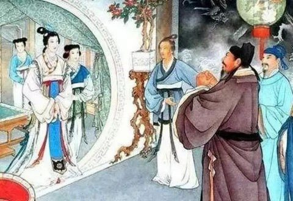
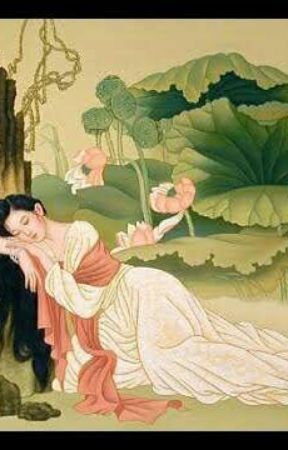
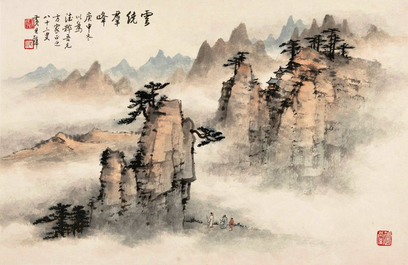
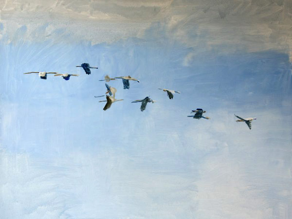

####Lời Bình Luận của Bằng Vân#####
*hợp tác với Xuân Diệu, Xuân Việt.*

 Lầu xanh

*Lầu xanh mới rủ trướng đào,\
Càng treo giá ngọc càng cao phẩm người.*

Nhân *lầu xanh* mà nói *trướng đào*, kể chuyện ở đâu lời cũng đẹp. Lại *treo giá ngọc* với *cao phẩm người*, nói việc mua bán đấy mà vẫn giữ được cốt cách.

*Biết bao bướm lả ong lơi,*

{"align":"left"} -->

*Ong bướm lả lơi* thì là văn thường, *bướm lả ong lơi* thì là văn già giặn. Nghề viết văn, khó thì thật khó, mà dễ cũng vẫn dễ. "*Biết* *bao ong bướm lả lơi*" thì câu thơ hồn ở hai chữ *ong bướm*. "*Lả lơi ong bướm biết bao*" thì hồn ở hai chữ *lả lơi*. Nhưng "*Biết bao ong bướm lả lơi*" thì hồn không riêng ở chữ nào, mà ở cảnh gợi ra, một bông hoa ong bướm đi về, ấy là "*thơ ở ngoài lời*", như người xưa có nói.

*Cuộc say đầy tháng, trận cười suốt đêm.*

Những cuộc say, những trận cười liên tiếp đầy tháng suốt đêm thì đã là thường. Một cuộc say mà đầy cả tháng, say điên say dại, say lấy chết; một trận cười mà dài suốt đêm, cười mê cười mẩn, cười thế đâu phải là cười vui !

*Dập dìu lá gió cành chim,*

Lá là của trăm gió, cành lá của muôn chim, dập dìu đi lại, không cần phải biết hai câu thơ của nàng Tiết Đào mới hiểu được sáu chữ này. Nhưng biết mà so sánh thì cũng nên. " *Chi nghênh nam bắc điểu, Diệp tống vãng lai phong* " (*Cành đón chim bắc nam, Lá đưa gió đi lại *) thơ của Tiết Đào mười chữ mà đủ: *cành lá,đón đưa, nam bắc, đi về, chim gió*, đã là tinh hoa kết đọng. Nhưng ngẫm cho kỹ thì đón dưa chỉ là đón đưa chứ không là vui chơi, mà gió chỉ có hai ngả đi về, chim chỉ đến tự hai phương nam bắc. Trong câu Kiều sáu chữ, ngoài bốn chữ cần *Lá gió cành chim*, chỉ thêm hai chữ *dập dìu, dập dìu* là trăm đưa nghìn đón, gió đâu cũng đón, chim nào cũng đưa, mà từ đón đến đưa, lại bao nhiêu tình sự.

Mộng dưới hoa

*Biết bao bướm lả ong lơi,\
Cuộc say đầy tháng, trận cười suốt đêm.\
Dập dìu lá gió cành chim,\
Sớm đưa Tống Ngọc, tối tìm Tràng Khanh*

*Bướm lả ong lơi* là nói sự vui chơi, *đầy tháng suốt đêm* là nói thêm miệt mài xuồng xã, *lá gió cành chim* là khách khứa đi về, *Tống-Ngọc Tràng Khanh* là thêm vẻ phong lưu ngoài mặt. Bốn câu hai cặp, mỗi cặp một lung một thừa, cũng tả một sự mà không câu nào điệp câu nào, chỉ như mây bạc có lớp có từng, như núi lam ngọn này ngọn khác, chính là lối văn trăm khúc nghìn khúc, trăm chiết nghìn chiết mà Thánh Thán có nói trong Tây Sương.

*Khi tỉnh rượu, lúc tàn canh,\
Giật mình, mình lại thương mình xót xa.*

Đương kể chuyện khách khứa vui chơi, tiếp xuống *tỉnh rượu tàn canh* thật là tự nhiên. Đến hai chữ *giật mình* tách lên đầu câu, một phút kinh hoàng, rồi hai chữ *xót xa* đem xuống cuối lời, vô cùng đau đớn. Không cứ gì nàng Kiều, những kẻ có tài có chí mà tài chưa thể dùng, chí chưa được toại, khác nào con rồng thiêng còn nằm trong vũng cạn, mỗi khi chợt nhớ đến thân thế, lại không giật mình xót xa như vậy hay sao ?

*Khi sao phong gấm rủ là,*

Lúc ở nhà thì chỉ " *êm đềm trướng rủ màn che* ", nhưng lúc sa vào lầu xanh, nhớ lại cảnh xưa, thì thấy đã phong bằng gấm, lại rủ là che, nghĩ càng chua xót mà thêm thương tiếc cái giá ngọc của mình.

*Giờ sao tan tác như hoa giữa đường !*

Hoa giữa đường thì ai dậm mà không được, còn gì che chở cho nữa. Nhuỵ non cành mỏng, phơi ra giữa trời giữa gió, tưởng đến mà lạnh người.

*Mặt sao dày gió dạn sương,*

Chỉ thoa phấn tô son ở trong nhà tiếp khách, thế mà tấm lòng đau đớn ê chề, tưởng như nét mặt đã dạn dày vì ra sương ra gió.

*Thân sao bướm chán ong chường bấy thân* !

Ôi ! Thân là thân ngàn vàng, thế mà bây giờ, chẳng những mình tự hổ với mình, lại cả đến bướm ong cũng chán chường nữa !

*Khi sao phong gấm rủ là,\
Giờ sao tan tác như hoa giữa đường !\
Mặt sao dày gió dạn sương,\
Thân sao bướm chán ong chường bấy thân !*

Trong bốn câu này, ta thấy có bốn phép dàn văn: "*Khi sao phong gấm rủ là*", một câu vọng lên thời trước, *Giờ sao tan tác như hoa giữa đường*, một câu trông xuống cảnh bây giờ, tứ văn hai mặt đối nhau, phương đông một ngọn núi, phương tây một ngọn núi, đông tây cùng lên vút song song, ấy là phép " **non cao đối ngọn** ". Phép này thông dụng nhất trong văn chương của ta xưa, khéo dùng thì lời văn đã đẹp, hơi văn lại liền. Những kẻ sính dùng phép ấy mà không dùng nổi, đối tứ chẳng được, đối ý cũng chẳng nên, quay ra chọi chữ, văn đọc lên như gõ trống đập thùng vậy.

Non cao đối ngọn

" *Khi sao phong gấm rủ là* ", một câu vọng lên thời trước, "*giờ sao tan tác như hoa giữa đường, mặt sao dày gió dạn sương, thân sao bướm chán ong chường bấy thân !* ", ba câu trông xuống cảnh bây giờ, tứ văn cũng đối nhau nhưng nặng nhẹ không cân, ấy là phép " **đăng chiếc đảo ngàn **", một chữ có thể đối với nguyên câu, một câu có thể đối với cả đoạn, một đoạn có thể đối với toàn chương, hùng kính như hải-đăng chỉ một ngọn mà soi dấu được trăm nghìn hòn đảo. Phép này vừa giúp tứ cho người viết, vừa lôi cuốn được người xem, nhưng bút non tấp tểnh dùng đến không khéo thì văn hoá ra đầu voi đuôi chuột.

Đăng chiếc đảo ngàn

"*Giờ sao tan tác như hoa giữa đường* " là một câu rộng rãi nói lung lên, hai câu sau " *mặt sao dày gió dạn sương, thân sao bướm chán ong chường bấy thân !* " tự nhiên phải đắc thế theo trào bút mà ra. Cùng hơi văn, lấy một câu mở lối cho nhiều câu, như con chim đầu đàn đem đường sẻ gió, ấy là phép " **chim trốc (1) dẫn bầy** ". Biết được phép này, làm văn không lo gì cạn tứ.

Chim trốc dẫn bầy

Lại có phép " **đôi nhạn cùng bay** ", một tứ tách làm hai ý, hai ý viết ra hai lời, hai lời song song như chim nhạn bay đôi, đã đẹp mắt lại không bao giờ mỏi cánh. Phép này khiến cho văn viết ra không bao giờ nhạt nhẽo. Câu " *Mặt sao dày gió dạn sươn*g " đi với câu "* Thân sao bướm chán ong chường bấy thân "* chính là một cặp uyên ương đó.

Đôi nhạn cùng bay

Bốn phép dàn văn kể trên, non cao đối ngọn, đăng chiếc đảo ngàn, chim trốc dẫn bầy và đôi nhạn cùng bay, là bốn phép chính trong nghề văn, luyện được bốn phép ấy, đã có thể cầm bút mà không tủi bút. Nhưng bốn phép ấy còn có thể hoặc thay đổi đôi chút, hoặc hợp lại cùng nhau, biến hoá không cùng.

___

(1) *Trốc* tiếng Nghệ nghĩa là đầu. Ngoài Bắc cũng có nói *trên trốc tủ* nghĩa là trên đầu tủ.
___

*Mặc người mưa Sở mây Tần,\
Những mình nào biết có xuân là gì.*

Hai câu thoạt xem là non cao đói ngọn, một bên thì kỹ nữ khách du, một bên thì nàng Kiều ; xem kỹ lại thấy là đôi nhạn cùng bay, cùng một tứ không vui chung tách làm hai ý, người làm sao, mình làm sao.\
Đôi nhạn cùng bay ấy lại thừa cái thế chim trốc đẫn bầy ở ba câu trên, *tan tác như hoa* là một từng, *sương gió bướm ong* là một từng, *mưa Sở mây Tần* lại là một từng nữa. Nhưng *mưa Sở mây Tần* chỉ là để chuyển sang *nào biết có xuân là gì*, hai câu thông nhau như hai cửa lầu ngà, một ở cuối lớp cung điện vừa qua, một trông sang những cung điện sắp tới, nào *gió tựa hoa kề* nào *câu thơ nét vẽ*. Ấy là trong cái thế chim trốc dẫn bầy có cái thế chim bầy mở lối, mà giao nhau thì đôi nhạn cùng bay đã hoá ra uyên ương liền cánh. Nhưng đặt tên mà chơi đó thôi, chứ những thể biến hoá của bốn phép dàn văn, kể sao cho xiết.

*Mặc người mưa Sở mây Tần,* cả một thế giới ăn chơi, *những mình nào biết có xuân là gì,* riêng một tấm lòng đau đớn. Một thân một mình mà cô đơn thì đã đành, lạc giữa đám đông mà cô đơn mới thật là khổ.

Đặc sắc ở hai câu, là trong mười bốn chữ, duy có bảy chữ quan hệ đến nghĩa văn : *người mây mưa mình biết xuân là gì* , kỳ dư đều là mỹ tự, *mặc *để tả sự thờ ơ, *Tần Sở* là nói khách khứa đổi thay, chữ *những* riêng biệt nàng Kiều ra, chữ *nào *như bức tường thành khoá lấy, đến hai chữ *có là* thì cái xuân đối với nàng Kiều không còn chút liên can. Rút lại, bảy mỹ tự lại chính là cái hồn của câu văn, mà bảy chữ kia chỉ là cốt.

Về từ chương, viết văn có một lối thấp, hai lối cao. Nghĩ sao viết vậy, không rút đi mà cũng không thêm ra, ấy là một lối thấp, viết văn như thế không khác gì đàn bà kể chuyện Lưu-hầu.\
Gọt rũa những hư tự, văn thành ít lời nhiều ý, như tuyết đọng ngọc đông, ấy là một lối cao. Đã gọi là viết văn, thì ít ra cũng phải học lấy lối này.\
Thêm thắt những mỹ tự, vẫn bấy nhiêu ý mà làm cho rõ rệt, cho mạnh mẽ, như nước tràn khắp đất, như mây nở đầy trời, ấy lại là một lối cao. Nhưng lối này rất khó, luyện chưa tới mà đã đem dùng, thì lời văn đểnh đoảng ngay như nước lã ao bèo, ý văn hời hợt ngay như mây tan khói mất.\
Ngoài ra, còn một lối viết rất cao, tựa hồ buột miệng nói mà ngẫu nhiên thành văn, chẳng cần gọt rũa mà uẩn súc, chẳng cần thêm thắt mà mỹ lệ, hay đén tuyệt vời (1). Muốn dùng lối này, cậy tài không được, cần phải luyện tâm trước đã.

***
(1) Thí dụ như câu " *Một mình không biết làm sao* " trong Kiều\
***

*Đòi phen gió tựa hoa kề,\
Nửa rèm tuyết ngậm, bốn bề trăng thâu.\
Cảnh nào cảnh chẳng đeo sầu !\
Người buồn cảnh có vui đâu bao giờ!\
Đòi phen nét vẽ câu thơ,\
Cung cầm trong nguyệt, nước cờ dưới hoa,\
Vui là vui gượng kẻo mà...\
Ai tri âm đó. mặn mà với ai ?*

Tám câu này chính là đàn chim bay theo hai câu " *Mặc người mưa Sở mây Tần, Những mình nào biết có xuân là gì* " thành cái thế chim trốc dẫn bầy. Nhưng đáng lẽ có một con trốc đàn thì đây có hai con. Một câu *mưa Sở mây Tần* đem đến hai câu phong hoa tuyết nguyệt và hai câu cầm kỳ thi hoạ. Một câu *nào biết có xuân là gì* đem đến hai câu người đối cảnh đẹp và hai câu người đối thú vui. Nhưng hai câu đầu đàn lại giao cánh mà bay, nên hai đàn nhập một, nhập một mà vẫn rõ là hai, rõ là hai mà liên lạc như một.\
Nếu phong hoa tuyết nguyệt rồi cầm kỳ thi hoạ thì là một làn riêng, người đói cảnh đẹp rồi người đối thú vui thì lại là một đàn riêng, hai đàn theo nhau. Nhưng phong hoa tuyết nguyệt ở đàn trên, tiếp xuống người đối cảnh đẹp ở đàn dưới, hai nửa ở hai đàn mà nghiễm nhiên là một đàn nhỏ, cùng với một đàn nhỏ bốn câu sau, gồm thành một đàn lớn, bay theo hai con nhạn dẫn đàn.

Lối dàn văn ở đây , hợp hai phép chim trốc dẫn bầy và uyên ương liền cánh, thành một thể riêng.

*Đòi phen gió tựa hoa kề,\
Nửa rèm tuyết ngậm, bốn bề trăng thâu.*

*Gió tựa hoa kề*, hóng gió xem hoa mà tựa mà kề, nghe ra có chiều lơi lả.\
*Nửa rèm tuyết ngậm*, là nhìn qua cửa sổ, một vùng tuyết trắng, chân trời lơ lửng ngang rèm.\
*Bốn bề trăng thâu* , là trông ra ngoài lầu, mênh mang đâu cũng là trăng. Cảnh đẹp mà buồn bao la.

*Đòi phen nét vẽ câu thơ,\
Cung cầm trong nguyệt, nước cờ dưới hoa,*

*Nét vẽ câu thơ,* qua quýt vội vàng, nghe ra có chiều giả dối.\
*Cung cầm trong nguyệt*, *nước cờ dưới hoa*, nghĩa thực là gẩy đàn trong ánh trăng, đánh cờ dưới dàn hoa. Hội ý thì *trong nguyệt dưới hoa,* chính là tả sự phong lưu tao nhã.\
Hai câu gió hoa thơ vẽ tả sự lả lơi xuồng xã của bọn khách du kỹ nữ, ngụ vẻ khinh khi. Tác giả dẫu đem những cảnh phong hoa, những thú thi hoạ vào chốn lầu xanh, mà vẫn không làm giảm giá những cảnh thú đó, vẫn dành phần thanh cao cho các tao nhân mặc khách.

Hai câu trăng tuyết cầm cờ, tả sự buồn bã mênh mông và tấm lòng sáng đẹp của nàng Kiều, nàng Kiều thân ở chốn bùn nhơ, mà được tác giả cho hưởng phần thanh cao, biệt đãi với bọn phàm phu tục tử. Chao ôi ! tác giả viết văn, muôn trùng khúc chiết, thú thật rằng Bằng Vân dụng công cũng đã lắm, mà vẫn còn lo chưa hiểu nổi tấm lòng trời đất ấy.\
Chỗ này, suýt nữa Bằng-Vân cũng lầm, là vì một mặt chưa thoát khỏi những khôn xưa sáo cũ, một mặt chưa vượt lên trên cái tinh-thần lập lý của phương tây. Đã biết rằng hai câu ấy có đủ "phong hoa tuyết nguyệt " hợp với chữ sẵn người xưa, nên khó nhận ra một điều ngay trước mắt là phong hoa ở một câu, tuýet nguyệt ở một câu, hai câu hai vẻ khác nhau. Đã tin rằng hai câu này nguyên một mệnh đề, phân tách theo lối học kim, nào chính nào phụ nào chủ nào động, mà quên làm một việc rất tự nhiên, là đọc lên chầm chậm để lắng nhận lấy linh hồn của mỗi câu thơ.

*Đòi phen gió tựa hoa kề,\
Nửa rèm tuyết ngậm, bốn bề trăng thâu.\
Cảnh nào cảnh chẳng đeo sầu !\
Người buồn cảnh có vui đâu bao giờ !*

Xem lại thì bốn câu này - và cả bốn câu tiếp theo - cũng đủ phép dàn văn như bốn câu " *Khi sao...Giờ sao...Mặt sao...Thân sao..*." ở trên.

Có điều trước là đại cuộc hưng khởi, nên dễ nhận qui mô, sau là cơ ngũ liền liền, nên khó phân hình thế.\
*Gió tựa hoa kề* là vẻ lả lơi, *tuyết ngậm trăng thâu* là vẻ buồn bã mênh mông, ấy là non cao đối ngọn. *Gió tựa hoa kề* là người vui cảnh vui, tiếp xuống ba câu sau chỉ la cảnh buồn người buồn, ấy là đăng chiếc đảo ngàn. *Tuyết ngậm trăng thâu* là cảnh buồn gợi ra hai câu nghĩ buồn ở sau, ấy là chim trốc dẫn bầy. Hai câu nghĩ ấy cùng một tứ, câu tren có cảnh mà ẩn người, câu dưới rõ cả người lẫn cảnh, ấy là đôi nhạn cùng bay.

Bốn câu trước xếp đặt theo lời theo ý, bốn câu này xếp đặt theo vẻ theo hồn. Vậy mới biết xem truyện Kiều, dẫu đọc một trăm lần, bàn một nghìn lượt, cũng đừng e là quá nhiều, chỉ nên sợ là chưa kỹ.

*Cảnh nào cảnh chẳng đeo sầu* !\
*Người buồn cảnh có vui đâu bao giờ* ?

Hai câu này đã thành ngạn ngữ, giản dị mà ai cũng phải chịu là hay. Các thi-sĩ sinh sau, nhiều kẻ tưởng rằng mình cũng có thể viết được như thế lắm, chỉ vì Nguyễn tiên-sinh đã viết trước mất rồi, nên phải chịu đấy thôi. Nhưng họ hãy đi ngược dòng văn-học-sử nước Viêt, sẽ thấy viết đượchai câu ấy, phải là Nguyễn Du.

Trong Hoa-Tiên có câu:

*Giang san thảm buộc sầu treo,* \
*Cành mai dễ chạnh, sắc chiều như xui.*

cũng tả tâm sự một người thiếu nữ buồn. Ta hãy quên hai câu Kiều trên, mà lắng đọc hai câu Hoa-Tiên nầy, sẽ thấy cái bút lực phi thường của tác giả Hoa Tiên. Hai chữ *giang san* tỏ ra một tầm mắt bao la, bốn chữ *thảm buộc sầu treo* tỏ ra một sức tưởng tượng mãnh liệt, đến như câu sau thì lại tỏ ra rằng cả cảnh sắc mai chiều đều không ngoài bụng nghĩ của tác giả.

Nhận thấy cái hay của hai câu Hoa Tiên rồi, ta trở lại hai câu Kiều mà so sánh. Những tiếng to tát " *giang san* tác giả không dùng, những tiếng gân guốc  *buộc treo* tác giả cũng không dùng, mà chỉ dùng ba lần một chữ *cảnh *để gồm cả mọi cảnh, dùng lướt qua (1) một chữ *đeo*, để cho cái sầu thành vấn vít, đeo lấy không thôi. *Thảm, sầu* lọc lại còn một cái *sầu*, không thảm mà sầu thì sầu dài dằng dặc.* Dễ chạnh, như xui* còn lại hai chữ *buồn, vui* tươ ng phản , đánh mạnh vào trí óc người xem. Rồi *mai, chiều* lại biến ra *bao giờ, bao giờ* là mai, là chiều, là nửa đêm, là giũa trưa, là ngày ấy sang ngày khác, là năm ấy sang năm khác.

Tác giả Hoa Tiên viết ra một câu, ôm trùm được sông núi, viết một câu nưã, thông suốt được thời giờ. Tác giả truyện Kiều viết một cau, bao quát đươc vạn vật, viết một câu nữa, vượt hẳn ra ngoài tháng ngày. Tác giả Hoa Tiên viết thât hay, không mấy ai viết nổi, tác giả truyện Kiều viết tuyệt hay, không ai viết hơn được nữa.

____

(1) Lướt qua, vì chủ âm ở những chữ *nào*, chữ *chẳng,* *sầu*, mà không ở chữ *đeo*
____

Mới biết tác-giả truyện Kiều ghê gớm thật, đã đi là đi đến nơi đến chốn, hậu thế chỉ còn việc noi theo, hay là tìm đường khác vì con đường nào cũng đưa đến Trường-an. (Ta biết Xuân-Việt sắp bẻ chữ Trường-an của ta, nhưng không hề gì, bởi khi ta nói đến Trường-an, lòng ta đâu phải không trông về Phú-xuân (1).)

*Vui là vui gượng kẻo mà...*\
*Ai tri âm đó. mặn mà với ai* !

Hai câu này mới xem thì tưởng là thường, xem kỹ lại thấy tài tình hơn hai câu trước. Ca-dao có câu:

*Sầù-đông trong héo ngoài tươi,*\
*Vui là vui gượng, cười là cười khuây.*

Tác-giả mượn bốn chữ *vui là vui gượng* để gióng với bốn chữ *cảnh nào cảnh chẳng* ở trên, thật là đắc địa. Nhưng còn hai chữ sau ? *Vui là vui gượng* đã là hết tứ, tay văn non thì sắp điền vào hai chữ ngẩn ngơ hay vô vị, cốt cho đầy câu; tác-giả thêm hai chữ *kẻo mà* lơ lửng, khiến câu văn chưa đủ nghĩa mà thành ra thật nhiều ý.\
Trong câu tám, nguyên tứ chỉ là *ai kẻ tri âm ?* tác-giả tách ra làm hai ý: *ai tri-âm đó* một bên, *mặn mà với ai* một bên. Về âm, thì một chữ *ai* thanh đầu câu, một chữ *ai* thanh cuối câu, giữa chữ *đó* trắc, bắt vần lấy chữ *mà* bằng âm chính âm phụ, cao thấp phân minh, ai bảo câu văn không phải là câu nhạc ? Về văn, thì hai chữ *măn mà*, trung bình ý nhị, không sỗ sàng mà cũng không lạnh nhạt, hai chữ thật thần tình, ở đâu mà dưới ngọn bút kỳ, chứ óc người thường, viết tới đây chỉ nghĩ đến hạ xuống vần *là* : *ai là tri-âm* chẳng hạn, còn nghĩ sao nổi hai chữ *mặn mà* ấy.\
***
(1) Trường-an là kinh-đô cũ của nước Tàu. Phú-xuân là tên xưa của Huế\
***

Về từ, thì một chữ *đó*, hai chữ *với ai*: *đó* là đâu đó, *vối ai* là không với ai, nửa ra lối vấn từ, nửa ra lối thán từ, vẫn nói là Kiều không tri âm với ai, nhưng cũng đã dành chút dư địa cho Thúc-Sinh sau này vậy.

Xuân-Việt nói: "Câu này cắt mạch nơi chữ *đó* chữ *đó *như tiếng nấc của kẻ nghẹn ngào".

*Cảnh nào cảnh chẳng đeo sầu !*\
*Người buồn cảnh có vui đâu bao giờ *.

Thường thì cảnh đẹp làm cho khuây khoả nỗi buồn, nhưng đây cảnh chẳng những không làm vui được người, lại nhuốm lấy cái buồn của người nữa, nỗi buồn của sâu sa biết mấy !

*Vui là vui gượng kẻo mà...*\
*Ai tri âm đó. mặn mà với ai* !

Chung quanh ngưòi đều vui, riêng một mình buồn đã là khổ, lại còn phải gượng gạo vui với những kẻ không tri âm !

*Thờ ơ gió trúc mưa mai*

*Gió mưa* là chỉ sự vui thú, *trúc mai *là chỉ nghĩa bạn bè, tác-giả ghép bốn chữ lại, nghe ra như gió lay cành trúc, mưa trên cây mai, câu văn có ý như lơ lửng không biết tả cảnh hay tả tình !

*Ngẩn ngơ trăm nỗi, dùi mài một thân.*

Vừa *ngẩn ngơ* tức là bồn chồn không định, lại *dùi mài* tức là chăm chăm một ý, ngữ *trăm nỗi ngổn ngang trong lòng* mà lại *thui thủi một thân*. Hai vế trong câu văn, đối chỉ là đối hư, chính thực là tiếp ý.

Viết đến đây, Bằng-Vân nhận thấy dường như câu nào trong truyện Kiều, Bằng-Vân cũng khen, mà khen rất mực, không còn biết câu nào là hơn. Hoặc có bạn bảo Bằng-Vân quá thiên, đã lý-tưởng hoá cụ Nguyễn-Du. Song mà Đoạn trường tân thanh còn đó, mực đen giấy trắng còn đây, Bằng-Vân chả sợ gì, các bạn hãy xét kỹ, lo rồi lại không cho là Bằng-Vân khen chửa hết lời hay sao !

Một đoạn tám câu tả tâm tình nàng Kiều đối cảnh đẹp thú vui, đã có hai câu *Mặc người mưa Sở mây Tần*  làm lối vào, *Thờ ơ gió trúc mưa mai*  làm lối ra. Thế văn như hùng binh nhập trận, đã có dũng-sĩ làm tiên-phong, lại có đại tướng đi đoạn hậu tập, đem tướng đoạn hậu lên tiên phong được đâu. Vào trận phải hăng hái mở đường cho ba quân cùng tiến, ra trận, phải đem lấy cái thắng rõ rệt mà ra. Bởi vậy nên hai câu trước nói lung lên, cốt sao cho mạnh lời, mà hai câu sau nói gồm lại, cốt sao cho hết ý.

*Mặc người mưa Sở mây Tần,*\
*Những mình nào biết có xuân là gì* !

*Mặc người, những mình* là dùng phép gióng tiếng *mưa Sở mây Tần* là dùng phép dồn chữ, *nào biét có xuân là gì*, thể câu theo lối phủ vấn từ. Gióng tiếng, dồn chữ, đặt phủ vấn, đều là làm cho mạnh lời.

*Thở ơ gió trúc mưa mai.*\
*Ngẩn ngơ trăm nỗi, dùi mài một thân.*

So với hai câu trên thì hết ý hơn. *Mặc người* vẫn chưa đến nỗi *thờ ơ,* *mây mưa* còn chưa đến độ *mưa gió*; *Tần Sở* chỉ là khách khứa đi về, còn *trúc mai* đã là bạn bè quen thuộc; *những mình* mới là riêng biệt chứ đâu đã phải *dùi mài một thân*; *nào biết có xuân là gì* thì mới là không vui, *ngẩn ngơ trăm nỗi* thì đã hẳn là buồn.

Cùng một tứ văn mà một mở một kết phân biệt tinh tường đến như thế, Bằng-Vân không nói sao nên !

*Ôm lòng đòi đoạn xa gần,*\
*Chẳng vò mà rối, chẳng dần mà đau.*

Hai câu này thật liên với hai câu trước, chợt đoc thì tưởng chỉ là một bực thang nữa, xem tiếp mới thấy bực thang ấy đua tới một từng trời khác.\
Hai câu trước kết đoạn mô tả tính tình Kiều, hai câu này mở đoạn phô diễn tâm sự nàng . Hơi văn đây mạnh lắm, ta thấy *đòi đoạn* là trăm nghìn lượt, *xa gần* là muôn vạn nỗi, *ôm lòng* là mang theo không rời, *vò rối...dần đau* là quặn đau ruột gan, xót ở da thịt. Một đoạn văn sau, nỗi đau đớn của nàng Kiều như tự bật lên tiếng, tự biến thành câu, tự hút lấy mực mà trào lên giấy.\
Nhà làm văn viết đến những đoạn rồi rào quá như thế, cũng lo như khi viết đến những đoạn khô khan; khô khan qúa thì viết ra không nổi, rồi rào quá thì không biết viết gì ra nữa. Nhưng chị xem hai câu mở mãnh liệt này, đã thấy tác-giả có cây bút mạnh như thạch trụ ngăn sông, dầu hơi văn có như mưa lũ tràn bờ, sức bút của tác-giả cũng thừa điều khiển ngọn nước.

>Nhớ ơn chín chữ cao xâu,\
Một này một ngả bóng dâu tà tà,\
Dặm nghìn nước thắm non xa,\
Nghi đâu thân phận con ra thế này !\
Sân hoè đôi chút thơ ngây.\
Trân cam ai kẻ đỡ thay việc mình ?\
Nhờ lời nguyện ước ba sinh,\
Xa xôi ai có thấu tình chăng ai ?\
Khi về hỏi liễu Chương-đài,\
Cành xuâu đã bẻ cho người chuyên tay !\
Tình sâu mong trả nghia dày,\
Hoa kia đã chắp cánh này cho chưa ?

Một đoạn mười hai câu tâm sự nàng Kiều, sáu câu chữ hiếu, sáu câu chữ tình, nhưng trong hiếu lại có chữ đễ, trong chữ tình lại có chữ nghĩa, mà cả hiếu lẫn tình, đều có thân mình ở trong. Như trên đã nói, hơi văn ở đây mạnh lắm, ví như quân lính khi đã xung phong, cơ nào đội ấy tiến thoái công thủ vẫn có quy tắc, nhưng hàng ba hàng tư, bước một bước hai, thì không hạn định nữa.\
Người xem văn gặp đoạn văn như thế, cũng phải đổi lối xem mới thấy được cái đẹp của văn, chứ có ai lấy con mắt xem điểm binh mà quan sát mặt trận thực bao giờ !

Trước hết, mỗi câu trong đoạn này chẳng phải một tình một ý mà là trăm tình nghìn ý chung đúc lại. Lấy sáu câu trên, những *chín chữ cao sâu* đã gợi ra bao nhiêu hình ảnh êm đềm, một *bóng dâu tà tà* đã gợi ra bao nhiêu hình ảnh lo âu; *Dặm nghìn nước thẳm non xa*, bao nhiêu là đường đất trong một câu; *nghĩ đâu thân phận con ra thế này*, bao nhiêu điều nhục nhã trong một câu. *Sân hoè đôi chút thơ ngây. Trân cam ai kẻ đỡ thay việc mình ?* là hết thảy những kỷ niệm âu yếm trong gia-đình, cùng với hai em và đối với cha mẹ.

Lại câu nọ liên tiếp câu kia, không có những lời rườm rà và thêm thắt, không cần những chữ chấp nối đẩy đưa, tình tự sinh tình, ý tự sinh ý, hơi văn như gió dục mây vần. Lấy sáu câu dưới , đương *nhớ lời nguyện ước ba sinh* thắt nghĩ ngay đến *hờn duyên tủi kiếp*, *Xa xôi ai có thấu tình chăng ai ?* Hờn tủi cho mình rồi bỗng dưng cảm thương cho người : *Khi về hỏi liễu Chương-đài,*\
*Cành xuâu đã bẻ cho người chuyên tay*. Rồi lòng cảm thương chuyển sang chuyện tình nghĩa: *Tình sâu mong trả nghia dày, Hoa kia đã chắp cánh này cho chưa ?*

Tình ý chung đúc, ấy là văn được *lượng*, mạch lạc tự nhiên, ấy là văn được *cốt.* Nhưng nếu được lượng được cốt mà trước sau không thuận, nhiều ít không cân, thì vẫn chưa thật là hay. Trước sau không thuận thì tất trái, trái thì khó nghe, nhiều ít không cân thì tất lạc, lạc thì khó hiểu. Bởi vậy nên biết văn đươc lượng được cốt rồi, ta lại cần xét xem văn có trước có sau, có chính có phụ không.

Khi Kiều còn khoá xuân Ngưng-Bích, nghĩ đến tình quân trước, nghĩ đến cha mẹ sau, nay Kiều đã rủ trướng lầu xanh, lại nghĩ đến cha mẹ trước, đến tình quân sau, là có làm sao ?\
Tình người ta không gì thân thiết bằng con yêu cha mẹ, thế mà không đằm thắm bằng trai a bằng gái thương nhau. Tình người ta không gì sâu xa bằng trai gái thương nhau, thế mà không lâu bền bằng con yêu cha mẹ.

Xưa ổ lầu Ngưng-Bích, Thuý Kiều mới xa Kim-Trọng chưa được bao lâu, lại tấm thân chưa đến nỗi xấu xa ong bướm, xa chưa lâu thì tình còn bồng bột, chưa đến nỗi xấu xa thì bụng còn trông mong, nên mới nghĩ đến Kim-Trọng trước.\
Các nhà đạo đức đừng nên hẹp lượng mà chê trách, và nên tự xét lấy mình.

Nay Kiều đã tiếp khách ít lâu, cho dẫu còn nặng yêu Kim-Trọng thì lòng tưởng nhớ đã nguôi nguôi, lại tấm thân nhục nhã trăm bề, còn trông mong gì nữa. Duy đối với cha mẹ, xa bao nhiêu lâu vẫn nhớ như vừa mới hôm qua, nhục đén thế nào cũng mong đươc gieo minh dưới gối, nghĩ đến ngay là lẽ tự-nhiên.

Sáu câu chữ hiếu, duy hai câu *Nhớ ơn chín chữ cao xâu, Một này một ngả bóng dâu tà tà*  là hoàn toàn nói về cha mẹ. Hai câu  *Dặm nghìn nước thắm non xa, Nghi đâu thân phận con ra thế này !* nhớ cha mẹ cũng là thương mình, nhưng thương mình chính thật là thương cha mẹ.\
Một câu  *Sân hoè đôi chút thơ ngây.* thì nói rõ đến hai em, nhưng tiếp theo câu " *Trân cam ai kẻ đỡ thay việc mình ?*" thì nhớ hai em mà vẫn là thương cha mẹ.\
Người đọc không cẩn thận , tưởng trong sáu câu, bốn câu nói về cha mẹ, hai câu nói về hai em, thật ra là cả sáu câu đều lấy cha mẹ làm chính, hai câu đầu nói thẳng ngay vào cha mẹ, bốn câu sau lấy sự thương thân mình và lòng nhớ hai em mà nói phụ thêm vào.

Đến sáu câu chữ tình. " *Nhờ lời nguyện ước ba sinh, Xa xôi ai có thấu tình chăng ai ?*" nói đến người yêu mà thật nghĩ đến mình, thương thân lưu lạc hơn là thương người xa xôi.\
"*Khi về hỏi liễu Chương-đài, Cành xuâu đã bẻ cho người chuyên tay !*" thì một thương Kim-Trọng không còn được gặp mình, hai thương thân mình như cành liễu chuyên tay.\
" *Tình sâu mong trả nghia dày, Hoa kia đã chắp cánh này cho chưa ?*" thì không còn chút nói đến mình mà hoàn toàn nghĩ đến em với tình quân, lại trong hai người ấy, thì lòng ở Kim-Trọng hơn là ở Thuý-Vân.\
Sáu câu đều lấy chữ tình làm gốc, hai câu đầu thì mình là chính, tình quân là phụ, hai câu giữa thì mình với tình quân ngang nhau, hai câu sau thì mình không còn nũa, tình quân là chính mà em mình là phụ.

Hoặc có kẻ bảo ta rằng :" Tác-giả viết văn, cốt sao cho xuôi lời tiếp ý, chứ đâu có nghĩ đến những chỗ khúc chiết quá như thế. Tác-giả viết văn tự nhiên, mà Bằng Vân đem cắt tóc làm tư, thế là Bằng Vân vẽ rắn thêm chân đó. "

Ta thưa : " Tạo Hoá nuôi sẵn cái sống trong lòng, nên sinh ra cỏ cây, tự nhiên mà cỏ cây sống. Tác-giả mang sẵn sự khúc chiết ở trong lòng, nên viết ra văn, tự nhiên mà văn khúc chiết. Tạo Hoá vô tình, tác-giả không cố ý. Nhưng nhà bác học vẫn cứ phân chất cỏ cây, tìm sự sống để học làm Tạo-Hoá, mà ta xem văn cũng cần phântasch để lý hội hết cái hay cái đẹp của người tài. "

*Nhớ ơn chín chữ cao sâu,*\
*Nhờ lời nguyện ước ba sinh,*

Trước lầu Ngưng Bích thì :

*Tưởng người dưới nguyệt chén đồng,*\
*Xót người lựa cửa hôm mai*

Những câu đáng lẽ trùng điệp, tác-giả dư tiếng giàu văn, chẳng những viết ra lời khác mà ý cũng khác. *Tưởng người*, *xót người* thì tình nhiều hơn nghĩa, *Nhớ ơn, nhớ lời* thì nghĩa nhiều hơn tình. *Dưới nguyệt chén đồng* và *lựa cửa hôm mai* là lòng yêu thương hiện ra hình ảnh, mà *chín chữ cao sâu* với *nguyện ước ba sinh* là hiếu tình phát ra lời nói.

*Một ngày một ngả bóng dâu tà tà*.

Muốn nói cha mẹ già, lấy trời chiều đã ngả để so sánh, ấy là một lần dụng văn. Muốn nói trời chiều đã ngả, lại lấy *bóng dâu tà tà* để hình dung, ấy là hai lần dụng văn. Cha mẹ già không ngăn được năm tháng, bóng dâu xế không đứng được mặt trời, lấy bốn chữ *Một ngày một ngả* để hội ý, ấy là ba lần dung văn. Ta đọc câu thơ, đã thấy cảnh đẹp ngàn dâu dưới bóng chiều chênh chếch, lại thấy lòng buồn cha mẹ mái tóc trổ hoa râm, cảnh đẹp linh lung mà lòng buồn man mác, có biết rằng được như thế là nhờ tác giả ba lần dụng văn trong tám chữ hay không ?

*Dặm nghìn nước thắm non xa,*

Nghìn dặm thì chỉ mà nghìn dặm, dặm nghìn thì không biết bao nhiêu đường xa dặm thẳn, chữ nghìn âm hưởn lại vang rền như mưa rào qua lộ. *Non xa* thì đã đành, *nước thẳm* thì lại mấy ai viêt nổi? Nghĩ ra bốn chữ, lời là *nước thẳm non xa*, mà nghĩa chỉ là nước non xa thẳm. Phép đảo chữ của tác-giả trong câu đây cũng là một lối tạo ngôn.

*Nghĩ đâu thân phận con ra thế này !*

Đương trong gián ngữ, len vào một chữ *con*, câu văn thành ra bán-trực-ngữ, nghe như lời nàng Kiều nói với cha mẹ, mà thật vẫn là ý nghĩ trong thâm tâm.\
Sáu câu trên văn vẻ bao nhiêu, thì tám câu chữ câu này nôm na bấy nhiêu, tự hồ tác-giả chỉ ghi chép lời nàng Kiều bỗng nhiên thốt ra.\
Nghĩ cho cùng, phi một lời nói tự nhiên, văn chương nào diễn tả nổi tấm lòng đau đớn ấy.

*Sân hoè đôi chút thơ ngây.*

*Đôi chút *là nói cho bé bỏn, *thơ ngây* là nói cho dễ thương. Cũng như ta nói: "Hai đứa ấy tiếng thế nhưng tính hãy còn con nít !"\
Anh chị thương em, nhiều khi em đã lớn rồi mà vẫn tưởng như còn bé dại. Thuý-Kiều nhất đán xa nhà, nhớ đến hai em lại càng tưởng như thế lắm.

Hai chữ *sân hoè*, lời vẫn là điển tích mà ra, song ngẫm tứ văn không phải là mong cho các em thành đạt như cháu Vương Hựu mà chỉ là nhớ đến nơi hằng ngày chị em thơ thẩn với nhau.

*Trân cam ai kẻ đỡ thay việc mình ?*

Thế Vương-Quan, Thuý-Vân không biết phụng dưỡng cha mẹ hay sao ? Đây là Thuý-Kiều tự ru lòng đau đớn của mình, nên nghĩ lẩn thẩn như vậy.

*Nhờ lời nguyện ước ba sinh,*\
*Xa xôi ai có thấu tình chăng ai ?*

" Thân mình khổ như thế này mà ai ở xa xôi có biết cho đâu !" Nghĩ đến người thương, hờn hờn tủi tủi, câu văn thấm thía, đọc lên thấy cả một thế giới đau thương. Hai chữ *xa xôi *đứng biệt một mình mà bao nhiêu xa cách, hai chữ *chăng ai* là lời phụ thêm mà bao nhiêu tình ý. Hai chữ *ai* trong câu này, chỉ có chữ *con* trong câu "*Nghĩ đâu thân phận con ra thế này !*" mới ví được.\
Bụng đương nghĩ lan man, miệng bỗng thốt ra lời với tiếng *ai* chỉ trống, không nói rõ mà như gọi ra, tưởng đâu người dưng mà lại là thân thiết, nghe như không quan tâm mà riêng cả một tấm tình. Phi tiếng Việt, làm gì có những lối văn biến hoá kỳ ảo ấy.

*Khi về hỏi liễu Chương-đài,*\
*Cành xuâu đã bẻ cho người chuyên tay !*

Họ Hàn viết thư cho tình nương họ Liễu, lấy cây liễu mà nói. Tác-giả viết văn, nhân điển tích ấy, lại lấy cây liễu mà nói.

Ba chữ *khi về hỏi* liền mạch với câu trên, ai cũng hiểu ngay rằng nói Kim-Trọng lúc trở lại nhà, ấy là dùng điển mà không tối nghĩa. Một chữ *chuyên* vừa ngọt lời xuôi ý, vừa đúng với tình sự nàng Kiều, đã tay khác bẻ lại người chuyên tay, ấy là dùng điển mà biết biến hoá. Đến như những chữ *thanh thanh, trường điều *trong thơ của họ Hàn, nghĩa tuy khác mà ý thì trùng, sao bằng hai chữ cành xuân ở đây, gồm được hết tứ.\
Như vậy là dùng điển mà ở trên điển. Họ Hàn tự dưng bật ra thơ hay, một vì mê gái, hai vì tình cờ gái lại họ Liễu. Tác-giả nhân đó viết lại thành thơ thật hay, giá họ Hàn xem đến cũng phải thất kinh.

*Tình sâu mong trả nghia dày,*\
*Hoa kia đã chắp cành này cho chưa ?*

Nhân ở trên có *cành xuân bẻ* nói việc Kiều qua tay kẻ khác, ở đây tiếp xuống *hoa chắp cành* để nói việc Thuý-Vân thay Kiều lấy Kim-Trọng. Nếu đứng riêng ra, thì câu ví *hoa kia cắp cành này* không có nghĩa rõ nhũ thế. Mà chính trong đoạn này, cũng đừng hỏi hoa kia có phải la Thuý-Vân không, mà cành này là ai ? Chỉ nên nhận lấy một hinh ảnh đẹp và một nghĩa câu rõ ràng, thế mới là biết xem văn.

*Mối tình đòi đoạn vò tơ,*\
*Giấc hương quan luống mẩn mơ canh dài.*

Lúc thức thì *đòi đoạn vò tơ*, lòng đau từng trận, ruột xót tưng cơn. Lúc ngủ thì *canh dài mơ mẩn*, cảnh quê hương chập chờn trong giấc mộng.\
*Mối tình*: không riêng điều tình ái, mà là tình thương tình nhớ, *giấc hương quan:* chẳng những nhớ cha mẹ, mà còn nhớ cảnh nhớ nhà.

Hai câu *Ôm lòng đòi đoạn...* ở trên là mở, hai câu "*Mối tình đòi đoạn..."* ở đây là đóng, mà đều dùng hai chữ *đòi đoạn* làm then khoá, cho người đọc dễ nhận thấy cửa vào cửa ra. Thánh Thán nói :" Vào trận được, ra trận được, là tay võ giỏi, vào định được, ra định được, là nhà văn hay; cọn như trước đã không biết lối vào, sau lại không biết lối ra, ấy là đồ cơm toi !"\
Tác-giả truyện Kiều, chẳng những vào đề ra đề dễ như không, còn chỉ lối cho người theo mình được nữa.

Riêng câu : *Giấc hương quan luống mẩn mơ canh dài.* , dặt lời thì hai chữ *hương quan* nghiễm nhiên đi với chữ *giấc*, một chữ *luống* đường hoàng đứng ngay giữa câu, dùng tiếng thì hai chữ *mẩn mơ* lấy *mê mẩn, mơ màng* gồm thàn một từ ngữ mới đầy ý nhị.\
Ngọn bút làm mua làm gió, muốn viết sao nên vậy. Ấy là chưa kể hai chư *canh dài*, ta nghe mãi thành quen, chứ chính nghĩa là *canh khuya đêm dài*, *canh dài* lại đem xuống cuối câu, khiến đêm buồn dây dưa chẳng hết.

*Song sa vò võ phương trời,*\
*Nay hoàng-hôn đã, lại mai hôn hoàng.*

Theo mạch văn thì *phương trời* là tiếp ý *hương quan ; hoàng hôn, hôn hoàng * là tiếp ý *canh dài.*\
Nhưng theo thể toàn khúc, thì hai câu này thấu lên hai câu "*Khi tỉnh rượu, lúc tan canh. Giật mình mình lại thương mình xót xa* !" Xót xa vẫn là có lúc, nhưng một ngày hai buổi mai chiều, buổi nào không chạnh lòng đau.\
Hai chữ *vò võ* tả người trong song cửa, mắt đăm đăm lòng ở chân trời. Bốn chữ *hoàng hôn, hôn hoàng* tả ngày quanh tháng quẩn, cuộc đời không chút đổi thay. Có người muốn ngắt câu ở sau chữ *hoàng hôn* :  *Nay hoàng hôn, đã lại mai hôn hoàng,* song có thế thì chỉ nghiã thời gian đi mau, tứ văn tiếp câu trên *( Song sa vò võ phương trời)* không liền, mà chuyển xuống câu dưới (*Lần lần thỏ bạc ác vàng )* thì lại trùng điệp.

>Lần lần thỏ bạc ác vàng,\
Xót người trong hội đoạn tràng đòi cơn.\
Đã cho lấy chữ hồng nhan,\
Làm cho, cho hại, cho tàn, cho cân !

Bốn câu này thấu lên bốn câu :\
>Biết bao bướm lả ong lơi\
Cuộc say đâỳ tháng... trận cười suốt đêm\
Dập dìu lá gió cành chim,\
Sớm đưa Tống Ngọc tối tìm Tràng Khanh

Bướm lả ong lơi không phải thú vui mà là *đoạn tràng, lá gió cành chim *không phỉa sung sướng mà là *tàn, hại. Đầy tháng, suốt đêm* chỉ là *lần lần *tháng trọn ngày qua, *Tống Ngọc, Tràng Khanh* chỉ là nghiệp chướng của *hồng nhan bạc mệnh.*

*Ác vàng* theo *thỏ bạc, *dư ảnh chiếu xuống *hồng nhan,*văn vừa màu vừa ảnh. *Đoạn tràng (*đứt ruột) trông lên là *xót *, trông xuống là *tàn hại, *văn có thể liên hoàn.\
Trong hai câu trên, hai chữ *lần lần *chẩm rải mà khôn ngăn, văn có tiềm tàng lửa mạnh.\
Trong hai câu dưới, năm chữ *cho *dục dã vang âm, ngũ lôi nổ dưới đầu ngọn bút:

*Đã cho lấy chữ hồng nhan,*\
*Làm cho, cho hại, cho tàn, cho cân !*

Hai câu này, cùng với hai câu đầu truyện Kiều, và hai câu gần cuối : " *Có tài mà cậy chi tài, Chữ tài liền với chữ tai một vần " *đều là những câu tóm tắt được ý nghĩa toàn truyện, ngụ một triết lý cao siêu, giải cho rõ, chữ vạn câu nghìn, hoạ chăng mới hết (1).

Hai câu mở đầu là : " *Lầu xanh mới rủ trướng đào, Càng treo giá ngọc càng cao phẩm người* " Nhưng rủ trướng đào chỉ là kiếp phong trần, phẩm giá treo cao chẳng qua cũng một lần sỉ-nhục.\
Đó là hai câu kết hậu:

*Đã đày vào kiếp phong trần,*\
*Sao cho sỉ nhục một lần mới thôi !*

Một khi đã vào kiếp phong trần, thf không sao thoát khỏi điều sỉ-nhục, số mệnh theo đuổi kỳ cùng, đó là nghĩa văn gớm ghê. Đã đầy vào kiếp phong trần, tất cả có nguyên nhân, sỉ nhục một lần chỉ là kết quả, nhân đã vậy thì quả không sao khác được, đó là ý văn sâu sắc.

Thần văn lạ : đã dùng chữ *đày *với *kiếp phong trần, *dĩ nhiên phải là *sỉ nhục, *còn *sao cho *với *một lần , *thì ra trong kiếp phong trần đày đoạ, vẫn dành phần vui vẻ thanh cao !\
Tình văn lại càng lạ : bao nhiêu đau đớn trong toàn khúc, dồn lại hai câu, nào *đầy* nào *kiếp,* nào *phong trần* nào *sỉ-nhục,* bao nhiêu thắt buộc mà chỉ hai chữ *mới thôi* cởi mở được hết, lại thanh thoát như không.

Đoạn văn này, đến hai câu: " *Đã cho lấy chữ hồng nhan, Làm cho, cho hại, cho tàn, cho cân !* " hơi văn đã mạnh như luồng gió bão, tứ văn đã tràn như nước vỡ bờ, tưởng đến là phải hết, không ngờ tác-giả còn dư sức, dùng phép " *Long Vương quẩy đuôi* ", thêm một chữ *đã, *nối một chữ *cho*, viết ra hai câu thật là hùng hậu. Bút lực của tác-giả xem đó biết thế nào cho cùng !

---
(1) Không phải Bằng Vân tiếc lời mà không nói. Đây ở ngoài phạm-vi văn chương, xin hẹn cùng các bạn, còn nhiều găp gỡ về sau

