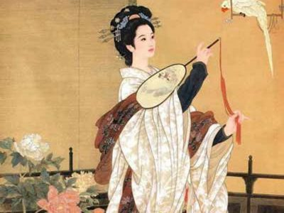
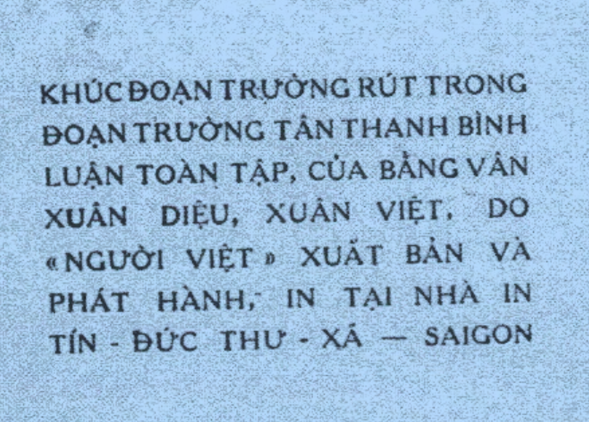

   

<!-- wp:heading {"align":"center","level":3} -->

<h3 class="has-text-align-center">Nghệ-thuât tuyệt vời</h3>

<!-- /wp:heading -->

<!-- wp:paragraph -->

Nghệ thuật là một phương châm ghi truyền cảm xúc và tư tưởng. Âm nhạc, văn chương, hội hoạ, điêu khắc, đều không ngoài định nghĩa đó. Riêng về nghệ-thuật văn chương, có ba thể khác nhau. Đem những cảm tưởng mình đã có, chung đức lại trong những câu ánh ngọc lung linh, như có luồng điện tiềm tàng ở trong, khiến người đọc bất giác lây những cảm-tưởng của mình, ấy là thể văn <em><strong>tao</strong> (1).</em>  Đem những tình sự đã cho mình cảm-tưởng, mô tả ra một cách tinh vi khúc chiết, như nguồn sống tụ trên mặt giấy, khiến cho người đọc tự nhiên phải nẩy ra những cảm tương như mình, ấy là thể văn <em><strong>thực(2)</strong></em>. Bày tỏ những lý lẽ rõ ràng như ánh sáng mặt trời mặt trãng, khiến người đọc tin theo mà tìm lấy những cảm tưởng như mình, ấy là thể văn <em>luận.</em> Trong ba thể văn ấy, đắc một thể nào, cũng đều đạt tới mục-đích của Nghệ-thuật.

<!-- /wp:paragraph -->

<!-- wp:paragraph -->

(1) Chữ "<em>tao</em>" mượn tiếng Ly-tao của Khuất-Nguyên, nhưng không hẳn là chỉ lối văn Sở từ<em>.</em> "Tao", dịch ra Pháp-văn, không phải là "lyrisme", mà là "communion directe" trực tiếp truyền cảm tưởng.

<!-- /wp:paragraph -->

<!-- wp:paragraph -->

(2) Chữ "<em>thực</em>" không phải như chữ "tả chân" đã có sẵn. Văn tả chân (réalisme) thấy sao viết vậy, như Thánh Thán nói, chỉ là đắp đất thành gò. Còn văn thực là sự sống tại lại trong vòng sự thực (la vie recrée dans le cadre de la vérité), ấy là một lối văn hoá-công.  

<!-- wp:paragraph -->

Nhà thi-sĩ hay làm thơ, nhà tiểu-thuyết năng viết truyện, nhà triết-học chuyên làm luận, thơ, truyện, luận tập mãi thành quen, sẽ như những đồ dùng ngoan ngoãn trong tay người thợ khéo.  Nhưng phô diễn cảm tưởng mà không hiểu cảm tưởng nguồn gốc bởi đâu, nhất lại không tự chủ được tâm hồn, thì nhà thi-sĩ chỉ như chiếc lá khô bạt gió. Mô tả tình sự mà không hiểu tình sự nguyên cớ vì sao, tả sự sống mà không hiểu lẽ sống, thì nhà tiểu-thuyết chẳng qua thu hình tiếng lại trả hình tiếng, làm một người máy không hồn. Bày tỏ lý lẽ mà không biết giới hạn của lý lẽ, lại không biết lý lẽ sẽ đưa đến chỗ tột cùng nào, thuyết được người nghe mà không hiểu được chính mình, thì nhà triết-học chỉ như con thuyền nước xoáy.

<!-- /wp:paragraph -->

<!-- wp:paragraph -->

Nghệ-thuật văn-chương, cũng như các Nghệ-thuật khác, đều phải lấy chữ <em><strong>giác</strong></em> làm đầu. Có <em><strong>giác</strong></em> thì nhà thi-sĩ mới thoát ra ngoài vòng cảm xúc, là cơn gió chứ không là lá khô. Có <em><strong>giác</strong></em> thì nhà tiểu-thuyết mới thấu đáo được tình sự, làm Hoá-công chứ không làm Người Máy. Có <em><strong>giác</strong> </em>thì nhà triết-học mới vượt được lên trên lý lẽ, làm bể cả chứ không làm con thuyền.

<!-- /wp:paragraph -->

<!-- wp:paragraph -->

GIÁC là gì ? Giác là biết; cái biết đi tới tột cùng thì bao trùm cả vũ trụ thời gian. Càng giác chừng nào thì Nghệ-thuật càng cao chừng ấy. Nhưng Nghệ-thuật chỉ là một phương châm của nhân loại (moyen humain) nên có định hạn cũng như hết thẩy mọi yếu tố ở đời này, mà sự Giác thì vô cùng vô tận, nên không cần phải giác đến tuyệt đích, đã có thể đạt đến Nghệ-thuật tuyệt vời.

<!-- /wp:paragraph -->

<!-- wp:paragraph -->

Trong bốn mươi tám câu thơ tả tâm tình một người thiếu-nữ trong sạch lâm chốn bùn nhơ, tác-giả Đoạn-trường Tân-thanh đã dạt tới Nghệ-thuật Tuyệt vời, cũng nhờ một chữ GIÁC.

<!-- /wp:paragraph -->

<!-- wp:paragraph -->

Tác-giả dùng lối văn tao, nhưng tao mà cũng có thực (2), cũng có luận. Hoàn toàn <em><strong>tao</strong></em> thì như câu: <em><strong>Giật mình, mình lại thương mình xót xa</strong></em>, nỗi đau đớn tự truyền thấm vào tâm hồn người đọc. <em>Tao </em>mà có <em>thực </em>thì như câu <em>"<strong>Nửa rèm tuyết ngậm, bốn bề trăng thâu</strong>"</em> cảnh bao la khiến người đọc nghĩ đến tự nhiên có cảm giác cô đơn mịt mùng. <em>Tao </em>mà có <em>luận </em>thì như câu "<em><strong>Ngừơi buồn cảnh có vui đâu bao giờ</strong>" </em>lời sáng suốt khiến cho người đọc phải nhận thấy là đúng, mà chia buồn với người trong cảnh. Song cái đau đớn, cái bao la, cái sáng suốt ấy chỉ là những trạng thái khác nhau của một tâm hồn giác ngộ. Nỗi đau đớn không còn là lời than thở mà là thuốc luyện tinh-thần, cảnh bao la không phải là tấm phông bày đặt mà là tầm xa nhỡn tuyến, lời sáng súốt không còn là lý luận mà là trường học của tư tưởng.

<!-- /wp:paragraph -->

<!-- wp:paragraph -->

Được như vậy là vì tác giả viết văn mà chủ được văn. "<em><strong>Giật mình, mình lại thương mình xót xa</strong></em> " nếu tác giả chưa qua những lúc giật mình,  chưa trên nỗi xót xa, thì tâm thần lay động, sao viết đươc câu văn thấm thía mà nhẹ nhàng như vây? 

<!-- /wp:paragraph -->

<!-- wp:paragraph -->

<em>"<strong>Nửa rèm tuyết ngậm bốn bề trăng thâu </strong>"</em> không vượt ra ngoài cảnh thì một vuông tuyết với mấy vùng trăng, sao tạo đươc nên câu thơ mênh mông bát ngát! "<em><strong>Ngừơi buồn cảnh có vui đâu bao giờ</strong>"</em> nếu tác-giả chỉ là một người phàm, bị cái buồn chi phối, thì câu văn lẩn quẩn trong lời nói đâu có thành nghĩa lý muôn thu?

<!-- /wp:paragraph -->

<!-- wp:paragraph -->

Tác-giả thâm hiểu lẽ sống ở đời cùng sự huyền vi của Tạo Hoá, nên mỗi chữ của tác-giả viết ra đều mang một linh hồn, mỗi câu của tác-giả viết ra, như một cửa sổ trông sang thế giới vô cùng.

<!-- /wp:paragraph -->

<!-- wp:heading {"level":4} -->

<h4>... Văn chương toàn bích.</h4>

<!-- /wp:heading -->

<!-- wp:paragraph -->

Vừa mở lời lên, " <em><strong>Lầu xanh mới rủ trướng đào</strong></em> ", lồ lộ như tấm trăng hồng trên nệm biếc, khiến cho muôn mắt phải nhìn. Rồi " <em><strong>bướm lả ong lơi</strong></em> ", "<em><strong>cành chim</strong></em> <em><strong>lá gió </strong></em> ",  tả những thú say sưa cười cợt, những sự đưa đón trai tơ, ngang tàng rất mực mà phong lưu rất mực ! Không ngờ " <em><strong>Khi tỉnh rượu, lúc tan canh</strong></em> " lại " <em><strong>giật mình xót xa</strong></em> " ngay đấy ! Muôn mắt đã nhìn, đến đây sấm nổ ngang trời, muôn tai lại nghe. Tiếp theo là cả một thiên lệ sử trong bốn câu thơ, thục nữ thanh cao mà ra " <em><strong>sương gió bướm ong</strong></em> ", như " <strong><em>hoa giữa đường tan tác</em></strong> ".

<!-- /wp:paragraph -->

<!-- wp:paragraph -->

Nhưng " <em><strong>Mặc người mưa Sở mây Tần</strong></em>, <em><strong>Những mình nào biết có xuân là gì</strong></em> " ấy là nước đục nẩy phù dung, hang sâu ngời ngọc sáng.  Bạn tài tử đã biết có châu lành hoa quý, dẫu vượt trăm sông nghìn núi để tìm tới thưởng thức cũng chẳng quản công. Huống chỉ bước lên vài bước đã thấy những cảnh gió hoa mơn trớn, tuyết nguyệt bao la, mà trong nguyệt dưới hoa, lại là những thú cầm kỳ thi hoạ. Nhưng cảnh đẹp mà chẳng khuây sầu, thú vui chỉ là vui gượng, người giai-nhân hẳn có tâm sự riêng chi.

<!-- /wp:paragraph -->

<!-- wp:paragraph -->

Được nghe câu tâm sự của người ấy chẳng là hữu hạnh ru ! Nhớ đức mẹ cha, xa xôi không quên người cũ, đành phận mình mà mong chắp nối duyên em, ấy là người có tình nghĩa, đáng quí đáng yêu. Giai nhân như thế mà mãi chịu " <em><strong>canh dài đòi đoạn vò tơ</strong></em> " thật là vô lý, mà bọn khách du dễ thường không ai người có mắt ?

<!-- /wp:paragraph -->

<!-- wp:paragraph -->

Nhưng sự vô lý chính có cái lý cao xa, mà bọn không có mắt lại là đa số ở đời này, nên Thuý-Kiều mới phải "<em><strong> song sa vò võ </strong></em>", mà tác-giả mới đem kiếp đoạn trường, muôn đời gửi trên tờ giấy.

<!-- /wp:paragraph -->

<!-- wp:paragraph -->

Từ " <em><strong>phương trời</strong></em>" tác-giả hạ xuống "<em><strong>hoàng hôn hôn hoàng"</strong></em>, con mắt nhìn xa, tấm lòng thấy rộng, thốt ra lời văn, thu được cả không gian thời gian vào ngọn bút.  " <em><strong>Thỏ bạc, ác vàng</strong></em>" tiếp ngay xuống " <em><strong>Xót người trong hội đoạn tràng đòi cơn</strong></em> " nghĩa dường hai mà câu văn như một, trên trời đau thương, mặt giăng mặt giời ngậm ngùi liên tiếp, một lòng son mà vũ trụ lung lay. " <em><strong>Đã cho lấy chữ hồng nhan, Làm cho, cho hại, cho tàn, cho cân </strong></em>" thì chẳng những "<em><strong>huyền nhật nguyệt</strong></em>" mà thôi, còn am hiểu lẽ sâu xa thân phận con người, thay cả quyền Trời, cầm cân Tạo-hoá. Đến hai câu " <em><strong>Đã đầy vào kiếp phong trần, Sao cho sỉ nhục</strong></em> <em><strong>một lần mới thôi !</strong></em>", tinh thần siêu việt, nghĩa lý vô cùng, thân không ở trên kiếp phong trần sỉ nhục, lòng không thấu hiểu sự lý muôn thu, viết sao được những câu văn lạ lùng ghê gớm ấy.

<!-- /wp:paragraph -->

<!-- wp:heading {"align":"center","level":4} -->

<h4 class="has-text-align-center">Khúc Đoạn Trường</h4>

<!-- /wp:heading -->

<!-- wp:paragraph -->

Tâu có Sở từ của <a href="/2020/05/01/ly-tao-khuat-nguyen/" target="_blank">Khuất-Nguyên</a>, 
Tương tiến tửu của <a href="/2020/05/01/tuong-tien-tuu-ly-bach/" target="_blank">Lý Bạch</a>, 
Xích-Bích phú của <a href="/2020/05/01/tien-xich-bich-phu/" target="_blank">Tô-đông-Pha</a>, 
Trường-hận ca của <a href="/2020/05/01/truong-han-ca/" target="_blank">Bạch-cư-Dị</a>, 
ta có <a href="/2020/05/01/khuc-doan-truong-nguyen-du/" target="_blank">Khúc Đoạn-Trường</a>.

<!-- wp:paragraph -->

Thi ca từ phú của Tầu thì nhiều, ngâm khúc của ta thì ít, song giá bắc lên cân, cho họ ném vào hết những trường ca trường phú của họ, ta chỉ đưa ra một Khúc Đoạn-Trường, nếu cán cân chưa chếch hẳn về ta, thì cũng chẳng sao nghiêng được về họ.

<!-- /wp:paragraph -->

<!-- wp:paragraph -->

Khúc Đoạn-Trường là gì ? Chính là đoạn văn lục bát của Tố Như, tả cảnh ngộ cô Kiều trong chốn lầu xanh. Bằng-Vân mượn hai chữ Đoạn-trường của tác-giả, xem đặt tên cho một khúc, ví như trái tim của toàn thiên.

<!-- /wp:paragraph -->

<!-- wp:paragraph -->

Ly-Tao từ thanh cao, Tương tiến tửu ngang tàng, Xích Bích phú thì được vẻ sảng khoái, Trường hận ca thì được vẻ phong lưu, nhưng Khúc Đoạn Trường vừa xót xa vừa thấm thía, vừa cao quý vừa mỉa mai. Sở Khuất Nguyên trung mà bị đuổi, đành trọn đời đeo sầu chứ không thay đỏi lòng theo tục, thế là thanh cao: nhưng gái lầu xanh thân là thân phong gấm rủ là, phút chốc lạc đàn mang lấy nợ yến anh, cảnh ngộ xót xa biết mấy ! Lý Thái Bạch say dài chẳng tỉnh, chung cổ không mong, thánh hiền không vọng, thật đã ngang tàng, nhưng gái lầu xanh thân làm kẻ bán vui mà không biết đén cái xuân, cảnh đẹp chẳng màng, tri âm chẳng tưởng, lòng đau thấm thía bao nhiêu ! Như Tô-Đông-Pha sao lãng lợi danh mà chơi gió chơi giăng, sảng khoái hơn người, nhưng gái lầu xanh buồn trong gió trăng hoa tuyết, gượng lúc thơ hoạ cầm cờ, lòng trong trắng thương thân dày dạn,  dạ ngẩn ngơ bên hiếu bên tình, tâm hồn cao quý như vậy lại không hơn cái sảng khoái dễ dàng kia sao ? Như Bạch Lạc Thiên ca ngợi sắc đẹp của Dương-Phi, tình yêu của Minh-Hoàng, phong lưu ít có, nhưng Tố-Như thương cảm tài hoa, làm truyện Thuý-Kiều, giá này dẫu đúc nhà vàng cũng nên, thế mà chỉ vì con tạo ghét ghen, đén nỗi phong trần cũng phong trần như ai, ý nghĩa mỉa mai há lại không hơn cái phong lưu hời hợt ? Huống chi trên những nỗi xót xa thấm thía, lại là một tâm hồn bao la bất diệt, mà trọng cái vẻ cao quý mỉa mai, lại ngụ một triết lý sâu sắc vô cùng.

<!-- /wp:paragraph -->

<!-- wp:paragraph -->

Khúc Đoạn-Trường của ta nghệ-thuật tuyệt vời, văn chương toàn bích, trên trang giấy lộ ra một ngọn bút nhọn sắc như gươm, trong câu thơ có ẩn một bản lĩnh phi thường đáng sợ.  Vậy mà sao từ trước tới nay, ta không hề dám so sánh với những thi ca từ phú của Tàu ? Có gì đâu ! Chẳng qua là những chấm lửa hồng trong đêm tối thì ai ai cũng nhìn, mà muôn sao vằng vặc trên không, thì mấy ai để ý. Sở từ, Nhạc phủ, Xích Bích, Trường hận chỉ là những chấm lửa hồng, còn Khúc Đoạn-trường ở giữa vòm tinh tú.  Ta sống dưới trời sao bát ngát mênh mông, nếu không biết ngẩng mặt nhìn lên, chỉ một mực theo đóm ăn tàn, đèn nhà không rạng, thì chẳng đáng buồn sao ?

<!-- /wp:paragraph -->

<!-- wp:paragraph -->

Ôi ! Khúc Đoạn-Trường của ta tuyệt diệu như vậy, Đoạn trường tân thanh của ta bao la như vậy, thử hỏi ta đã làm gì để xứng với hạnh phúc của ta ? Trả lời câu hỏi ấy, tất là ta phải khóc. Xuân-Diệu trước ta đã có ý "<em><strong>khấp Tố Như</strong></em>" Xuân-Việt thì từ bao giờ vẫn khóc, lệ hai người ấy như dòng ngân và suối lưả, nay gom cùng nước mắt ta. Chắc rằng càng khóc với ta, còn bao nhiêu người Việt, nhưng khóc sao cho không phí giọt hồng, dàn được hai bờ Cửu-Long chan chứa.

<!-- /wp:paragraph -->

<!-- wp:image {"id":971,"sizeSlug":"large"} -->

<!-- /wp:image -->

<!-- wp:paragraph {"align":"center"} -->

   
