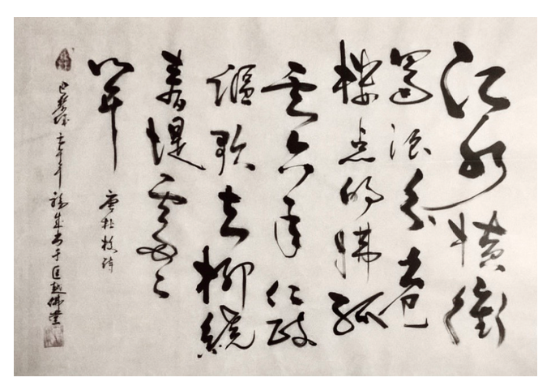
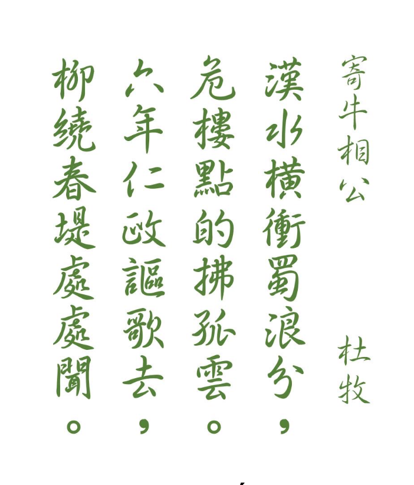

Ký Ngưu tướng công - Đường Đỗ Mục thi - 841\
Ba lê thành Nhâm Ngọ niên, Phước-Thành thư vu Khuông Việt phật đường

### ***Lời giải của ông Trần văn Chánh***

*Bài thơ của Đỗ Mục viết chữ thảo, đọc ra chữ chân phương như sau:* 

漢 水 橫 衝 蜀 浪 分,  
危 樓 點 的 拂 孤 雲.  
六 年 仁 政 謳 歌 去,  
柳 繞 春 堤 處 處 聞  

*Phần lạc khoản ghi:* 

Đường Đỗ Mục thi *(= Thơ Đỗ Mục thời Đường)*
Ba lê thành Nhâm Ngọ niên *(= Paris năm Nhâm Ngọ)*

Phước Thành thư vu Khuông Việt Phật đường *(= Phước Thành viết tại chùa Khuông Việt)*

### **PHIÊN ÂM BÀI THƠ:**

Hán thủy hoành xung Thục lãng phân   
Nguy lâu điểm đích phất cô vân   
Lục niên nhân chính âu ca khứ   
Liễu nhiễu xuân đê xứ xứ văn.  

### **TẠM DỊCH NGHĨA:**

Sông Hán xông ngang phân chia sóng đất Thục  
Ngôi lầu cao trông như cái chấm nhỏ màu trắng lướt qua đám mây lẻ loi   
Tiếng âu ca trong sáu năm thi hành chính sách nhân hậu [của Ngưu tướng công]   
Nơi rặng liễu quanh con đê mùa xuân, khắp chốn đều nghe.  

**CHÚ THÍCH:**

1. Bài thơ này có nhan đề là “Ký Ngưu tướng công” (Gởi tướng công họ Ngưu tức Ngưu
Tăng Nho), sáng tác trong năm Hội Xương nguyên niên thời Đường Vũ Tông (năm 841)
để ca ngợi công đức, thành tích chính trị của họ Ngưu (năm 841 là năm xảy ra sự kiện
sông Hán tràn đê làm ngập thành quách, Lý Đức Dụ đổ tội và giáng chức Ngưu Tăng
Nho).
2. Hai chữ đầu bài thơ, bản chữ thảo viết “江水” (Giang thủy = sông Trường Giang),
nhưng bản gốc bài thơ của Đỗ Mục là “漢水” (Hán thủy = sông Hán). Sông Hán là một
nhánh lớn nhất của Trường Giang.
3. Chữ 繞 (nhiễu) ở câu thơ cuối, có bản viết khác là 遠 (viễn). Chữ 繞 (nhiễu) này còn
có dạng viết khác là 遶.

***

  
### ***Bản của thày Hằng Trường :*** ++++

