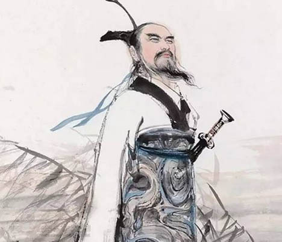

   
*Ly-Tao* 
Sở Khuất Nguyên trung mà bị đuổi, đành trọn đời đeo sầu chứ không thay đỏi lòng theo tục, thế là thanh cao: nhưng gái lầu xanh thân là thân phong gấm rủ là, phút chốc lạc đàn mang lấy nợ yến anh, cảnh ngộ xót xa biết mấy !  
**Bằng Vân** - *Khúc Đoạn-Trường Lời bình luận toàn khúc*   

***

*Ly tao* là tác phẩm tiêu biểu của Khuất Nguyên, là bài thơ lãng mạn-trữ tình-tự thuật đầu tiên và lớn nhất trong lịch sử văn học Trung Quốc. *Ly tao* nổi tiếng đến mức người Trung Quốc về sau coi đó là đại biểu của thơ ca. Họ gọi nhà thơ, nhà văn là “*tao nhân*, mạc khách” (ở Việt Nam ta trước đây cũng quan niệm như vậy, nên Lê Thánh Tông gọi thi đàn do mình sáng lập là “Tao đàn”, và Thế Lữ trong bài *Cây đàn muôn điệu* đã viết *“Mượn cây bút nàng Ly tao tôi vẽ...”*). Về chữ *Ly tao* có nhiều cách giải thích. Chu Bích Liên, trong sách *Cổ thi hải*, kết hợp ý kiến của nhiều nhà nghiên cứu, lý giải rằng: *Ly tao* nguyên là một điệu dân ca nước Sở, thích hợp với việc thể hiện những nỗi uất ức, bất bình; vì thế nhà thơ Khuất Nguyên khi bị vua Sở đầy ải đã dùng *Ly tao* làm đề để trữ phát những nỗi đau buồn day dứt uất kết trong lòng, đồng thời nói lên lý tưởng mà mình hoài bão. Ở ta, thông thường vẫn hiểu chữ “ly tao” theo cách chú giải của Vương Dật (người cuối đời Ðông Hán): *“Ly tao - nỗi sầu ly biệt”*. Chú như vậy cũng thông (có thể đây là nguyên nghĩa của *Ly tao* trong *Sở điệu*).

#### Tâm sự Khuất Nguyên

Lương Khải Siêu, một danh sĩ cuối đời Thanh, nói: “Đầu óc Khuất Nguyên chứa 2 nguyên tố mâu thuẫn nhau: một là lý tưởng thì cực kỳ cao thượng, hai là cảm tình thì cực kỳ nhiệt liệt”.

Vì tâm hồn cao khiết, không chịu tuỳ thời, a dua nên gặp nghịch cảnh, Khuất Nguyên không dùng được tài để cứu dân, cứu nước, chỉ thố lộ những lời ai oán, như:

哀民生之多難兮， 長太息以掩涕。  
*Ai dân sinh chi đa nạn hề, Trường thái tức dĩ yếm thế.*  
Buồn cho dân gặp nhiều nạn hề, Ta thở dài, che nước mắt.

豈余身之憚殃兮， 恐皇輿之敗績。  
*Khởi dư thân chi đạn ương hề, Khủng ho{ng dư chi bại tích.*   
Ta nào sợ chết hề, Lo cho triều đình suy sụp.

Giọng thê thảm, nhưng ông vẫn tự cao:

高余冠之岌岌兮， 長余佩之陸離;  
*Cao dư quan chi ngập ngập hề, Trường dư bội chi lục ly.*  
Mũ ta cao mà ngất ngưỡng hề, Bội ta dài và sặc sỡ.

vẫn sửa mình, giữ đạo cho tới chết mới thôi:

Đã không được vua dùng, trên đời cô độc, không ai giống mình, thì tìm tới nơi rừng sâu, hang thẳm để bạn với hưu nai:

民生各有所樂兮， 余獨好修以為恆。 雖體解吾猶未變兮， 豈余心之可懲?  
*Dân sinh các hữu sở nhạo hề, Dư độc hiếu tu dĩ vi hằng.  
Tuy thế giải ngô do vị biến hề, Khởi dư tâm chi khả trừng?*

Ai có vui của người nấy hề, Ta riêng lấy sửa mình làm đạo thường.   
Tuy thân nát, chí ta không biến hề, Há lòng sợ chết mà ngại ngùng?

國無人，莫吾知兮，   
又何懷乎故都?   
既莫足與為美政兮，  
吾將從彭，咸之所居。

*Quốc vô nhân, mạc ngô tri hề,  
Hựu hà hoài hồ cố đô?  
Ký mạc túc dữ vi mỹ chính hề,  
Ngô tương tòng Bành, Hàm chi sở cư.*

Nước không người, chẳng ai biết ta hề,   
Thì còn nhớ tiếc gì cố đô?  
Đã chẳng được cùng sửa mỹ chính hề,   
Ta theo Bành, Hàm mà ẩn cư.

Nhưng lòng ái quốc của ông nồng nàn quá, tuy oán hờn nhà vua mà vẫn còn luyến tiếc, đã nhất định bỏ đi rồi mà khi quay lại nhìn cố hương thì lại ngậm ngùi; đến con ngựa của ông, như cùng một tâm sự với ông, cũng dùng dằng, không muốn bước tới:

忽臨睨夫舊鄉。  
僕夫悲，餘馬懷兮，  
蜷局，顧而不行。

*Hốt lâm nghễ phù cựu hương.   
Bộc phù bi, dư mã hoài hề,   
Quyền cục, cố nhi bất hành.*

Hốt nhìn làng cũ rầu rầu,  
Ta buồn, ngựa cũng quay đầu không đi.

Một lòng trung trinh, muốn giúp nước mà không được, thân trong sạch làu làu mà sống ở đời ô trọc, thì chỉ còn mỗi giải pháp là “gieo mình xuống sông Mịch La, chôn thân vào bụng cá”.

赴湘流，葬於江魚之腹中  
*(Phó Tương lưu, tàng ư giang ngư chi phúc trung)*.

#### Văn của Khuất Nguyên 

Tác phẩm bất hủ của ông là thiên Ly tao (nghĩa là xa vua mà buồn), một bài trường thiên 370 câu tả tâm sự ông. Đặc sắc của thiên ấy là lời triền miên bi thảm, thường dùng phép tượng trưng, phép nhân cách hỏi và dẫn rất nhiều thần thoại.

Tình cảm ông thay đổi kỳ dị: mới vui đó đã buồn, mới cười đó đã khóc; mới muốn đi xa lại đổi ý, đòi lên chầu Thượng Đế, rồi lại muốn bói, muốn trở về cố hương; muốn tự tử. Thật là chân tình, mỗi chữ là một tiếng thở dài, một giọt nước mắt; ít thấy văn nhân nào đau khổ, thác loạn đến mức vậy.  
**Nguyễn Hiến Lê** - *Đai cương văn học sử Trung quốc*   

***

[Link~> Trang thơ Khuất-Nguyên **Ly Tao** trên Thi Viện](https://www.thivien.net/Khu%E1%BA%A5t-Nguy%C3%AAn/Ly-tao/poem-lRoe60dlSbBq5oc1ZRJWhQ){:target="_blank"}      

   
### Nỗi sầu ly biệt      
   
   
Bá Dung nhớ cha ta thuở nọ,  
Vốn dòng vua về họ Cao Dương.  
Tháng giêng đầu tiết xuân sang,  
Cõi đời ta xuống, giữa đương ngày Dần.  
...   

Cất mình khoảng trời mây rộng rãi,  
Chợt ngoảnh đầu trông lại quê hương.  
Ngựa buồn, đầy tớ thảm thương,  
Co ro nhớn nhác, ngại đường chẳng đi.  
Vãn rằng:  
Thôi than tiếc làm chi cho cực!   
Biết ta đâu một nước không người.  
Chính lành làm sức với ai,  
Bành Hàm đâu đó ta thời đi theo.  

___

####  Nguyễn Hiến Lê - Đại Cương Văn Học Sử Trung Quốc
   

Bài Thiên vấn (hỏi trời) cũng là một kỳ văn, kém Ly tao về phương diện nghệ thuật nhưng giọng lâm ly cùng cực: ông hỏi Trời một hơi 172 câu. Sức tưởng tượng của ông thật vô địch.   

Dưới đây chúng tôi xin chép thiên Thiệp giang 涉江 mà Phan Kế Bính đã dịch trong Việt Hán văn khảo.       
   
   
[Link ~> Trang thơ Khuất-Nguyên **Thiệp-Giang** trên Thi Viên](https://www.thivien.net/Khu%E1%BA%A5t-Nguy%C3%AAn/Thi%E1%BB%87p-giang/poem-csh8ujkV1cSEGuoKbE1Ufg){:target="_blank"}        
   

<h4><strong><a rel="noreferrer noopener" target="_blank" href="https://hvdic.thivien.net/whv/%E6%B6%89">涉</a><a rel="noreferrer noopener" target="_blank" href="https://hvdic.thivien.net/whv/%E6%B1%9F">江</a>&nbsp;&nbsp; Thiệp giang </strong></h4>

<a rel="noreferrer noopener" target="_blank" href="https://hvdic.thivien.net/whv/%E4%BD%99">余</a><a rel="noreferrer noopener" target="_blank" href="https://hvdic.thivien.net/whv/%E5%B9%BC">幼</a><a rel="noreferrer noopener" target="_blank" href="https://hvdic.thivien.net/whv/%E5%A5%BD">好</a><a rel="noreferrer noopener" target="_blank" href="https://hvdic.thivien.net/whv/%E6%AD%A4">此</a><a rel="noreferrer noopener" target="_blank" href="https://hvdic.thivien.net/whv/%E5%A5%87">奇</a><a rel="noreferrer noopener" target="_blank" href="https://hvdic.thivien.net/whv/%E6%9C%8D">服</a><a rel="noreferrer noopener" target="_blank" href="https://hvdic.thivien.net/whv/%E5%85%AE">兮</a>， Dư ấu hiếu thử kỳ phục hề, <a rel="noreferrer noopener" target="_blank" href="https://hvdic.thivien.net/whv/%E5%B9%B4">年</a><a rel="noreferrer noopener" target="_blank" href="https://hvdic.thivien.net/whv/%E6%97%A2">既</a><a rel="noreferrer noopener" target="_blank" href="https://hvdic.thivien.net/whv/%E8%80%81">老</a><a rel="noreferrer noopener" target="_blank" href="https://hvdic.thivien.net/whv/%E8%80%8C">而</a><a rel="noreferrer noopener" target="_blank" href="https://hvdic.thivien.net/whv/%E4%B8%8D">不</a><a rel="noreferrer noopener" target="_blank" href="https://hvdic.thivien.net/whv/%E8%A1%B0">衰</a>。 Niên ký lão nhi bất thôi. <a rel="noreferrer noopener" target="_blank" href="https://hvdic.thivien.net/whv/%E5%B8%A6">带</a><a rel="noreferrer noopener" target="_blank" href="https://hvdic.thivien.net/whv/%E9%95%BF">长</a><a rel="noreferrer noopener" target="_blank" href="https://hvdic.thivien.net/whv/%E9%93%97">铗</a><a rel="noreferrer noopener" target="_blank" href="https://hvdic.thivien.net/whv/%E4%B9%8B">之</a><a rel="noreferrer noopener" target="_blank" href="https://hvdic.thivien.net/whv/%E9%99%86">陆</a><a rel="noreferrer noopener" target="_blank" href="https://hvdic.thivien.net/whv/%E7%A6%BB">离</a><a rel="noreferrer noopener" target="_blank" href="https://hvdic.thivien.net/whv/%E5%85%AE">兮</a>， Đới trường giáp chi lục ly hề, <a rel="noreferrer noopener" target="_blank" href="https://hvdic.thivien.net/whv/%E5%86%A0">冠</a><a rel="noreferrer noopener" target="_blank" href="https://hvdic.thivien.net/whv/%E5%88%87">切</a><a rel="noreferrer noopener" target="_blank" href="https://hvdic.thivien.net/whv/%E4%BA%91">云</a><a rel="noreferrer noopener" target="_blank" href="https://hvdic.thivien.net/whv/%E4%B9%8B">之</a><a rel="noreferrer noopener" target="_blank" href="https://hvdic.thivien.net/whv/%E5%B4%94">崔</a><a rel="noreferrer noopener" target="_blank" href="https://hvdic.thivien.net/whv/%E5%B7%8D">巍</a>。 Quan thiết vân chi thôi nguy. <a rel="noreferrer noopener" target="_blank" href="https://hvdic.thivien.net/whv/%E8%A2%AB">被</a><a rel="noreferrer noopener" target="_blank" href="https://hvdic.thivien.net/whv/%E6%98%8E">明</a><a rel="noreferrer noopener" target="_blank" href="https://hvdic.thivien.net/whv/%E6%9C%88">月</a><a rel="noreferrer noopener" target="_blank" href="https://hvdic.thivien.net/whv/%E5%85%AE">兮</a>， Bị minh nguyệt hề, <a rel="noreferrer noopener" target="_blank" href="https://hvdic.thivien.net/whv/%E4%BD%A9">佩</a><a rel="noreferrer noopener" target="_blank" href="https://hvdic.thivien.net/whv/%E5%AE%9D">宝</a><a rel="noreferrer noopener" target="_blank" href="https://hvdic.thivien.net/whv/%E7%92%90">璐</a>。 Bội bảo lộ.  ... Ngô hựu hà oán hồ kim chi nhân! <a rel="noreferrer noopener" target="_blank" href="https://hvdic.thivien.net/whv/%E4%BD%99">余</a><a rel="noreferrer noopener" target="_blank" href="https://hvdic.thivien.net/whv/%E5%B0%86">将</a><a rel="noreferrer noopener" target="_blank" href="https://hvdic.thivien.net/whv/%E8%91%A3">董</a><a rel="noreferrer noopener" target="_blank" href="https://hvdic.thivien.net/whv/%E9%81%93">道</a><a rel="noreferrer noopener" target="_blank" href="https://hvdic.thivien.net/whv/%E8%80%8C">而</a><a rel="noreferrer noopener" target="_blank" href="https://hvdic.thivien.net/whv/%E4%B8%8D">不</a><a rel="noreferrer noopener" target="_blank" href="https://hvdic.thivien.net/whv/%E8%B1%AB">豫</a><a rel="noreferrer noopener" target="_blank" href="https://hvdic.thivien.net/whv/%E5%85%AE">兮</a>， Dư tương đổng đạo nhi bất dự hề,

<h4>Bản dịch của&nbsp;<a href="https://www.thivien.net/Phan-K%E1%BA%BF-B%C3%ADnh/author-KQ-W_-0cP1Hf9gF4O23nzQ">Phan Kế Bính</a> <strong><em>Qua sông</em></strong></h4>

  
    
  Ta thuở nhỏ ưa mặc đồ lạ hề,  
  Tuổi đã già mà chưa thôi.  
  Đeo gươm dài chi lấp lánh hề,  
  Đội mũ “thiết vân” chi cao lồi.  
  Châu “minh nguyệt” hề ta đeo,  
  Ngọc “bảo lộ” hề ta có.  
   ...   
  Đời đục vẩn mà không ai biết ta hề,  
  Ta cứ ruổi mau mà chẳng ngó.  

***

Nguồn:  
1. Phan Kế Bính, *Việt Hán văn khảo*, Nam Ký xuất bản, 1938  
2. Dương Quảng Hàm, *Việt Nam văn học sử yếu*, Trung tâm học liệu xuất bản, 1968
