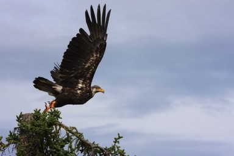

A shell command that earned his programmer $500 in less than 5 minutes:  

`$ find pictures/ -type f -iname '*.jpg' | xargs -I '{}' convert '{}' -resize 150x150 -quality 100 '{}'.png`  
This single command line created thumbnails of the more than 20,000 images a photographer had in his portfolio. He already had exported them manually to JPG, only to find out that he actually needed PNGs of 150px max in each dimension.

`$ find pictures/ -type f -iname '*.jpg' -exec rm {} \;`

Let’s break down these commands:

* `find` [^1] is a command that searches for files and directories, optionally matching certain criteria.
pictures/ tells find where to start its search.
* `type f` is the first search criterion: it tells find to only look for files
* `iname ‘*.jpg’` tells find the second search criterion: do a case insensitive search for all files ending with`.jpg`. The case insensitivity causes this criterion to also match `.JPG` or `.jpg`
* `The |`, called the pipe symbol, causes the shell to pipe the output of the command on its left hand side to be used as the input of the command of the right hand side.
* `xargs` [^2] executes the command given as its arguments to be executed for each line of input.
* `I ‘{}’` instructs xargs to replace every occurrence of ‘{}’ in the arguments that follow with the content of the current line of the input.
* `convert` [^3] is part of the ImageMagick image manipulation package.
* `‘{}’` will be replaced by the content of the current line of the input. Say, the first file `find` found is `pictures/aaa_first.jpg` the effective command for this iteration of xargs would read convert pictures/aaa_first.jpg ...
* `resize ` instructs convert to change the size of the image at hand to a maximum size pf 150x150, while maintaining the aspect ratio. So, for example if the original picture was 300 x 200, the resulting picture would be 150x100. If the original size was 150x300, the dimensions of the converted image would be 75x150.
* `quality 100` instructs convert to generate with the best quality it can achieve. Sometimes, you do not need (or even want) full quality images, for example for previews. In this case, you could set -quality 80.
* `‘{}’.png` tells convert where to save the output to. In this example, to pictures/aaa_first.jpg.png As convert is rather smart and detects the image type of the original JPG, it knows that it is supposed to write the output file in PNG format.  

Footnotes:

[^1]: find(1)  Linux man page
[^2]: xargs(1): build/execute from stdin
[^3]: convert(1) - Linux man page
