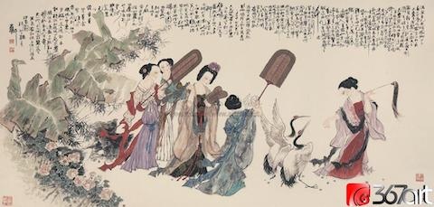

 
Như Bạch Lạc Thiên ca ngợi sắc đẹp của Dương-Phi, tình yêu của Minh-Hoàng, phong lưu ít có, nhưng Tố-Như thương cảm tài hoa, làm truyện Thuý-Kiều, giá này dẫu đúc nhà vàng cũng nên, thế mà chỉ vì con tạo ghét ghen, đén nỗi phong trần cũng phong trần như ai, ý nghĩa mỉa mai há lại không hơn cái phong lưu hời hợt ?

**Bằng Vân** *Khúc Đoạn-Trường Lời bình luận toàn khúc*

#### **[長](https://hvdic.thivien.net/whv/%E9%95%B7)[恨](https://hvdic.thivien.net/whv/%E6%81%A8)[歌](https://hvdic.thivien.net/whv/%E6%AD%8C)&nbsp;&nbsp;(Cheng hen ge - Bai Juyi)  &#13;&#10;Trường hận ca**

[漢](https://hvdic.thivien.net/whv/%E6%BC%A2)[皇](https://hvdic.thivien.net/whv/%E7%9A%87)[重](https://hvdic.thivien.net/whv/%E9%87%8D)[色](https://hvdic.thivien.net/whv/%E8%89%B2)[思](https://hvdic.thivien.net/whv/%E6%80%9D)[傾](https://hvdic.thivien.net/whv/%E5%82%BE)[國](https://hvdic.thivien.net/whv/%E5%9C%8B)，  
Hán hoàng&nbsp;trọng sắc tư khuynh quốc  
*Vua Hán trọng sắc đẹp, muốn có một người nghiêng nước nghiêng thành*

[御](https://hvdic.thivien.net/whv/%E5%BE%A1)[宇](https://hvdic.thivien.net/whv/%E5%AE%87)[多](https://hvdic.thivien.net/whv/%E5%A4%9A)[年](https://hvdic.thivien.net/whv/%E5%B9%B4)[求](https://hvdic.thivien.net/whv/%E6%B1%82)[不](https://hvdic.thivien.net/whv/%E4%B8%8D)[得](https://hvdic.thivien.net/whv/%E5%BE%97)。  
Ngự vũ đa niên cầu bất đắc  
*Ở ngôi bao năm tìm kiếm không được*

[楊](https://hvdic.thivien.net/whv/%E6%A5%8A)[家](https://hvdic.thivien.net/whv/%E5%AE%B6)[有](https://hvdic.thivien.net/whv/%E6%9C%89)[女](https://hvdic.thivien.net/whv/%E5%A5%B3)[初](https://hvdic.thivien.net/whv/%E5%88%9D)[長](https://hvdic.thivien.net/whv/%E9%95%B7)[成](https://hvdic.thivien.net/whv/%E6%88%90)，  
Dương gia hữu nữ sơ trưởng thành  
*Họ Dương có cô gái mới lớn lên*

[養](https://hvdic.thivien.net/whv/%E9%A4%8A)[在](https://hvdic.thivien.net/whv/%E5%9C%A8)[深](https://hvdic.thivien.net/whv/%E6%B7%B1)[閨](https://hvdic.thivien.net/whv/%E9%96%A8)[人](https://hvdic.thivien.net/whv/%E4%BA%BA)[未](https://hvdic.thivien.net/whv/%E6%9C%AA)[識](https://hvdic.thivien.net/whv/%E8%AD%98)。  
Dưỡng tại thâm khuê nhân vị thức  
*Nuôi dạy ở nơi buồng the, người ngoài chưa ai biết*

[天](https://hvdic.thivien.net/whv/%E5%A4%A9)[生](https://hvdic.thivien.net/whv/%E7%94%9F)[麗](https://hvdic.thivien.net/whv/%E9%BA%97)[質](https://hvdic.thivien.net/whv/%E8%B3%AA)[難](https://hvdic.thivien.net/whv/%E9%9B%A3)[自](https://hvdic.thivien.net/whv/%E8%87%AA)[棄](https://hvdic.thivien.net/whv/%E6%A3%84)，  
Thiên sinh lệ chất nan tự khí  
*Vẻ đẹp trời sinh khó tự bỏ hoài,*

[一](https://hvdic.thivien.net/whv/%E4%B8%80)[朝](https://hvdic.thivien.net/whv/%E6%9C%9D)[選](https://hvdic.thivien.net/whv/%E9%81%B8)[在](https://hvdic.thivien.net/whv/%E5%9C%A8)[君](https://hvdic.thivien.net/whv/%E5%90%9B)[王](https://hvdic.thivien.net/whv/%E7%8E%8B)[側](https://hvdic.thivien.net/whv/%E5%81%B4)。  
Nhất triêu tuyển tại quân vương trắc  
*Một sớm được tuyển vào bên vua*

[回](https://hvdic.thivien.net/whv/%E5%9B%9E)[眸](https://hvdic.thivien.net/whv/%E7%9C%B8)[一](https://hvdic.thivien.net/whv/%E4%B8%80)[笑](https://hvdic.thivien.net/whv/%E7%AC%91)[百](https://hvdic.thivien.net/whv/%E7%99%BE)[媚](https://hvdic.thivien.net/whv/%E5%AA%9A)[生](https://hvdic.thivien.net/whv/%E7%94%9F)，  
Hồi mâu nhất tiếu bách mị sinh  
*Mỗi lần ngoành mặt, nhoẻn cười lộ ra trăm vẻ đáng yêu*

[六](https://hvdic.thivien.net/whv/%E5%85%AD)[宮](https://hvdic.thivien.net/whv/%E5%AE%AE)[粉](https://hvdic.thivien.net/whv/%E7%B2%89)[黛](https://hvdic.thivien.net/whv/%E9%BB%9B)[無](https://hvdic.thivien.net/whv/%E7%84%A1)[顏](https://hvdic.thivien.net/whv/%E9%A1%8F)[色](https://hvdic.thivien.net/whv/%E8%89%B2)。  
Lục cung&nbsp;phấn đại vô nhan sắc  
*Sáu cung son phấn không còn ai đáng gọi là có nhan sắc nữa*

[春](https://hvdic.thivien.net/whv/%E6%98%A5)[寒](https://hvdic.thivien.net/whv/%E5%AF%92)[賜](https://hvdic.thivien.net/whv/%E8%B3%9C)[浴](https://hvdic.thivien.net/whv/%E6%B5%B4)[華](https://hvdic.thivien.net/whv/%E8%8F%AF)[清](https://hvdic.thivien.net/whv/%E6%B8%85)[池](https://hvdic.thivien.net/whv/%E6%B1%A0)，  
Xuân hàn tứ dục&nbsp;Hoa Thanh&nbsp;trì  
*Tiết xuân lạnh, được tắm ở hồ Hoa Thanh*

[溫](https://hvdic.thivien.net/whv/%E6%BA%AB)[泉](https://hvdic.thivien.net/whv/%E6%B3%89)[水](https://hvdic.thivien.net/whv/%E6%B0%B4)[滑](https://hvdic.thivien.net/whv/%E6%BB%91)[洗](https://hvdic.thivien.net/whv/%E6%B4%97)[凝](https://hvdic.thivien.net/whv/%E5%87%9D)[脂](https://hvdic.thivien.net/whv/%E8%84%82)。  
Ôn tuyền thuỷ hoạt tẩy ngưng chi  
*Suối ấm, nước trơn dội trên da trắng mịn như mỡ đông*

[侍](https://hvdic.thivien.net/whv/%E4%BE%8D)[兒](https://hvdic.thivien.net/whv/%E5%85%92)[扶](https://hvdic.thivien.net/whv/%E6%89%B6)[起](https://hvdic.thivien.net/whv/%E8%B5%B7)[嬌](https://hvdic.thivien.net/whv/%E5%AC%8C)[無](https://hvdic.thivien.net/whv/%E7%84%A1)[力](https://hvdic.thivien.net/whv/%E5%8A%9B)，  
Thị nhi phù khởi kiều vô lực  
*Thị tỳ nâng dậy, yếu mềm như không còn sức nữa*

[始](https://hvdic.thivien.net/whv/%E5%A7%8B)[是](https://hvdic.thivien.net/whv/%E6%98%AF)[新](https://hvdic.thivien.net/whv/%E6%96%B0)[承](https://hvdic.thivien.net/whv/%E6%89%BF)[恩](https://hvdic.thivien.net/whv/%E6%81%A9)[澤](https://hvdic.thivien.net/whv/%E6%BE%A4)[時](https://hvdic.thivien.net/whv/%E6%99%82)。  
Thuỷ thị tân thừa ân trạch thì  
*Ấy là lần đầu tiên được thấm nhuần ơn vua*

[雲](https://hvdic.thivien.net/whv/%E9%9B%B2)[鬢](https://hvdic.thivien.net/whv/%E9%AC%A2)[花](https://hvdic.thivien.net/whv/%E8%8A%B1)[顏](https://hvdic.thivien.net/whv/%E9%A1%8F)[金](https://hvdic.thivien.net/whv/%E9%87%91)[步](https://hvdic.thivien.net/whv/%E6%AD%A5)[搖](https://hvdic.thivien.net/whv/%E6%90%96)，  
Vân mấn hoa nhan kim bộ dao  
*Tóc mây, mặt hoa, những chuỗi ngọc trên đầu rung rinh*

[芙](https://hvdic.thivien.net/whv/%E8%8A%99)[蓉](https://hvdic.thivien.net/whv/%E8%93%89)[帳](https://hvdic.thivien.net/whv/%E5%B8%B3)[暖](https://hvdic.thivien.net/whv/%E6%9A%96)[度](https://hvdic.thivien.net/whv/%E5%BA%A6)[春](https://hvdic.thivien.net/whv/%E6%98%A5)[宵](https://hvdic.thivien.net/whv/%E5%AE%B5)。  
Phù dung trướng noãn độ xuân tiêu  
*Trướng phù dung ấm trải qua đêm xuân*

[春](https://hvdic.thivien.net/whv/%E6%98%A5)[宵](https://hvdic.thivien.net/whv/%E5%AE%B5)[苦](https://hvdic.thivien.net/whv/%E8%8B%A6)[短](https://hvdic.thivien.net/whv/%E7%9F%AD)[日](https://hvdic.thivien.net/whv/%E6%97%A5)[高](https://hvdic.thivien.net/whv/%E9%AB%98)[起](https://hvdic.thivien.net/whv/%E8%B5%B7)，  
Xuân tiêu khổ đoản nhật cao khởi  
*Bực nỗi đêm xuân ngắn ngủi, mặt trời lên cao rồi mới dậy*

[從](https://hvdic.thivien.net/whv/%E5%BE%9E)[此](https://hvdic.thivien.net/whv/%E6%AD%A4)[君](https://hvdic.thivien.net/whv/%E5%90%9B)[王](https://hvdic.thivien.net/whv/%E7%8E%8B)[不](https://hvdic.thivien.net/whv/%E4%B8%8D)[早](https://hvdic.thivien.net/whv/%E6%97%A9)[朝](https://hvdic.thivien.net/whv/%E6%9C%9D)。  
Tòng thử quân vương bất tảo triều  
*Từ đấy vua không ra coi chầu sớm nữa*

[承](https://hvdic.thivien.net/whv/%E6%89%BF)[歡](https://hvdic.thivien.net/whv/%E6%AD%A1)[侍](https://hvdic.thivien.net/whv/%E4%BE%8D)[宴](https://hvdic.thivien.net/whv/%E5%AE%B4)[無](https://hvdic.thivien.net/whv/%E7%84%A1)[閑](https://hvdic.thivien.net/whv/%E9%96%91)[暇](https://hvdic.thivien.net/whv/%E6%9A%87)，  
Thừa hoan thị yến vô nhàn hạ  
*Khi mua vui, khi hầu tiệc, chẳng lúc nào ngơi*

[春](https://hvdic.thivien.net/whv/%E6%98%A5)[從](https://hvdic.thivien.net/whv/%E5%BE%9E)[春](https://hvdic.thivien.net/whv/%E6%98%A5)[遊](https://hvdic.thivien.net/whv/%E9%81%8A)[夜](https://hvdic.thivien.net/whv/%E5%A4%9C)[專](https://hvdic.thivien.net/whv/%E5%B0%88)[夜](https://hvdic.thivien.net/whv/%E5%A4%9C)。  
Xuân tòng xuân du dạ chuyển dạ  
*Mùa xuân theo đi chơi xuân, đêm nào cũng là đêm riêng của nàng với vua*

[後](https://hvdic.thivien.net/whv/%E5%BE%8C)[宮](https://hvdic.thivien.net/whv/%E5%AE%AE)[佳](https://hvdic.thivien.net/whv/%E4%BD%B3)[麗](https://hvdic.thivien.net/whv/%E9%BA%97)[三](https://hvdic.thivien.net/whv/%E4%B8%89)[千](https://hvdic.thivien.net/whv/%E5%8D%83)[人](https://hvdic.thivien.net/whv/%E4%BA%BA)，  
Hậu cung giai lệ tam thiên nhân  
*Gái đẹp nơi hậu cung hàng ba ngìn người,*

[三](https://hvdic.thivien.net/whv/%E4%B8%89)[千](https://hvdic.thivien.net/whv/%E5%8D%83)[寵](https://hvdic.thivien.net/whv/%E5%AF%B5)[愛](https://hvdic.thivien.net/whv/%E6%84%9B)[在](https://hvdic.thivien.net/whv/%E5%9C%A8)[一](https://hvdic.thivien.net/whv/%E4%B8%80)[身](https://hvdic.thivien.net/whv/%E8%BA%AB)。  
Tam thiên sủng ái tại nhất nhân  
*Tình yêu thương đối với ba ngìn người ấy nay trút cả vào mình nàng*

[金](https://hvdic.thivien.net/whv/%E9%87%91)[星](https://hvdic.thivien.net/whv/%E6%98%9F)[妝](https://hvdic.thivien.net/whv/%E5%A6%9D)[成](https://hvdic.thivien.net/whv/%E6%88%90)[嬌](https://hvdic.thivien.net/whv/%E5%AC%8C)[侍](https://hvdic.thivien.net/whv/%E4%BE%8D)[夜](https://hvdic.thivien.net/whv/%E5%A4%9C)，  
Kim ốc trang thành kiều thị dạ  
*Nơi nhà vàng, trang hoàng xong, là chỗ của những đêm hầu hạ nũng nịu*

[玉](https://hvdic.thivien.net/whv/%E7%8E%89)[樓](https://hvdic.thivien.net/whv/%E6%A8%93)[宴](https://hvdic.thivien.net/whv/%E5%AE%B4)[罷](https://hvdic.thivien.net/whv/%E7%BD%B7)[醉](https://hvdic.thivien.net/whv/%E9%86%89)[和](https://hvdic.thivien.net/whv/%E5%92%8C)[春](https://hvdic.thivien.net/whv/%E6%98%A5)。  
Ngọc lâu yến bãi tuý hoà xuân  
*Tiệc lầu ngọc, tan rồi là buổi say sưa với cả chiều xuân êm ái!*

[姊](https://hvdic.thivien.net/whv/%E5%A7%8A)[妹](https://hvdic.thivien.net/whv/%E5%A6%B9)[弟](https://hvdic.thivien.net/whv/%E5%BC%9F)[兄](https://hvdic.thivien.net/whv/%E5%85%84)[皆](https://hvdic.thivien.net/whv/%E7%9A%86)[列](https://hvdic.thivien.net/whv/%E5%88%97)[士](https://hvdic.thivien.net/whv/%E5%A3%AB)，  
Tỷ muội huynh đệ giai liệt thổ  
*Chị em, anh em đều đước cắt đất phong quan*

[可](https://hvdic.thivien.net/whv/%E5%8F%AF)[憐](https://hvdic.thivien.net/whv/%E6%86%90)[光](https://hvdic.thivien.net/whv/%E5%85%89)[彩](https://hvdic.thivien.net/whv/%E5%BD%A9)[生](https://hvdic.thivien.net/whv/%E7%94%9F)[門](https://hvdic.thivien.net/whv/%E9%96%80)[戶](https://hvdic.thivien.net/whv/%E6%88%B6)。  
Khả liên quang thái sinh môn hộ  
*Thương thay! Một mình làm vẻ vang cho cả nhà cả họ!!*

[遂](https://hvdic.thivien.net/whv/%E9%81%82)[令](https://hvdic.thivien.net/whv/%E4%BB%A4)[天](https://hvdic.thivien.net/whv/%E5%A4%A9)[下](https://hvdic.thivien.net/whv/%E4%B8%8B)[父](https://hvdic.thivien.net/whv/%E7%88%B6)[母](https://hvdic.thivien.net/whv/%E6%AF%8D)[心](https://hvdic.thivien.net/whv/%E5%BF%83)，  
Toại linh thiên hạ phụ mẫu tâm  
*Khiến cho lòng những người làm cha mẹ trong thiên hạ*

[不](https://hvdic.thivien.net/whv/%E4%B8%8D)[重](https://hvdic.thivien.net/whv/%E9%87%8D)[生](https://hvdic.thivien.net/whv/%E7%94%9F)[男](https://hvdic.thivien.net/whv/%E7%94%B7)[重](https://hvdic.thivien.net/whv/%E9%87%8D)[生](https://hvdic.thivien.net/whv/%E7%94%9F)[女](https://hvdic.thivien.net/whv/%E5%A5%B3)。  
Bất trọng sinh nam trọng sinh nữ  
*Quý sinh con gái hơn sinh trai*

[驪](https://hvdic.thivien.net/whv/%E9%A9%AA)[宮](https://hvdic.thivien.net/whv/%E5%AE%AE)[高](https://hvdic.thivien.net/whv/%E9%AB%98)[處](https://hvdic.thivien.net/whv/%E8%99%95)[入](https://hvdic.thivien.net/whv/%E5%85%A5)[青](https://hvdic.thivien.net/whv/%E9%9D%92)[雲](https://hvdic.thivien.net/whv/%E9%9B%B2)，  
Ly&nbsp;cung cao xứ nhập thanh vân  
*Cung điện trên núi Ly Sơn cao vút mây xanh*

[仙](https://hvdic.thivien.net/whv/%E4%BB%99)[樂](https://hvdic.thivien.net/whv/%E6%A8%82)[風](https://hvdic.thivien.net/whv/%E9%A2%A8)[飄](https://hvdic.thivien.net/whv/%E9%A3%84)[處](https://hvdic.thivien.net/whv/%E8%99%95)[處](https://hvdic.thivien.net/whv/%E8%99%95)[聞](https://hvdic.thivien.net/whv/%E8%81%9E)。  
Tiên nhạc phong phiêu xứ xứ văn  
*Khúc nhạc tiên theo gió đưa đi, nơi nơi nghe tiếng*

[緩](https://hvdic.thivien.net/whv/%E7%B7%A9)[歌](https://hvdic.thivien.net/whv/%E6%AD%8C)[慢](https://hvdic.thivien.net/whv/%E6%85%A2)[舞](https://hvdic.thivien.net/whv/%E8%88%9E)[凝](https://hvdic.thivien.net/whv/%E5%87%9D)[絲](https://hvdic.thivien.net/whv/%E7%B5%B2)[竹](https://hvdic.thivien.net/whv/%E7%AB%B9)，  
Hoãn ca mạn vũ ngưng ty trúc  
*Giọng ca trầm trầm, điệu múa khoan hoà với tiếng đàn tiếng sáo*

[盡](https://hvdic.thivien.net/whv/%E7%9B%A1)[日](https://hvdic.thivien.net/whv/%E6%97%A5)[君](https://hvdic.thivien.net/whv/%E5%90%9B)[王](https://hvdic.thivien.net/whv/%E7%8E%8B)[看](https://hvdic.thivien.net/whv/%E7%9C%8B)[不](https://hvdic.thivien.net/whv/%E4%B8%8D)[足](https://hvdic.thivien.net/whv/%E8%B6%B3)。  
Tận nhật quân vương khan bất túc  
*Suốt ngày vua xem không xuể*

[漁](https://hvdic.thivien.net/whv/%E6%BC%81)[陽](https://hvdic.thivien.net/whv/%E9%99%BD)[鼙](https://hvdic.thivien.net/whv/%E9%BC%99)[鼓](https://hvdic.thivien.net/whv/%E9%BC%93)[動](https://hvdic.thivien.net/whv/%E5%8B%95)[地](https://hvdic.thivien.net/whv/%E5%9C%B0)[來](https://hvdic.thivien.net/whv/%E4%BE%86)，  
Ngư Dương&nbsp;bề cổ động địa lai  
*Tiếng trống trận Ngư Dương bỗng dậy đất kéo đến*

[驚](https://hvdic.thivien.net/whv/%E9%A9%9A)[破](https://hvdic.thivien.net/whv/%E7%A0%B4)[霓](https://hvdic.thivien.net/whv/%E9%9C%93)[裳](https://hvdic.thivien.net/whv/%E8%A3%B3)[羽](https://hvdic.thivien.net/whv/%E7%BE%BD)[衣](https://hvdic.thivien.net/whv/%E8%A1%A3)[曲](https://hvdic.thivien.net/whv/%E6%9B%B2)。  
Kinh phá&nbsp;Nghê thường vũ y&nbsp;khúc  
*Làm cho điệu múa Nghê thường vũ y tan tác kinh hoàng*

[九](https://hvdic.thivien.net/whv/%E4%B9%9D)[重](https://hvdic.thivien.net/whv/%E9%87%8D)[城](https://hvdic.thivien.net/whv/%E5%9F%8E)[闕](https://hvdic.thivien.net/whv/%E9%97%95)[煙](https://hvdic.thivien.net/whv/%E7%85%99)[塵](https://hvdic.thivien.net/whv/%E5%A1%B5)[生](https://hvdic.thivien.net/whv/%E7%94%9F)，  
Cửu trùng thành khuyết yên trần sinh  
*Chín lần thành khuyết, khói bụi mịt mù*

[千](https://hvdic.thivien.net/whv/%E5%8D%83)[乘](https://hvdic.thivien.net/whv/%E4%B9%98)[萬](https://hvdic.thivien.net/whv/%E8%90%AC)[騎](https://hvdic.thivien.net/whv/%E9%A8%8E)[西](https://hvdic.thivien.net/whv/%E8%A5%BF)[南](https://hvdic.thivien.net/whv/%E5%8D%97)[行](https://hvdic.thivien.net/whv/%E8%A1%8C)。  
Thiên thặng vạn kỵ tây nam hành  
*Ngìn cỗ xe, muôn cỗ ngựa chạy về tây nam*

[翠](https://hvdic.thivien.net/whv/%E7%BF%A0)[華](https://hvdic.thivien.net/whv/%E8%8F%AF)[搖](https://hvdic.thivien.net/whv/%E6%90%96)[搖](https://hvdic.thivien.net/whv/%E6%90%96)[行](https://hvdic.thivien.net/whv/%E8%A1%8C)[復](https://hvdic.thivien.net/whv/%E5%BE%A9)[止](https://hvdic.thivien.net/whv/%E6%AD%A2)，  
Thuý hoa dao dao hành phục chỉ  
*Tàn thắm, cờ hoa ngả nghiêng dùng dằng*

[西](https://hvdic.thivien.net/whv/%E8%A5%BF)[出](https://hvdic.thivien.net/whv/%E5%87%BA)[都](https://hvdic.thivien.net/whv/%E9%83%BD)[門](https://hvdic.thivien.net/whv/%E9%96%80)[百](https://hvdic.thivien.net/whv/%E7%99%BE)[餘](https://hvdic.thivien.net/whv/%E9%A4%98)[里](https://hvdic.thivien.net/whv/%E9%87%8C)。  
Tây xuất đô môn bách dư lý  
*Đi ra phía tây, khỏi cổng thành được hơn trăm dặm*

[六](https://hvdic.thivien.net/whv/%E5%85%AD)[軍](https://hvdic.thivien.net/whv/%E8%BB%8D)[不](https://hvdic.thivien.net/whv/%E4%B8%8D)[發](https://hvdic.thivien.net/whv/%E7%99%BC)[無](https://hvdic.thivien.net/whv/%E7%84%A1)[奈](https://hvdic.thivien.net/whv/%E5%A5%88)[何](https://hvdic.thivien.net/whv/%E4%BD%95)，  
Lục quân bất phát vô nại hà  
*Bỗng sáu quân không chịu tiến, tình thế khó xong*

[宛](https://hvdic.thivien.net/whv/%E5%AE%9B)[轉](https://hvdic.thivien.net/whv/%E8%BD%89)[蛾](https://hvdic.thivien.net/whv/%E8%9B%BE)[眉](https://hvdic.thivien.net/whv/%E7%9C%89)[馬](https://hvdic.thivien.net/whv/%E9%A6%AC)[前](https://hvdic.thivien.net/whv/%E5%89%8D)[死](https://hvdic.thivien.net/whv/%E6%AD%BB)。  
Uyển chuyển nga mi mã tiền tử  
*Gái mày ngày phải quằn quại chết trước đầu ngựa*

[花](https://hvdic.thivien.net/whv/%E8%8A%B1)[鈿](https://hvdic.thivien.net/whv/%E9%88%BF)[委](https://hvdic.thivien.net/whv/%E5%A7%94)[地](https://hvdic.thivien.net/whv/%E5%9C%B0)[無](https://hvdic.thivien.net/whv/%E7%84%A1)[人](https://hvdic.thivien.net/whv/%E4%BA%BA)[收](https://hvdic.thivien.net/whv/%E6%94%B6)，  
Hoa điền uỷ địa vô nhân thu  
*Bông hoa vàng, cành thuý kiều, hình kim tước và trâm ngọc cài đầu*

[翠](https://hvdic.thivien.net/whv/%E7%BF%A0)[翹](https://hvdic.thivien.net/whv/%E7%BF%B9)[金](https://hvdic.thivien.net/whv/%E9%87%91)[雀](https://hvdic.thivien.net/whv/%E9%9B%80)[玉](https://hvdic.thivien.net/whv/%E7%8E%89)[搔](https://hvdic.thivien.net/whv/%E6%90%94)[頭](https://hvdic.thivien.net/whv/%E9%A0%AD)。  
Thuý kiều, kim tước, ngọc tao đầu  
*Rơi rắc trên mặt đất chẳng còn ai nhặt*

[君](https://hvdic.thivien.net/whv/%E5%90%9B)[王](https://hvdic.thivien.net/whv/%E7%8E%8B)[掩](https://hvdic.thivien.net/whv/%E6%8E%A9)[面](https://hvdic.thivien.net/whv/%E9%9D%A2)[救](https://hvdic.thivien.net/whv/%E6%95%91)[不](https://hvdic.thivien.net/whv/%E4%B8%8D)[得](https://hvdic.thivien.net/whv/%E5%BE%97)，  
Quân vương yểm diện cứu bất đắc  
*Cứu không nổi, vua đành bưng mặt*

[回](https://hvdic.thivien.net/whv/%E5%9B%9E)[看](https://hvdic.thivien.net/whv/%E7%9C%8B)[血](https://hvdic.thivien.net/whv/%E8%A1%80)[淚](https://hvdic.thivien.net/whv/%E6%B7%9A)[相](https://hvdic.thivien.net/whv/%E7%9B%B8)[和](https://hvdic.thivien.net/whv/%E5%92%8C)[流](https://hvdic.thivien.net/whv/%E6%B5%81)。  
Hồi khan huyết lệ tương hoà lưu  
*Khi nhìn lại, máu pha nước mắt đã chảy ròng ròng*

[黃](https://hvdic.thivien.net/whv/%E9%BB%83)[埃](https://hvdic.thivien.net/whv/%E5%9F%83)[散](https://hvdic.thivien.net/whv/%E6%95%A3)[漫](https://hvdic.thivien.net/whv/%E6%BC%AB)[風](https://hvdic.thivien.net/whv/%E9%A2%A8)[蕭](https://hvdic.thivien.net/whv/%E8%95%AD)[索](https://hvdic.thivien.net/whv/%E7%B4%A2)，  
Hoàng ai tản mạn phong tiêu tác  
*Bụi vàng tản mát bay, gió hiu hắt thổi*

[雲](https://hvdic.thivien.net/whv/%E9%9B%B2)[棧](https://hvdic.thivien.net/whv/%E6%A3%A7)[縈](https://hvdic.thivien.net/whv/%E7%B8%88)[紆](https://hvdic.thivien.net/whv/%E7%B4%86)[登](https://hvdic.thivien.net/whv/%E7%99%BB)[劍](https://hvdic.thivien.net/whv/%E5%8A%8D)[閣](https://hvdic.thivien.net/whv/%E9%96%A3)。  
Vân sạn oanh vu đăng Kiếm Các  
*Những đợt thang mây vẫn uốn khúc cheo leo tren núi Kiếm Các*

[峨](https://hvdic.thivien.net/whv/%E5%B3%A8)[嵋](https://hvdic.thivien.net/whv/%E5%B5%8B)[山](https://hvdic.thivien.net/whv/%E5%B1%B1)[下](https://hvdic.thivien.net/whv/%E4%B8%8B)[少](https://hvdic.thivien.net/whv/%E5%B0%91)[人](https://hvdic.thivien.net/whv/%E4%BA%BA)[行](https://hvdic.thivien.net/whv/%E8%A1%8C)，  
Nga My sơn hạ thiểu nhân hành  
*Dưới chân núi Nga My (ở tỉnh Tứ Xuyên ngày nay) thưa thớt người đi*

[旌](https://hvdic.thivien.net/whv/%E6%97%8C)[旗](https://hvdic.thivien.net/whv/%E6%97%97)[無](https://hvdic.thivien.net/whv/%E7%84%A1)[光](https://hvdic.thivien.net/whv/%E5%85%89)[日](https://hvdic.thivien.net/whv/%E6%97%A5)[色](https://hvdic.thivien.net/whv/%E8%89%B2)[薄](https://hvdic.thivien.net/whv/%E8%96%84)。  
Tinh kỳ vô quang nhật sắc bạc  
*Bóng cờ ủ rũ, ánh mặt trời bạc phếch*

[蜀](https://hvdic.thivien.net/whv/%E8%9C%80)[江](https://hvdic.thivien.net/whv/%E6%B1%9F)[水](https://hvdic.thivien.net/whv/%E6%B0%B4)[碧](https://hvdic.thivien.net/whv/%E7%A2%A7)[蜀](https://hvdic.thivien.net/whv/%E8%9C%80)[山](https://hvdic.thivien.net/whv/%E5%B1%B1)[青](https://hvdic.thivien.net/whv/%E9%9D%92)，  
Thục giang thuỷ bích Thục sơn thanh  
*Sông đất Thục (nay là tỉnh Tứ Xuyên) biếc, núi đất Thục xanh*

[聖](https://hvdic.thivien.net/whv/%E8%81%96)[主](https://hvdic.thivien.net/whv/%E4%B8%BB)[朝](https://hvdic.thivien.net/whv/%E6%9C%9D)[朝](https://hvdic.thivien.net/whv/%E6%9C%9D)[暮](https://hvdic.thivien.net/whv/%E6%9A%AE)[暮](https://hvdic.thivien.net/whv/%E6%9A%AE)[情](https://hvdic.thivien.net/whv/%E6%83%85)。  
Thánh chủ triêu triêu mộ mộ tình  
*Tình vua nhớ nhung hết sớm lại chiều*

[行](https://hvdic.thivien.net/whv/%E8%A1%8C)[宮](https://hvdic.thivien.net/whv/%E5%AE%AE)[見](https://hvdic.thivien.net/whv/%E8%A6%8B)[月](https://hvdic.thivien.net/whv/%E6%9C%88)[傷](https://hvdic.thivien.net/whv/%E5%82%B7)[心](https://hvdic.thivien.net/whv/%E5%BF%83)[色](https://hvdic.thivien.net/whv/%E8%89%B2)，  
Hành cung kiến nguyệt thương tâm sắc  
*Ánh trăng nơi hành cung, trông những đau lòng*

[夜](https://hvdic.thivien.net/whv/%E5%A4%9C)[雨](https://hvdic.thivien.net/whv/%E9%9B%A8)[聞](https://hvdic.thivien.net/whv/%E8%81%9E)[鈴](https://hvdic.thivien.net/whv/%E9%88%B4)[腸](https://hvdic.thivien.net/whv/%E8%85%B8)[斷](https://hvdic.thivien.net/whv/%E6%96%B7)[聲](https://hvdic.thivien.net/whv/%E8%81%B2)。  
Dạ vũ văn linh trường đoạn thanh  
*Tiếng kiểng lúc đêm mưa, nghe càng đứt ruột*

[天](https://hvdic.thivien.net/whv/%E5%A4%A9)[旋](https://hvdic.thivien.net/whv/%E6%97%8B)[地](https://hvdic.thivien.net/whv/%E5%9C%B0)[轉](https://hvdic.thivien.net/whv/%E8%BD%89)[迴](https://hvdic.thivien.net/whv/%E8%BF%B4)[龍](https://hvdic.thivien.net/whv/%E9%BE%8D)[馭](https://hvdic.thivien.net/whv/%E9%A6%AD)，  
Thiên tuyền địa chuyển hồi long ngự  
*Trời xoay đất chuyển, xe rồng (xe của vua) lại trở về*

[到](https://hvdic.thivien.net/whv/%E5%88%B0)[此](https://hvdic.thivien.net/whv/%E6%AD%A4)[躊](https://hvdic.thivien.net/whv/%E8%BA%8A)[躇](https://hvdic.thivien.net/whv/%E8%BA%87)[不](https://hvdic.thivien.net/whv/%E4%B8%8D)[能](https://hvdic.thivien.net/whv/%E8%83%BD)[去](https://hvdic.thivien.net/whv/%E5%8E%BB)。  
Đáo thử trừ trừ bất nhẫn khứ  
*Tới đó (chỉ bãi Mã Ngôi, nơi Dương Quí Phi chết) dùng dằng không nỡ dời chân*

[馬](https://hvdic.thivien.net/whv/%E9%A6%AC)[嵬](https://hvdic.thivien.net/whv/%E5%B5%AC)[坡](https://hvdic.thivien.net/whv/%E5%9D%A1)[下](https://hvdic.thivien.net/whv/%E4%B8%8B)[泥](https://hvdic.thivien.net/whv/%E6%B3%A5)[土](https://hvdic.thivien.net/whv/%E5%9C%9F)[中](https://hvdic.thivien.net/whv/%E4%B8%AD)，  
Mã Ngôi pha hạ nê thổ trung  
*Trong đống đất bùn, trên bãi Mã Ngôi*

[不](https://hvdic.thivien.net/whv/%E4%B8%8D)[見](https://hvdic.thivien.net/whv/%E8%A6%8B)[玉](https://hvdic.thivien.net/whv/%E7%8E%89)[顏](https://hvdic.thivien.net/whv/%E9%A1%8F)[空](https://hvdic.thivien.net/whv/%E7%A9%BA)[死](https://hvdic.thivien.net/whv/%E6%AD%BB)[處](https://hvdic.thivien.net/whv/%E8%99%95)。  
Bất kiến ngọc nhan không tử xứ  
*Mặt ngọc nào thấy đâu, còn trơ chỗ thác uổng!*

[君](https://hvdic.thivien.net/whv/%E5%90%9B)[臣](https://hvdic.thivien.net/whv/%E8%87%A3)[相](https://hvdic.thivien.net/whv/%E7%9B%B8)[顧](https://hvdic.thivien.net/whv/%E9%A1%A7)[盡](https://hvdic.thivien.net/whv/%E7%9B%A1)[霑](https://hvdic.thivien.net/whv/%E9%9C%91)[衣](https://hvdic.thivien.net/whv/%E8%A1%A3)，  
Quân thần tương cố tận triêm y  
*Vua tôi nhìn nhau, ai nấy lệ rơi thấm áo*

[東](https://hvdic.thivien.net/whv/%E6%9D%B1)[望](https://hvdic.thivien.net/whv/%E6%9C%9B)[都](https://hvdic.thivien.net/whv/%E9%83%BD)[門](https://hvdic.thivien.net/whv/%E9%96%80)[信](https://hvdic.thivien.net/whv/%E4%BF%A1)[馬](https://hvdic.thivien.net/whv/%E9%A6%AC)[歸](https://hvdic.thivien.net/whv/%E6%AD%B8)。  
Đông vọng đô môn tín mã quy  
*Hướng về phương đông, phía cổng thành mặc cho vó ngựa quen đường lững thững bước về*

[歸](https://hvdic.thivien.net/whv/%E6%AD%B8)[來](https://hvdic.thivien.net/whv/%E4%BE%86)[池](https://hvdic.thivien.net/whv/%E6%B1%A0)[苑](https://hvdic.thivien.net/whv/%E8%8B%91)[皆](https://hvdic.thivien.net/whv/%E7%9A%86)[依](https://hvdic.thivien.net/whv/%E4%BE%9D)[舊](https://hvdic.thivien.net/whv/%E8%88%8A)，  
Quy lai trì uyển giai y cựu  
*Tới nơi, ao vườn vẫn nguyên như cũ*

[太](https://hvdic.thivien.net/whv/%E5%A4%AA)[液](https://hvdic.thivien.net/whv/%E6%B6%B2)[芙](https://hvdic.thivien.net/whv/%E8%8A%99)[蓉](https://hvdic.thivien.net/whv/%E8%93%89)[未](https://hvdic.thivien.net/whv/%E6%9C%AA)[央](https://hvdic.thivien.net/whv/%E5%A4%AE)[柳](https://hvdic.thivien.net/whv/%E6%9F%B3)。  
Thái Dịch phù dung Vỵ Ương liễu;  
*Sen hồ Thái Dịch, liễu cung Vị Ương,*

[芙](https://hvdic.thivien.net/whv/%E8%8A%99)[蓉](https://hvdic.thivien.net/whv/%E8%93%89)[如](https://hvdic.thivien.net/whv/%E5%A6%82)[面](https://hvdic.thivien.net/whv/%E9%9D%A2)[柳](https://hvdic.thivien.net/whv/%E6%9F%B3)[如](https://hvdic.thivien.net/whv/%E5%A6%82)[眉](https://hvdic.thivien.net/whv/%E7%9C%89)，  
Phù dung như diện liễu như mi  
*Thấy hoa sen, nhớ đến mặt nàng, thấy lá liễu, nhớ lông mày nàng*

[對](https://hvdic.thivien.net/whv/%E5%B0%8D)[此](https://hvdic.thivien.net/whv/%E6%AD%A4)[如](https://hvdic.thivien.net/whv/%E5%A6%82)[何](https://hvdic.thivien.net/whv/%E4%BD%95)[不](https://hvdic.thivien.net/whv/%E4%B8%8D)[淚](https://hvdic.thivien.net/whv/%E6%B7%9A)[垂](https://hvdic.thivien.net/whv/%E5%9E%82)。  
Đối thử như hà bất lệ thuỳ  
*Trước cảnh ấy, cầm sao được giọt lệ!*

[春](https://hvdic.thivien.net/whv/%E6%98%A5)[風](https://hvdic.thivien.net/whv/%E9%A2%A8)[桃](https://hvdic.thivien.net/whv/%E6%A1%83)[李](https://hvdic.thivien.net/whv/%E6%9D%8E)[花](https://hvdic.thivien.net/whv/%E8%8A%B1)[開](https://hvdic.thivien.net/whv/%E9%96%8B)[日](https://hvdic.thivien.net/whv/%E6%97%A5)，  
Xuân phong đào lý hoa khai nhật  
*Những buổi gió xuân, đào lý nở hoa*

[秋](https://hvdic.thivien.net/whv/%E7%A7%8B)[雨](https://hvdic.thivien.net/whv/%E9%9B%A8)[梧](https://hvdic.thivien.net/whv/%E6%A2%A7)[桐](https://hvdic.thivien.net/whv/%E6%A1%90)[葉](https://hvdic.thivien.net/whv/%E8%91%89)[落](https://hvdic.thivien.net/whv/%E8%90%BD)[時](https://hvdic.thivien.net/whv/%E6%99%82)。  
Thu vũ ngô đồng diệp lạc thì  
*Những lúc mưa thu, ngô đồng rụng lá*

[西](https://hvdic.thivien.net/whv/%E8%A5%BF)[宮](https://hvdic.thivien.net/whv/%E5%AE%AE)[南](https://hvdic.thivien.net/whv/%E5%8D%97)[內](https://hvdic.thivien.net/whv/%E5%85%A7)[多](https://hvdic.thivien.net/whv/%E5%A4%9A)[秋](https://hvdic.thivien.net/whv/%E7%A7%8B)[草](https://hvdic.thivien.net/whv/%E8%8D%89)，  
Tây Cung, Nam Nội&nbsp;đa thu thảo  
*Đền Tây Cung, điện Nam Nội cỏ thu mọc đầy*

[落](https://hvdic.thivien.net/whv/%E8%90%BD)[葉](https://hvdic.thivien.net/whv/%E8%91%89)[滿](https://hvdic.thivien.net/whv/%E6%BB%BF)[階](https://hvdic.thivien.net/whv/%E9%9A%8E)[紅](https://hvdic.thivien.net/whv/%E7%B4%85)[不](https://hvdic.thivien.net/whv/%E4%B8%8D)[掃](https://hvdic.thivien.net/whv/%E6%8E%83)。  
Lạc diệp mãn giai hồng bất tảo  
*Lá rụng tơi bời, đỏ thềm không ai quét*

[梨](https://hvdic.thivien.net/whv/%E6%A2%A8)[園](https://hvdic.thivien.net/whv/%E5%9C%92)[子](https://hvdic.thivien.net/whv/%E5%AD%90)[弟](https://hvdic.thivien.net/whv/%E5%BC%9F)[白](https://hvdic.thivien.net/whv/%E7%99%BD)[髮](https://hvdic.thivien.net/whv/%E9%AB%AE)[新](https://hvdic.thivien.net/whv/%E6%96%B0)，  
Lê viên đệ tử bạch phát tân  
*Bọn con em nơi lê viên tóc đà nhuốm bạc*

[椒](https://hvdic.thivien.net/whv/%E6%A4%92)[房](https://hvdic.thivien.net/whv/%E6%88%BF)[阿](https://hvdic.thivien.net/whv/%E9%98%BF)[監](https://hvdic.thivien.net/whv/%E7%9B%A3)[青](https://hvdic.thivien.net/whv/%E9%9D%92)[娥](https://hvdic.thivien.net/whv/%E5%A8%A5)[老](https://hvdic.thivien.net/whv/%E8%80%81)。  
Tiêu Phòng&nbsp;a giám thanh nga lão  
*Lũ thái giám, thị tỳ chốn Tiêu Phòng cũng đã già rồi*

[夕](https://hvdic.thivien.net/whv/%E5%A4%95)[殿](https://hvdic.thivien.net/whv/%E6%AE%BF)[螢](https://hvdic.thivien.net/whv/%E8%9E%A2)[飛](https://hvdic.thivien.net/whv/%E9%A3%9B)[思](https://hvdic.thivien.net/whv/%E6%80%9D)[悄](https://hvdic.thivien.net/whv/%E6%82%84)[然](https://hvdic.thivien.net/whv/%E7%84%B6)，  
Tịch điện huỳnh phi tứ tiễu nhiên  
*Trước điện, buổi tối, cái đóm bay, cảnh tình lặng ngắt*

[孤](https://hvdic.thivien.net/whv/%E5%AD%A4)[燈](https://hvdic.thivien.net/whv/%E7%87%88)[挑](https://hvdic.thivien.net/whv/%E6%8C%91)[盡](https://hvdic.thivien.net/whv/%E7%9B%A1)[未](https://hvdic.thivien.net/whv/%E6%9C%AA)[成](https://hvdic.thivien.net/whv/%E6%88%90)[眠](https://hvdic.thivien.net/whv/%E7%9C%A0)。  
Cô đăng khiêu tận vị thành miên  
*Ngọn đèn vò võ khêu đã hết bấc, giấc mộng vẫn chưa thành*

[遲](https://hvdic.thivien.net/whv/%E9%81%B2)[遲](https://hvdic.thivien.net/whv/%E9%81%B2)[鐘](https://hvdic.thivien.net/whv/%E9%90%98)[鼓](https://hvdic.thivien.net/whv/%E9%BC%93)[初](https://hvdic.thivien.net/whv/%E5%88%9D)[長](https://hvdic.thivien.net/whv/%E9%95%B7)[夜](https://hvdic.thivien.net/whv/%E5%A4%9C)，  
Trì trì chung cổ sơ trường dạ  
*Tiếng trống cầm canh chầm chậm của đêm mới bắt đầu dài*

[耿](https://hvdic.thivien.net/whv/%E8%80%BF)[耿](https://hvdic.thivien.net/whv/%E8%80%BF)[星](https://hvdic.thivien.net/whv/%E6%98%9F)[河](https://hvdic.thivien.net/whv/%E6%B2%B3)[欲](https://hvdic.thivien.net/whv/%E6%AC%B2)[曙](https://hvdic.thivien.net/whv/%E6%9B%99)[天](https://hvdic.thivien.net/whv/%E5%A4%A9)。  
Cảnh cảnh tinh hà dục thự thiên  
*Ánh sao lấp lánh trên sông Ngân lúc trời sắp sáng*

[鴛](https://hvdic.thivien.net/whv/%E9%B4%9B)[鴦](https://hvdic.thivien.net/whv/%E9%B4%A6)[瓦](https://hvdic.thivien.net/whv/%E7%93%A6)[冷](https://hvdic.thivien.net/whv/%E5%86%B7)[霜](https://hvdic.thivien.net/whv/%E9%9C%9C)[華](https://hvdic.thivien.net/whv/%E8%8F%AF)[重](https://hvdic.thivien.net/whv/%E9%87%8D)，  
Uyên ương ngoã&nbsp;lãnh sương hoa trọng  
*Lớp sương nặng phủ trên mái ngói uyên ương giá ngắt*

[翡](https://hvdic.thivien.net/whv/%E7%BF%A1)[翠](https://hvdic.thivien.net/whv/%E7%BF%A0)[衾](https://hvdic.thivien.net/whv/%E8%A1%BE)[寒](https://hvdic.thivien.net/whv/%E5%AF%92)[誰](https://hvdic.thivien.net/whv/%E8%AA%B0)[與](https://hvdic.thivien.net/whv/%E8%88%87)[共](https://hvdic.thivien.net/whv/%E5%85%B1)。  
Phỉ thuỷ khâm hàn thuỳ dữ cộng  
*Tấm chăn cánh trả, lạnh như tiền, chung đắp cùng ai?*

[悠](https://hvdic.thivien.net/whv/%E6%82%A0)[悠](https://hvdic.thivien.net/whv/%E6%82%A0)[生](https://hvdic.thivien.net/whv/%E7%94%9F)[死](https://hvdic.thivien.net/whv/%E6%AD%BB)[別](https://hvdic.thivien.net/whv/%E5%88%A5)[經](https://hvdic.thivien.net/whv/%E7%B6%93)[年](https://hvdic.thivien.net/whv/%E5%B9%B4)，  
Du du sinh tử biệt kinh niên  
*Kẻ khuất người còn xa nhau đã hơn năm trời đằng đẵng*

[魂](https://hvdic.thivien.net/whv/%E9%AD%82)[魄](https://hvdic.thivien.net/whv/%E9%AD%84)[不](https://hvdic.thivien.net/whv/%E4%B8%8D)[曾](https://hvdic.thivien.net/whv/%E6%9B%BE)[來](https://hvdic.thivien.net/whv/%E4%BE%86)[入](https://hvdic.thivien.net/whv/%E5%85%A5)[夢](https://hvdic.thivien.net/whv/%E5%A4%A2)。  
Hồn phách bất tằng lai nhập mộng  
*Hồn phách chưa từng gặp nhau trong giấc chiêm bao*

[臨](https://hvdic.thivien.net/whv/%E8%87%A8)[邛](https://hvdic.thivien.net/whv/%E9%82%9B)[道](https://hvdic.thivien.net/whv/%E9%81%93)[士](https://hvdic.thivien.net/whv/%E5%A3%AB)[鴻](https://hvdic.thivien.net/whv/%E9%B4%BB)[都](https://hvdic.thivien.net/whv/%E9%83%BD)[客](https://hvdic.thivien.net/whv/%E5%AE%A2)，  
Lâm Cùng&nbsp;đạo sĩ&nbsp;Hồng Đô&nbsp;khách  
*Một đạo sĩ ở Lâm Cùng, đến chơi Hồng Đô*

[能](https://hvdic.thivien.net/whv/%E8%83%BD)[以](https://hvdic.thivien.net/whv/%E4%BB%A5)[精](https://hvdic.thivien.net/whv/%E7%B2%BE)[誠](https://hvdic.thivien.net/whv/%E8%AA%A0)[致](https://hvdic.thivien.net/whv/%E8%87%B4)[魂](https://hvdic.thivien.net/whv/%E9%AD%82)[魄](https://hvdic.thivien.net/whv/%E9%AD%84)。  
Năng dĩ tinh thành trí hồn phách  
*Có phép thuật tinh thành gọi được hồn phách người chết*

[為](https://hvdic.thivien.net/whv/%E7%82%BA)[感](https://hvdic.thivien.net/whv/%E6%84%9F)[君](https://hvdic.thivien.net/whv/%E5%90%9B)[王](https://hvdic.thivien.net/whv/%E7%8E%8B)[輾](https://hvdic.thivien.net/whv/%E8%BC%BE)[轉](https://hvdic.thivien.net/whv/%E8%BD%89)[思](https://hvdic.thivien.net/whv/%E6%80%9D)，  
Vị cảm quân vương triển chuyển tư  
*Vì cảm nỗi lòng vua nhớ nhung trằn trọc*

[遂](https://hvdic.thivien.net/whv/%E9%81%82)[教](https://hvdic.thivien.net/whv/%E6%95%99)[方](https://hvdic.thivien.net/whv/%E6%96%B9)[士](https://hvdic.thivien.net/whv/%E5%A3%AB)[殷](https://hvdic.thivien.net/whv/%E6%AE%B7)[勤](https://hvdic.thivien.net/whv/%E5%8B%A4)[覓](https://hvdic.thivien.net/whv/%E8%A6%93)。  
Toại giao phương sĩ ân cần mịch  
*Mới sai phương sĩ (đạo sĩ) hết lòng tìm kiếm:*

[排](https://hvdic.thivien.net/whv/%E6%8E%92)[空](https://hvdic.thivien.net/whv/%E7%A9%BA)[馭](https://hvdic.thivien.net/whv/%E9%A6%AD)[氣](https://hvdic.thivien.net/whv/%E6%B0%A3)[奔](https://hvdic.thivien.net/whv/%E5%A5%94)[如](https://hvdic.thivien.net/whv/%E5%A6%82)[電](https://hvdic.thivien.net/whv/%E9%9B%BB)，  
Bài không ngự khí bôn như điện  
*Xé tầng mây, cưỡi làn gió, đi nhanh như chớp*

[升](https://hvdic.thivien.net/whv/%E5%8D%87)[天](https://hvdic.thivien.net/whv/%E5%A4%A9)[入](https://hvdic.thivien.net/whv/%E5%85%A5)[地](https://hvdic.thivien.net/whv/%E5%9C%B0)[求](https://hvdic.thivien.net/whv/%E6%B1%82)[之](https://hvdic.thivien.net/whv/%E4%B9%8B)[遍](https://hvdic.thivien.net/whv/%E9%81%8D)。  
Thăng thiên nhập địa cầu chi biến  
*Lên trời, xuống đất, tìm khắp mọi nơi*

[上](https://hvdic.thivien.net/whv/%E4%B8%8A)[窮](https://hvdic.thivien.net/whv/%E7%AA%AE)[碧](https://hvdic.thivien.net/whv/%E7%A2%A7)[落](https://hvdic.thivien.net/whv/%E8%90%BD)[下](https://hvdic.thivien.net/whv/%E4%B8%8B)[黃](https://hvdic.thivien.net/whv/%E9%BB%83)[泉](https://hvdic.thivien.net/whv/%E6%B3%89)，  
Thượng cùng bích lạc hạ hoàng tuyền  
*Trên từ mây biếc, dưới đến suối vàng*

[兩](https://hvdic.thivien.net/whv/%E5%85%A9)[處](https://hvdic.thivien.net/whv/%E8%99%95)[茫](https://hvdic.thivien.net/whv/%E8%8C%AB)[茫](https://hvdic.thivien.net/whv/%E8%8C%AB)[皆](https://hvdic.thivien.net/whv/%E7%9A%86)[不](https://hvdic.thivien.net/whv/%E4%B8%8D)[見](https://hvdic.thivien.net/whv/%E8%A6%8B)。  
Lưỡng xứ mang mang giai bất kiến  
*Cả hai nơi đều mênh mang không thấy*

[忽](https://hvdic.thivien.net/whv/%E5%BF%BD)[聞](https://hvdic.thivien.net/whv/%E8%81%9E)[海](https://hvdic.thivien.net/whv/%E6%B5%B7)[上](https://hvdic.thivien.net/whv/%E4%B8%8A)[有](https://hvdic.thivien.net/whv/%E6%9C%89)[仙](https://hvdic.thivien.net/whv/%E4%BB%99)[山](https://hvdic.thivien.net/whv/%E5%B1%B1)，  
Hốt văn hải thượng hữu tiên sơn  
*Chợt nghe ở ngoài bể cổ có ngọn núi tiên*

[山](https://hvdic.thivien.net/whv/%E5%B1%B1)[在](https://hvdic.thivien.net/whv/%E5%9C%A8)[虛](https://hvdic.thivien.net/whv/%E8%99%9B)[無](https://hvdic.thivien.net/whv/%E7%84%A1)[縹](https://hvdic.thivien.net/whv/%E7%B8%B9)[緲](https://hvdic.thivien.net/whv/%E7%B7%B2)[間](https://hvdic.thivien.net/whv/%E9%96%93)。  
Sơn tại hư vô phiếu diểu gian  
*Núi rập rờn trong khoảng hư vô huyền ảo*

[樓](https://hvdic.thivien.net/whv/%E6%A8%93)[閣](https://hvdic.thivien.net/whv/%E9%96%A3)[玲](https://hvdic.thivien.net/whv/%E7%8E%B2)[瓏](https://hvdic.thivien.net/whv/%E7%93%8F)[五](https://hvdic.thivien.net/whv/%E4%BA%94)[雲](https://hvdic.thivien.net/whv/%E9%9B%B2)[起](https://hvdic.thivien.net/whv/%E8%B5%B7)，  
Lâu các linh lung ngũ vân khởi  
*Lầu gác lộng lẫy, năm thức mây lồng*

[其](https://hvdic.thivien.net/whv/%E5%85%B6)[中](https://hvdic.thivien.net/whv/%E4%B8%AD)[綽](https://hvdic.thivien.net/whv/%E7%B6%BD)[約](https://hvdic.thivien.net/whv/%E7%B4%84)[多](https://hvdic.thivien.net/whv/%E5%A4%9A)[仙](https://hvdic.thivien.net/whv/%E4%BB%99)[子](https://hvdic.thivien.net/whv/%E5%AD%90)。  
Kỳ trung xước ước đa tiên tử  
*Có bao nàng tiên thướt tha yểu điệu*

[中](https://hvdic.thivien.net/whv/%E4%B8%AD)[有](https://hvdic.thivien.net/whv/%E6%9C%89)[一](https://hvdic.thivien.net/whv/%E4%B8%80)[人](https://hvdic.thivien.net/whv/%E4%BA%BA)[字](https://hvdic.thivien.net/whv/%E5%AD%97)[太](https://hvdic.thivien.net/whv/%E5%A4%AA)[真](https://hvdic.thivien.net/whv/%E7%9C%9F)，  
Trung hữu nhất nhân tự Thái Chân  
*Trong đó, một nàng tên gọi Thái Chân*

[雪](https://hvdic.thivien.net/whv/%E9%9B%AA)[膚](https://hvdic.thivien.net/whv/%E8%86%9A)[花](https://hvdic.thivien.net/whv/%E8%8A%B1)[貌](https://hvdic.thivien.net/whv/%E8%B2%8C)[參](https://hvdic.thivien.net/whv/%E5%8F%83)[差](https://hvdic.thivien.net/whv/%E5%B7%AE)[是](https://hvdic.thivien.net/whv/%E6%98%AF)。  
Tuyết phu hoa mạo sâm si thị  
*Da tuyết, mặt hoa na ná giống*

[金](https://hvdic.thivien.net/whv/%E9%87%91)[闕](https://hvdic.thivien.net/whv/%E9%97%95)[西](https://hvdic.thivien.net/whv/%E8%A5%BF)[廂](https://hvdic.thivien.net/whv/%E5%BB%82)[叩](https://hvdic.thivien.net/whv/%E5%8F%A9)[玉](https://hvdic.thivien.net/whv/%E7%8E%89)[扃](https://hvdic.thivien.net/whv/%E6%89%83)，  
Kim khuyết tây sương khấu ngọc quynh  
*Gõ cửa ngọc mái tây nơi kim khuyết*

[轉](https://hvdic.thivien.net/whv/%E8%BD%89)[教](https://hvdic.thivien.net/whv/%E6%95%99)[小](https://hvdic.thivien.net/whv/%E5%B0%8F)[玉](https://hvdic.thivien.net/whv/%E7%8E%89)[報](https://hvdic.thivien.net/whv/%E5%A0%B1)[雙](https://hvdic.thivien.net/whv/%E9%9B%99)[成](https://hvdic.thivien.net/whv/%E6%88%90)。  
Chuyển giao Tiểu Ngọc báo Song Thành  
*Nhờ Tiểu Ngọc, truyền bảo đến Song Thành (tên hai tiên nữ)*

[聞](https://hvdic.thivien.net/whv/%E8%81%9E)[道](https://hvdic.thivien.net/whv/%E9%81%93)[漢](https://hvdic.thivien.net/whv/%E6%BC%A2)[家](https://hvdic.thivien.net/whv/%E5%AE%B6)[天](https://hvdic.thivien.net/whv/%E5%A4%A9)[子](https://hvdic.thivien.net/whv/%E5%AD%90)[使](https://hvdic.thivien.net/whv/%E4%BD%BF)，  
Văn đạo Hán gia thiên tử sứ  
*Nghe có sứ vua Hán tới*

[九](https://hvdic.thivien.net/whv/%E4%B9%9D)[華](https://hvdic.thivien.net/whv/%E8%8F%AF)[帳](https://hvdic.thivien.net/whv/%E5%B8%B3)[裡](https://hvdic.thivien.net/whv/%E8%A3%A1)[夢](https://hvdic.thivien.net/whv/%E5%A4%A2)[魂](https://hvdic.thivien.net/whv/%E9%AD%82)[驚](https://hvdic.thivien.net/whv/%E9%A9%9A)。  
Cửu hoa trướng lý mộng hồn kinh  
*Trong màn cửa hoa giật mình tỉnh giấc*

[攬](https://hvdic.thivien.net/whv/%E6%94%AC)[衣](https://hvdic.thivien.net/whv/%E8%A1%A3)[推](https://hvdic.thivien.net/whv/%E6%8E%A8)[枕](https://hvdic.thivien.net/whv/%E6%9E%95)[起](https://hvdic.thivien.net/whv/%E8%B5%B7)[徘](https://hvdic.thivien.net/whv/%E5%BE%98)[徊](https://hvdic.thivien.net/whv/%E5%BE%8A)，  
Lãm y thôi chẩm khởi bồi hồi  
*Khép áo, đẩy gối, bồi hồi trở dậy*

[珠](https://hvdic.thivien.net/whv/%E7%8F%A0)[箔](https://hvdic.thivien.net/whv/%E7%AE%94)[銀](https://hvdic.thivien.net/whv/%E9%8A%80)[屏](https://hvdic.thivien.net/whv/%E5%B1%8F)[迤](https://hvdic.thivien.net/whv/%E8%BF%A4)[邐](https://hvdic.thivien.net/whv/%E9%82%90)[開](https://hvdic.thivien.net/whv/%E9%96%8B)。  
Châu bạc ngân bình di lý khai  
*Cánh rèm châu, bức mành bạc từ từ mở ra*

[雲](https://hvdic.thivien.net/whv/%E9%9B%B2)[鬢](https://hvdic.thivien.net/whv/%E9%AC%A2)[半](https://hvdic.thivien.net/whv/%E5%8D%8A)[偏](https://hvdic.thivien.net/whv/%E5%81%8F)[新](https://hvdic.thivien.net/whv/%E6%96%B0)[睡](https://hvdic.thivien.net/whv/%E7%9D%A1)[覺](https://hvdic.thivien.net/whv/%E8%A6%BA)，  
Vân kết bán thiên tân thuỵ giác  
*Bối tóc mây hơi lệch, vẻ còn ngái ngủ*

[花](https://hvdic.thivien.net/whv/%E8%8A%B1)[冠](https://hvdic.thivien.net/whv/%E5%86%A0)[不](https://hvdic.thivien.net/whv/%E4%B8%8D)[整](https://hvdic.thivien.net/whv/%E6%95%B4)[下](https://hvdic.thivien.net/whv/%E4%B8%8B)[堂](https://hvdic.thivien.net/whv/%E5%A0%82)[來](https://hvdic.thivien.net/whv/%E4%BE%86)。  
Hoa quan bất chỉnh há đường lai  
*Mũ hoa đội chưa ngay, vội bước xuống thềm*

[風](https://hvdic.thivien.net/whv/%E9%A2%A8)[吹](https://hvdic.thivien.net/whv/%E5%90%B9)[仙](https://hvdic.thivien.net/whv/%E4%BB%99)[袂](https://hvdic.thivien.net/whv/%E8%A2%82)[飄](https://hvdic.thivien.net/whv/%E9%A3%84)[飄](https://hvdic.thivien.net/whv/%E9%A3%84)[舉](https://hvdic.thivien.net/whv/%E8%88%89)，  
Phong xuy tiên duệ phiêu phiêu cử  
*Gió thổi, vạt áo nhẹ nhẹ bay*

[猶](https://hvdic.thivien.net/whv/%E7%8C%B6)[似](https://hvdic.thivien.net/whv/%E4%BC%BC)[霓](https://hvdic.thivien.net/whv/%E9%9C%93)[裳](https://hvdic.thivien.net/whv/%E8%A3%B3)[羽](https://hvdic.thivien.net/whv/%E7%BE%BD)[衣](https://hvdic.thivien.net/whv/%E8%A1%A3)[舞](https://hvdic.thivien.net/whv/%E8%88%9E)。  
Do tự Nghê Thường vũ y vũ  
*Hệt như lúc đang múa khúc Nghê thường y vũ*

[玉](https://hvdic.thivien.net/whv/%E7%8E%89)[容](https://hvdic.thivien.net/whv/%E5%AE%B9)[寂](https://hvdic.thivien.net/whv/%E5%AF%82)[寞](https://hvdic.thivien.net/whv/%E5%AF%9E)[淚](https://hvdic.thivien.net/whv/%E6%B7%9A)[闌](https://hvdic.thivien.net/whv/%E9%97%8C)[干](https://hvdic.thivien.net/whv/%E5%B9%B2)，  
Ngọc dung tịch mịch lệ lan can  
*Vẻ ngọc âm thầm, vắn dài hàng lệ,*

[梨](https://hvdic.thivien.net/whv/%E6%A2%A8)[花](https://hvdic.thivien.net/whv/%E8%8A%B1)[一](https://hvdic.thivien.net/whv/%E4%B8%80)[枝](https://hvdic.thivien.net/whv/%E6%9E%9D)[春](https://hvdic.thivien.net/whv/%E6%98%A5)[帶](https://hvdic.thivien.net/whv/%E5%B8%B6)[雨](https://hvdic.thivien.net/whv/%E9%9B%A8)。  
Lê hoa nhất chi xuân đới vũ  
*Một cành hoa lệ đẫm hạt mưa xuân*

[含](https://hvdic.thivien.net/whv/%E5%90%AB)[情](https://hvdic.thivien.net/whv/%E6%83%85)[凝](https://hvdic.thivien.net/whv/%E5%87%9D)[睇](https://hvdic.thivien.net/whv/%E7%9D%87)[謝](https://hvdic.thivien.net/whv/%E8%AC%9D)[君](https://hvdic.thivien.net/whv/%E5%90%9B)[王](https://hvdic.thivien.net/whv/%E7%8E%8B)，  
Hàm tình ngưng thế tạ quân vương  
*Đăm đăm khoé mắt, nghẹn ngào “Đa tạ lòng quân vương*

[一](https://hvdic.thivien.net/whv/%E4%B8%80)[別](https://hvdic.thivien.net/whv/%E5%88%A5)[音](https://hvdic.thivien.net/whv/%E9%9F%B3)[容](https://hvdic.thivien.net/whv/%E5%AE%B9)[兩](https://hvdic.thivien.net/whv/%E5%85%A9)[渺](https://hvdic.thivien.net/whv/%E6%B8%BA)[茫](https://hvdic.thivien.net/whv/%E8%8C%AB)。  
Nhất biệt tâm dung lưỡng diểu mang!  
*Một lần từ biệt đôi ngả cách mặt khuất lời*

[昭](https://hvdic.thivien.net/whv/%E6%98%AD)[陽](https://hvdic.thivien.net/whv/%E9%99%BD)[殿](https://hvdic.thivien.net/whv/%E6%AE%BF)[裡](https://hvdic.thivien.net/whv/%E8%A3%A1)[恩](https://hvdic.thivien.net/whv/%E6%81%A9)[愛](https://hvdic.thivien.net/whv/%E6%84%9B)[絕](https://hvdic.thivien.net/whv/%E7%B5%95)，  
Chiêu Dương điện lý ân ái tuyệt  
*Tình ân ái ở Chiêu Dương thế là đoạn tuyệt*

[蓬](https://hvdic.thivien.net/whv/%E8%93%AC)[萊](https://hvdic.thivien.net/whv/%E8%90%8A)[宮](https://hvdic.thivien.net/whv/%E5%AE%AE)[中](https://hvdic.thivien.net/whv/%E4%B8%AD)[日](https://hvdic.thivien.net/whv/%E6%97%A5)[月](https://hvdic.thivien.net/whv/%E6%9C%88)[長](https://hvdic.thivien.net/whv/%E9%95%B7)。  
Bồng Lai cung trung nhật nguyệt trường  
*Ngày tháng trong cung Bồng Lai dài đằng đẵng*

[回](https://hvdic.thivien.net/whv/%E5%9B%9E)[頭](https://hvdic.thivien.net/whv/%E9%A0%AD)[下](https://hvdic.thivien.net/whv/%E4%B8%8B)[望](https://hvdic.thivien.net/whv/%E6%9C%9B)[人](https://hvdic.thivien.net/whv/%E4%BA%BA)[寰](https://hvdic.thivien.net/whv/%E5%AF%B0)[處](https://hvdic.thivien.net/whv/%E8%99%95)，  
Hồi đầu hạ vọng nhân hoàn xứ  
*Ngoảnh mặt nhìn xuống cõi đời*

[不](https://hvdic.thivien.net/whv/%E4%B8%8D)[見](https://hvdic.thivien.net/whv/%E8%A6%8B)[長](https://hvdic.thivien.net/whv/%E9%95%B7)[安](https://hvdic.thivien.net/whv/%E5%AE%89)[見](https://hvdic.thivien.net/whv/%E8%A6%8B)[塵](https://hvdic.thivien.net/whv/%E5%A1%B5)[霧](https://hvdic.thivien.net/whv/%E9%9C%A7)。  
Bất kiến Trường An kiến trần vụ  
*Không thấy Trường An, chỉ thấy bụi trần mù mịt*

[唯](https://hvdic.thivien.net/whv/%E5%94%AF)[將](https://hvdic.thivien.net/whv/%E5%B0%87)[舊](https://hvdic.thivien.net/whv/%E8%88%8A)[物](https://hvdic.thivien.net/whv/%E7%89%A9)[表](https://hvdic.thivien.net/whv/%E8%A1%A8)[深](https://hvdic.thivien.net/whv/%E6%B7%B1)[情](https://hvdic.thivien.net/whv/%E6%83%85)，  
Duy tương cựu vật biểu thâm tình  
*Nay xin mượn vật cũ để tỏ chút tình thâm*

[鈿](https://hvdic.thivien.net/whv/%E9%88%BF)[合](https://hvdic.thivien.net/whv/%E5%90%88)[金](https://hvdic.thivien.net/whv/%E9%87%91)[釵](https://hvdic.thivien.net/whv/%E9%87%B5)[寄](https://hvdic.thivien.net/whv/%E5%AF%84)[將](https://hvdic.thivien.net/whv/%E5%B0%87)[去](https://hvdic.thivien.net/whv/%E5%8E%BB)。  
Điến hạp kim hoa ký tương khứ  
*Chiếc hộp khảm, cành kim thoa, gửi mang về giúp*

[釵](https://hvdic.thivien.net/whv/%E9%87%B5)[留](https://hvdic.thivien.net/whv/%E7%95%99)[一](https://hvdic.thivien.net/whv/%E4%B8%80)[股](https://hvdic.thivien.net/whv/%E8%82%A1)[合](https://hvdic.thivien.net/whv/%E5%90%88)[一](https://hvdic.thivien.net/whv/%E4%B8%80)[扇](https://hvdic.thivien.net/whv/%E6%89%87)，  
Thoa lưu nhất cổ, hạp nhất phiến  
*Thoa để lại một nhành, hộp để lại một mảnh*

[釵](https://hvdic.thivien.net/whv/%E9%87%B5)[擘](https://hvdic.thivien.net/whv/%E6%93%98)[黃](https://hvdic.thivien.net/whv/%E9%BB%83)[金](https://hvdic.thivien.net/whv/%E9%87%91)[合](https://hvdic.thivien.net/whv/%E5%90%88)[分](https://hvdic.thivien.net/whv/%E5%88%86)[鈿](https://hvdic.thivien.net/whv/%E9%88%BF)。  
Thoa tích hoàng kim hạp phân điến  
*Thoa bẻ nhánh vàng, hộp chia mảnh khảm*

[但](https://hvdic.thivien.net/whv/%E4%BD%86)[教](https://hvdic.thivien.net/whv/%E6%95%99)[心](https://hvdic.thivien.net/whv/%E5%BF%83)[似](https://hvdic.thivien.net/whv/%E4%BC%BC)[金](https://hvdic.thivien.net/whv/%E9%87%91)[鈿](https://hvdic.thivien.net/whv/%E9%88%BF)[堅](https://hvdic.thivien.net/whv/%E5%A0%85)，  
Đãn giao tâm tự kim điến kiên  
*Chỉ nguyệt tấm lòng bền như vàng như khảm*

[天](https://hvdic.thivien.net/whv/%E5%A4%A9)[上](https://hvdic.thivien.net/whv/%E4%B8%8A)[人](https://hvdic.thivien.net/whv/%E4%BA%BA)[間](https://hvdic.thivien.net/whv/%E9%96%93)[會](https://hvdic.thivien.net/whv/%E6%9C%83)[相](https://hvdic.thivien.net/whv/%E7%9B%B8)[見](https://hvdic.thivien.net/whv/%E8%A6%8B)。  
Thiên thượng nhân gian hội tương kiến  
*Kẻ trên đời, người trần thế sẽ còn gặp nhau!”*

[臨](https://hvdic.thivien.net/whv/%E8%87%A8)[別](https://hvdic.thivien.net/whv/%E5%88%A5)[殷](https://hvdic.thivien.net/whv/%E6%AE%B7)[勤](https://hvdic.thivien.net/whv/%E5%8B%A4)[重](https://hvdic.thivien.net/whv/%E9%87%8D)[寄](https://hvdic.thivien.net/whv/%E5%AF%84)[詞](https://hvdic.thivien.net/whv/%E8%A9%9E)，  
Lâm biệt ân cần trung ký từ  
*Lúc sắp từ biệt còn ân cần nhắc gửi mấy lời*

[詞](https://hvdic.thivien.net/whv/%E8%A9%9E)[中](https://hvdic.thivien.net/whv/%E4%B8%AD)[有](https://hvdic.thivien.net/whv/%E6%9C%89)[誓](https://hvdic.thivien.net/whv/%E8%AA%93)[兩](https://hvdic.thivien.net/whv/%E5%85%A9)[心](https://hvdic.thivien.net/whv/%E5%BF%83)[知](https://hvdic.thivien.net/whv/%E7%9F%A5)。  
Từ trung hữu thệ lưỡng tâm tri:  
*Trong đó có lời thề riêng, chỉ hai tấm lòng được biết*

[七](https://hvdic.thivien.net/whv/%E4%B8%83)[月](https://hvdic.thivien.net/whv/%E6%9C%88)[七](https://hvdic.thivien.net/whv/%E4%B8%83)[日](https://hvdic.thivien.net/whv/%E6%97%A5)[長](https://hvdic.thivien.net/whv/%E9%95%B7)[生](https://hvdic.thivien.net/whv/%E7%94%9F)[殿](https://hvdic.thivien.net/whv/%E6%AE%BF)，  
Thất nguyệt thất nhật&nbsp;Trường Sinh điện  
*Đó là đêm mồng bảy tháng bày, tại điện Trường Sinh*

[夜](https://hvdic.thivien.net/whv/%E5%A4%9C)[半](https://hvdic.thivien.net/whv/%E5%8D%8A)[無](https://hvdic.thivien.net/whv/%E7%84%A1)[人](https://hvdic.thivien.net/whv/%E4%BA%BA)[私](https://hvdic.thivien.net/whv/%E7%A7%81)[語](https://hvdic.thivien.net/whv/%E8%AA%9E)[時](https://hvdic.thivien.net/whv/%E6%99%82)。  
Dạ bán vô nhân tư ngữ thì  
*Nửa đêm, người vắng, thề riêng với nhau:*

[在](https://hvdic.thivien.net/whv/%E5%9C%A8)[天](https://hvdic.thivien.net/whv/%E5%A4%A9)[願](https://hvdic.thivien.net/whv/%E9%A1%98)[作](https://hvdic.thivien.net/whv/%E4%BD%9C)[比](https://hvdic.thivien.net/whv/%E6%AF%94)[翼](https://hvdic.thivien.net/whv/%E7%BF%BC)[鳥](https://hvdic.thivien.net/whv/%E9%B3%A5)，  
“Tại thiên nguyệt tác tỷ dực điểu  
*“Ở trên trời nguyện làm chim liền cánh,*

[在](https://hvdic.thivien.net/whv/%E5%9C%A8)[地](https://hvdic.thivien.net/whv/%E5%9C%B0)[願](https://hvdic.thivien.net/whv/%E9%A1%98)[為](https://hvdic.thivien.net/whv/%E7%82%BA)[連](https://hvdic.thivien.net/whv/%E9%80%A3)[理](https://hvdic.thivien.net/whv/%E7%90%86)[枝](https://hvdic.thivien.net/whv/%E6%9E%9D)。  
Tại địa nguyện vi liên lý chi”  
*Ở dưới đất nguyện làm cây liền cành”*

[天](https://hvdic.thivien.net/whv/%E5%A4%A9)[長](https://hvdic.thivien.net/whv/%E9%95%B7)[地](https://hvdic.thivien.net/whv/%E5%9C%B0)[久](https://hvdic.thivien.net/whv/%E4%B9%85)[有](https://hvdic.thivien.net/whv/%E6%9C%89)[時](https://hvdic.thivien.net/whv/%E6%99%82)[盡](https://hvdic.thivien.net/whv/%E7%9B%A1)，  
Thiên trường địa cửu hữu thì tận  
*Trời đất dài lâu cũng có lúc hết*

[此](https://hvdic.thivien.net/whv/%E6%AD%A4)[恨](https://hvdic.thivien.net/whv/%E6%81%A8)[綿綿](https://hvdic.thivien.net/whv/%E7%B6%BF)[無](https://hvdic.thivien.net/whv/%E7%84%A1)[絕](https://hvdic.thivien.net/whv/%E7%B5%95)[期](https://hvdic.thivien.net/whv/%E6%9C%9F)。  
Thử hận miên miên vô tuyệt kỳ  
*Hận này đằng dặc, không thủa nào cùng!*

{% 
   include image.html url="/assets/images/2020/05/truong-han-ca.jpg"
                      description=" Dương quý phi - Đường Minh Hoàng "
                      width="75%"
                      height=""
%}

#### Bản dịch của&nbsp;[Tản Đà](https://www.thivien.net/T%E1%BA%A3n-%C4%90%C3%A0/author-FOvItidPjMKModgAy49buw)

Gửi bởi&nbsp;[Vanachi](https://www.thivien.net/Vanachi/member-8OezdZDSC-q-9wfu_BOuVw)&nbsp;ngày 22/05/2005 20:28

Đức vua Hán mến người khuynh quốc  
Trải bao năm tìm chuốc công tai  
Nhà Dương có gái mới choai  
Buồn xuân khoá kín chưa ai bạn cùng  
Lạ gì của tuyết đông ngọc đúc  
Chốn ngai vàng phút chốc ngồi bên  
Một cười trăm vẻ thiên nhiên  
Sáu cung nhan sắc thua hờn phấn son  
Trời xuân lạnh suối tuôn mạch ấm  
Da mỡ đông kỳ tắm ao Hoa  
Vua yêu bận ấy mới là  
Con hầu nâng dậy coi đà mệt thay  
Vàng nhẹ bước lung lay tóc mái  
Màn phù dung êm ái đêm xuân  
Đêm xuân vắn vủn có ngần  
Ngai rồng từ đấy chậm phần vua ra  
Suốt ngày tháng tiệc hoa vui mãi  
Đêm xuân tàn, xuân lại còn đêm  
Ba ngìn xinh đẹp chị em  
Ba ngìn yêu quí chất nêm một mình  
Nhà vàng đúc, đêm thanh ấm áp  
Lầu ngọc cao, say ắp mầu xuân  
Anh em sướng đủ mọi phần  
Mà cho thiên hạ có lần rẻ trai  
Vẳng tiên nhạc khắp nơi nghe biết  
Làn gió đưa cao tít Ly cung  
Suốt ngày múa hát thung dung  
Tiếng tơ, tiếng trúc say lòng quân vương  
Ầm tiếng trống Ngư Dương kéo đến  
Khúc Nghê Thường tan biến như không  
Chín lần thành khuyết bị tung  
Nghìn xe, muôn ngựa qua vùng Tây Nam  
Đi lại đứng hơn trăm dậm đất  
Cờ thuý hoa bóng phất lung lay  
Sáu quân rúng rắng làm rầy  
Mày ngài trước ngựa lúc này thương ôi!  
Ai người nhặt thoa rơi bỏ đất  
Ôi! Thuý Kiều ngọc nát vàng phai  
Quân vương bưng mặt cho rồi  
Quay đầu trông lại, máu trôi lệ dàn  
Gió tung bụi mê man tản mác  
Đường thang mây Kiếm Các lần đi  
Vắng tanh, dưới núi Nga My  
Mặt trời nhạt thếch, tinh kỳ buồn tênh  
Đát Ba Thục non xanh nước biếc  
Lòng vua cha thương tiếc hôm mai  
Thấy trăng luống những đau người  
Đêm mưa đứt ruột, canh dài tiếng chuông  
Phút trời đất quay cuồng vận số  
Bánh xe rồng đến chỗ ngày xưa  
Đất bùn chỗ chết còn trơ  
Thấy đâu mặt ngọc! Bây giờ Mã Ngôi!  
Đầm vạt áo, vua tôi giọt lệ  
Gióng dây cương, ngựa tế về đông  
Cảnh xua dương liễu, phù dung  
Vị Ương, Thái Dịch hồ cung vẹn mười  
Phù dung đó, mặt ai đâu tá?  
Mày liễu đâu? Cho lá còn như  
Càng trông hoa liễu năm xưa  
Càng xui nước mắt như mưa ướt đầm  
Xuân đào lý gió đêm huê nở  
Thu khi mưa rụng lá ngô đồng  
Kìa Nam Uyển, nọ Tây Cung  
Đầy thềm ai quét lá hồng thu rơi?  
Vườn lê cũ những ai con hát?  
Mái tóc coi trắng phớt lạ lùng  
Những ai coi giữ tiêu phòng?  
Mày xanh thuở ấy nay cùng già nhăn  
Trước cung điện nhìn sân đêm tối  
Đom đóm bay gợi mối u sầu  
Ngọn đền khêu đã cạn dầu  
Khó thay, giấc ngủ dễ hầu ngủ xong!  
Tiếng canh tối tùng tùng điểm trống  
Năm canh dài chẳng giống đêm xưa  
Sông Ngân lấp lánh sao thưa  
Trời như muốn sáng, sao chưa sáng trời?  
Tren mái ngói sương rơi ướt lạnh  
Trong chăn nằm bên cạnh nào ai?  
Cách năm sống thác đôi nơi  
Thấy đâu hồn phách vãng lai giấc nồng?  
Khách đạo sĩ Lâm Cùng có gã  
Chơi Hồng Đô phép lạ thần thông  
Xót vì vua chúa nhớ nhung  
Mới sai phương sĩ hết lòng ra tay  
Cưỡi luồng gió như bay như biến  
Tren trời xanh, dưới đến đất đen  
Hai nơi bích lạc, hoàng tuyền  
Dưới tren tìm khắp mơ huyền thấy chi!  
Sực nghe nói tìm đi mé bể,  
Có non tiên ngoài phía hư không  
Rỡ ràng cugn điện linh lung  
Xa trông năm sắc mây lồng đẹp sao!  
Trong tha thướt biết bao tiên tử  
Một nàng tiên tên chữ Ngọc Chân  
Mặt hoa da tuyết trắng ngần  
Dáng như người ấy có phần phải chăng?  
Mái tây gõ cửa vàng then ngọc  
Cậy đưa tin Tiểu Ngọc, Song Thành  
Nghe tin sứ giả Hán Đình  
Cửa hoa trong trướng giật mình giấc mơ  
Cầm áo dậy, thẩn thơ buồn bực,  
Mở rèm châu, bình bạc lần ra  
Bâng khoâng nửa mái mây tà  
Thềm cao xuống chiếc mũ hoa lệch đầu  
Phớt tay áo bay màu ngọn gió  
Giống Nghê Thường khúc múa năm xưa  
Lệ dàn mặt ngọc lưa thưa  
Cành lê hoa trĩu hạt mưa xuân đầm  
Ngừng nước mắt âm thầm buồn bã  
Đội ơn lòng, xin tạ quân vương  
Từ ngày cách trở đôi phương  
Vắng tanh tăm tiếng, mơ màng hình dong  
Nơi đế điện dứt vòng ân ái  
Chốn tiên cugn thư thái hàng ngày  
Cõi trần ngoảnh lại mà hay  
Tràng An chẳng thấy, thấy đầy bụi nhơ!  
Lấy chi tỏ tình xưa thăm thú?  
Gửi cành hoa vật cũ cầm xuôi  
Thoa vàng hộp khảm phân đôi  
Nửa xin để lại nửa thời đem đi  
Chỉ xin nguyện lòng ghi dạ tạc  
Tựa hoa vàng bền chắc không phai  
Thời cho cách trở đôi nơi  
Nhân gian rồi với trên trời gặp nhau  
Ân cần dặn mấy câu lâm biệt  
Lời thề xưa lòng biết với lòng  
Là đêm trùng thất ngồi chung  
Trường Sinh sẵn điện vắng không bóng người  
Xin kết nguyện chim trời liền cánh  
Xin làm cây cành nhánh liền nhau  
Thấm chi trời đất dài lâu  
Giận này dặc dặc dễ hầu có nguôi...

nguồn:&nbsp;*Tiểu thuyết thứ bảy*, số 31 (29-12-1934) và số 33 (12-1-1935)

{% 
   include image.html url="https://fracademic.com/pictures/frwiki/72/Hua-Qing-Chi-Yang-Gui-Fei.jpg"
                      description="CC BY-SA 3.0
Hua-Qing-Chi-Yang-Gui-Fei 華清池楊貴妃入浴像
Created: 19 October 2006 "
                      width="66%"
                      height="66%"
%}
