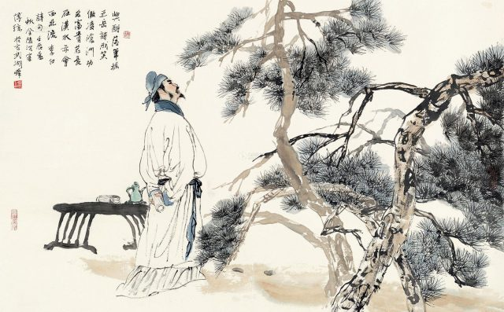
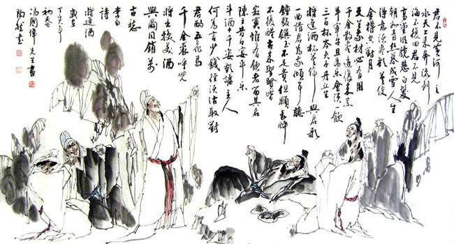

 
Lý Thái Bạch say dài chẳng tỉnh, chung cổ không mong, thánh hiền không vọng, thật đã ngang tàng, nhưng gái lầu xanh thân làm kẻ bán vui mà không biết đén cái xuân, cảnh đẹp chẳng màng, tri âm chẳng tưởng, lòng đau thấm thía bao nhiêu !  
**Bằng Vân** *Khúc Đoạn Trường , Lời bình luận toàn khúc.*

***

 

  Tôi muốn được sinh ở thế kỷ thứ 8, không phải để coi viên dạ minh châu của Đường Minh Hoàng, cũng không phải để nghe khúc Nghê thường của Dương Quí Phi mà để biết dung nhan, cốt cách một người mà thi sĩ Hạ Tri Chương mới gặp đã tặng ngay cái hiệu “ông tiên bị đày xuống trần” (天 上 謫 仙 人 Thiên thượng trích tiên nhân), một người chỉ say sưa quanh năm, bạ đâu ngủ đấy, trong quán rượu ở chợ, dưới gốc cây trên núi, màđược vua phải nể, kẻ quyền thế là Cao lực sĩ phải sợ, một người không hề giúp ích gì cho đời, chỉ ngao du sơn thuỷ rồi ngâm nga ca vịnh màđược hậu thế đặt ngang hàng với các vị giáo chủ, phải, ngang với Thích Ca, Lão Tử, Giê Du, Khổng Tử vì, cũng như 4 vị Phật, Thánh kia, người ấy đã được thế nhân đặt ra những truyện hoang đường về lúc giáng phàm của mình. Người ấy là Lý Bạch.   
 
 
  Bà mẹ đức Thích Ca nằm mê thấy một con voi trắng chui vào nách rồi sinh ra ngài và mẹ đức Khổng Tử nằm mê thấy con lân thì bà mẹ Lý Bạch, khi có thai, cũng nằm mê thấy sao Trường Canh nên mới đặt tên cho Lý là Thái Bạch 太白. Mới sanh ra, Lão Tử đã râu tóc bạc phơ; Lý trái lại, 7 tuổi vẫn chưa biết nói, nhưng khi bà mẹ bồng lên lầu, bỗng nhiên Lý ngâm được 4 câu thơ mà ý thực quái dị. Thơ rằng:   
 
 
危 樓 高 百 尺，  
手 可 摘 星 辰。  
不 敢 高 聲 語，  
恐 驚 天 上 人。   
 
 
  Nguy lâu cao bách xích,  
Thủ khả trích tinh thần.  
Bất cảm cao thanh ngữ,  
Củng kinh thiên thượng nhân.    
 
 
  *Vòi vọi lầu trăm thước,*  
*Vói tay hái được sao.*   
*Chỉ e nói lớn tiếng,*  
*Kinh động tiên trên cao.*   
 
 
  Không biết Nam Tào, Bắc Đẩu, Chức Nữ, Ngưu lang có kinh khủng vì lời thơ của Lý không chứ người phàm từ trước tới nay không ai không khâm phục.   
 
 
  Đỗ Phủ, “thi thánh” đời Đường, phải nói:   
 
 
  白 也 詩 無 敵，  
飄 然 思 不 群。   
 
 
  (Bạch dả thi vô địch,  
Phiêu nhiên tứ bất quần)   
 
 
  *Lý Bạch thơ vô địch,*  
*Phiêu nhiên khác hẳn người.*   
 
 
  Hoàng Đình Kiên đời Tống phải nhận ông là con phượng hoàng, con kỳ lân ở giữa loài người.   
 
 
  Đến như Hồ Thích, một học giả thâm oán những tư tưởng lãng mạn mà cũng không dám cao thanh mạt sát ông, chỉ nói:   
 
 
  “...Chúng ta là bọn phàm phu tục tử, tự thẹn hình hài ô uế, thấy rằng lời ca xướng của ông không phải là lời ca xướng của chúng ta. Đỗ Phủ mới là thi nhân của chúng ta, còn Lý Bạch chỉ là một *ông tiên bị đày xuống trần* thôi!”   
 
 
  Nghĩa là Hồ đối với Lý có th|i độ “kính nhi viễn chi” vậy.  
Không rõ Lý sinh ở đâu, có sách chép là ở đất Thục, có sách bảo là ở Sơn Đông, Lý có tên hiệu là Thanh Liên cư sĩ 青 蓮 居 士, hồi trẻ đi chơi khắp các danh thắng ở bờ sông Trường Giang, giao du với bọn ẩn sĩ mà đời gọi là “Trúc Khê lục dật” 竹 溪 六 逸 (sáu dật sĩ ở khe trúc), gần 50 tuổi vì có một đạo sĩ là Ngô Quân tiến cử, ông bị dời về kinh đô.   
 
 
  Vua Huyền Tông rất trọng ông, nhưng ông không như những thi sĩ khác, chịu đem cái tài hoa của mình nịnh nọt bọn vương hầu, lại xin trở về núi.   
 
 
  Hồi An Lộc Sơn làm loạn, Lý bị Vĩnh Vương tên Lân ép đến giúp việc. Lân tuy không thuộc bè đảng của An Lộc Sơn song cũng không theo vua Đường. Vì thế khi Lân thua, Lý bị bắt giam rồi bị đày tới đất Dạ Lang. Chẳng bao lâu được tha, lại chu du sơn thuỷ, gởi tình trong thơ và rượu. Một đêm, vì quá say rượu mà mất.   
 
 
  Người đời muốn cho vị trích tiên ấy từ trên trời sa xuống cõi phàm, an ủi sinh linh trong ba bốn chục năm, rồi lại ôm trăng mà về thiên cung, nên đặt chuyện rằng Lý say rượu, thấy vừng trăng vằng vặc dưới đáy sông, nhảy xuống ôm và bị nước cuốn đi.   
 
 
  **Tính tình**   
 
 
  Lý cực kỳ lãng mạn, suốt đời chỉ yêu thơ, rượu, sơn thuỷ và mỹ nhân, phản đối đạo Nho, ấp ủ những tư tưởng hư vô của Lão, Trang, cùng những tư tưởng giải thoát của nhà Phật. Ông nói:   
 
 
  我 本 楚 狂 人
  鳳 歌 笑 孔 丘。 
  手 持 綠 玉 杖， 
  朝 別 黃 鶴 樓。 
  五 嶽 尋 山 不 辭 遠，
  一 生 好 入 名 山 遊。   
 
 
Ngã bản Sở cuồng nhân,  
Phượng ca tiếu Khổng Khâu.  
Thủ trì lục ngọc trượng,  
Triêu biệt Hoàng hạc lâu.  
Ngũ Nhạc tầm sơn bất từ viễn,   
Nhất sinh hiếu nhập danh sơn du.    
 
 
*Ta vốn người Sở cuồng*,  
*Hát Phượng cười Khổng Khâu,*   
*Sáng cầm gậy ngọc biếc,*  
*Từ biệt Hoàng hạc lâu.*  
*Ngũ Nhạc dù xa ta cũng tới,*
*Danh sơn trọn kiếp thích ngao du.*

Có nhân sinh quan như vậy, nên ông lánh đời, thường lên núi cao ở.   
 
 
  山 中 問 答   
 
 
問 余 何 意 棲 碧 山 ?  
笑 而 不 答 心 自 閑。  
桃 花 流 水 杳 然 去，  
別 有 天 地 非 人 間。   
 
 
  Sơn trung vấn đáp  
Vấn dư hà ý thê bích san?  
Tiếu nhi bất đáp tâm tự nhàn.  
Đào hoa lưu thủy diểu nhiên khứ,   
Biệt hữu thiên địa, phi nhân gian.    
 
 
  *Lời vấn đáp trong núi*  
*Hỏi ta sao ở chốn thanh san?*  
*Cười mà chẳng đáp, lòng tự nhàn.*   
*Hoa đào dòng nước mông lung chảy.*   
*Riêng có càn khôn, khác thế gian.*   
 
 
  Lúc nào ở giữa loài người thì ông say sưa suốt ngày. Một lần ông nói chỗ nào có rượu ngon là quê hương của ông ở chỗ đó:   
 
 
  但 使 主 人 能 醉 客， 不 知 何 處 是 他 鄉?   
 
 
  Đãn sử chủ nhân năng tuý khách, Bất tri hà xứ thị tha hương?  
*Chủ nhân nếu biết làm say khách, Vũ trụ đâu mà chẳng cố hương?*   
 
 
  Khi ngồi vào tiệc rượu thì hưởng tận cái vui để tan cái *vạn cổ sầu*, một lần uống trăm chén, nếu hết rượu thì áo cừu, ngựa quý cũng đem đổi lấy rượu:   

 **Nguyễn Hiến Lê**   *Đại Cương Văn Học Sử Trung Quốc*  
 
 ***
 

 
**將 進 酒**  
**Thương tiến tửu**  
*Xin mời rượu*
 
  君 不 見 ：  
Quân bất kiến:  
*Anh không thấy:*   
 
 
  黃 河 之 水 天 上 來，  
Hoàng Hà chi thuỷ thiên thượng lai,  
*Nước sông Hoàng Hà chảy từ trên trời xuống*   
 
 
  奔 流 到 海 不 復 回 ？  
Bôn lưu đáo hải bất phục hồi!  
*Chảy ra đến biển không quay trở lại nữa*   
 
 
  又 不 見 ：  
Hựu bất kiến:  
*Anh lại không thấy:*   
 
 
  高 堂 明 鏡 悲 白 髮 ，  
Cao đường minh kính bi bạch phát,  
*Cha mẹ soi gương buồn nhìn tóc bạc*   
 
 
  朝 如 青 絲 暮 成 雪 ？  
Triêu như thanh ty mộ thành tuyết.  
*Sáng còn xanh mượt, chiều tối đã thành trắng như tuyết*   
 
 

   人 生 得 意 歡   ，  
Nhân sinh đắc ý tu tận hoan,  
*Đời người khi nào đắc ý nên tận tình vui sướng*

   莫      使      金      樽      月   。  
Mạc sử kim tôn không đối nguyệt!  
*Đừng để chén rượu vàng cạn queo nhìn vầng trăng*

   天      生      我      才      必      有      用   ，  
Thiên sinh ngã tài tất hữu dụng,  
*Trời sinh ra ta có tài thì ắt sẽ được dùng*

   千      金      散      盡      還      復      來   。  
Thiên kim tán tận hoàn phục lai.  
*Ngàn vàng tiêu sạch hết rồi sẽ có trở lại*

   烹      羊      宰      牛      且      為      樂   ，  
Phanh dương tể ngưu thả vi lạc,  
*Mổ dê giết trâu cứ vui cái đã*

   會      須      一      飲      三      百      杯   。  
Hội tu nhất ẩm tam bách bôi.  
*Uống một lần ba trăm ly rồi hãy tính*

   岑      夫      子   ，  
Sầm phu tử,  
*Này ông bạn họ Sầm*

   丹      丘      生   ，  
Đan Khâu sinh.  
*Này ông bạn Đan Khâu*

   將      進      酒   ，  
Thương tiến tửu,  
*Xin mời uống rượu*

   杯      莫      停   。  
Bôi mạc đình!  
*Chớ có ngừng chén*

   與   (   君      歌      一      曲   ，  
Dữ quân ca nhất khúc,  
*Tôi xin ca một khúc cho các anh*

   請      君      為      我      傾      耳      聽   。  
Thỉnh quân vị ngã khuynh nhĩ thính:  
*Xin các anh vì tôi lắng tai nghe*

   鐘      鼓      饌   (   玉      何      足      貴   ，  
“Chung cổ soạn ngọc bất túc quý,  
*Chuông trống cỗ bàn không đáng quý trọng*

   但      願      長      醉      不      願      醒   。  
Đãn nguyện trường tuý bất nguyện tỉnh!  
*Chỉ xin được say hoài không muốn tỉnh*

   古      來      聖      賢      皆      寂      寞   ，  
Cổ lai thánh hiền giai tịch mịch,  
*Xưa nay các bậc thánh hiền đều không còn tiếng tăm*

   唯      有      飲      者      留      其      名   。  
Duy hữu ẩm giả lưu kỳ danh.  
*Chỉ có kẻ uống rượu mới để lại tên tuổi*

   陳      王      昔      時      宴      平      樂   ，  
Trần vương&nbsp;tích thời yến Bình Lạc,  
*Trần vương hồi xưa mở yến hội ở Bình Lạc*

   斗      酒      十      千      恣      歡      謔   。  
Đẩu tửu thập thiên tứ hoan hước”.  
*Mười ngàn đấu rượu tha hồ mà hoan lạc vui cười*

   主      人      為      何      言      少      錢   ，  
Chủ nhân hà vi ngôn thiểu tiền,  
*Tại sao chủ nhân lại nói ít tiền*

   逕      須      沽      取      對      君      酌   。  
Kính tu cô thủ đối quân chước.  
*Hãy mau mau mua rượu mời các anh uống*

   五      花      馬   ，  
Ngũ hoa mã,  
*Này ngựa hoa năm sắc*

   千      金      裘   ，  
Thiên kim cừu,  
*Này áo cừu giá ngàn vàng*

呼 兒 將 出 換 美 酒 ，  
Hô nhi tương xuất hoán mỹ tửu,  
*Kêu đứa nhỏ ra đem đổi lấy rượu*

與 爾 同 消 萬 古 愁 。  
Dữ nhĩ đồng tiêu vạn cổ sầu.  
*Cùng bạn tiêu mối sầu vạn cổ*  
	
__________________________________

Bài này được sáng tác khoảng năm Thiên Bảo thứ 11. Đề mục *Thương tiến tửu* vốn là tên một điệu Nhạc phủ đời Hán, thuộc *Đoản tiêu nao ca* có nội dung là lời phóng ngôn khi uống rượu, có sách chép là *Tích tôn không* 惜罇空.

Chữ 將 trong tên bài ở đây đọc âm *thương* (tương ứng âm “qiāng” trong tiếng Trung hiện đại) với nghĩa xin mời, hãy.

[link ~> Trang thơ Lý Bạch - Thương tiến tửu trên Thi viện](https://www.thivien.net/L%C3%BD-B%E1%BA%A1ch/Th%C6%B0%C6%A1ng-ti%E1%BA%BFn-t%E1%BB%ADu/poem-2SOZi2_E9ZMjy3mQn1w89A)