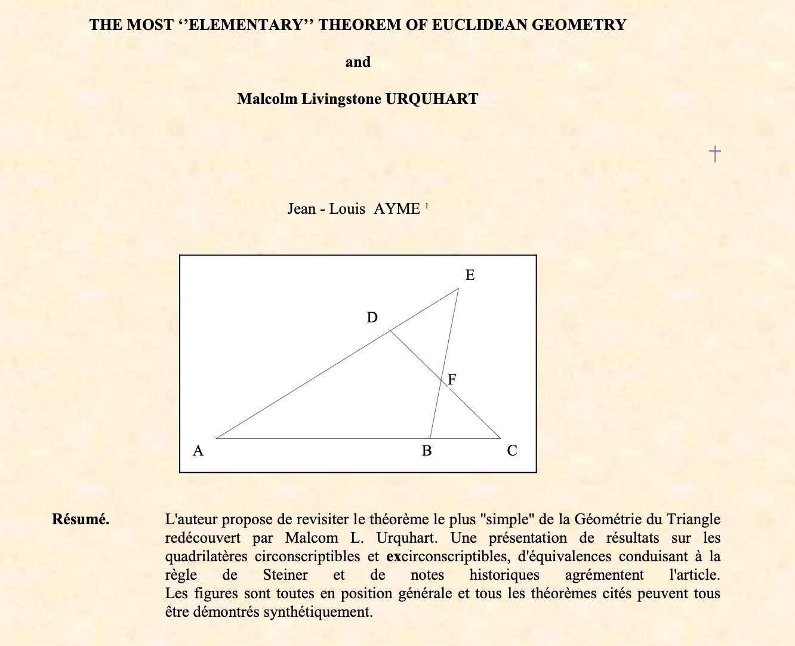

Malcolm   Livingstone   Urquhart   

   
<a target="_blank" href="http://jl.ayme.pagesperso-orange.fr/vol20.html" rel="noreferrer noopener">lien: jl.ayme.pagesperso-orange.fr/vol20</a>   
The most elementary theorem of Euclidean geometry.   
JL Aymé - St-Denis, Île de la Réunion (Océan Indien, France), le 31/05/2012   
  

Démonstration par quadrilatères inscriptibles:   
<a target="_blank" href="https://www.cut-the-knot.org/Curriculum/Geometry/Pitot.shtml#Urquhart" rel="noreferrer noopener">Article *Inscriptible and exscriptible quadrilaterals* @ cut-the-knot.org</a>  

<iframe scrolling="no" title="Pitot's theorem" src="https://www.geogebra.org/material/iframe/id/WhhGuj7D/width/442/height/441/border/888888/smb/false/stb/false/stbh/false/ai/false/asb/false/sri/true/rc/false/ld/false/sdz/true/ctl/false" width="442px" height="441px" style="border:0px;"> </iframe>

Notes historiques :  

<a target="_blank" href="https://www.cut-the-knot.org/pythagoras/UrquhartsTheorem.shtml#Bicycle" rel="noreferrer noopener">Article *UrquhartsTheorem* @ cut-the-knot.org</a>  

